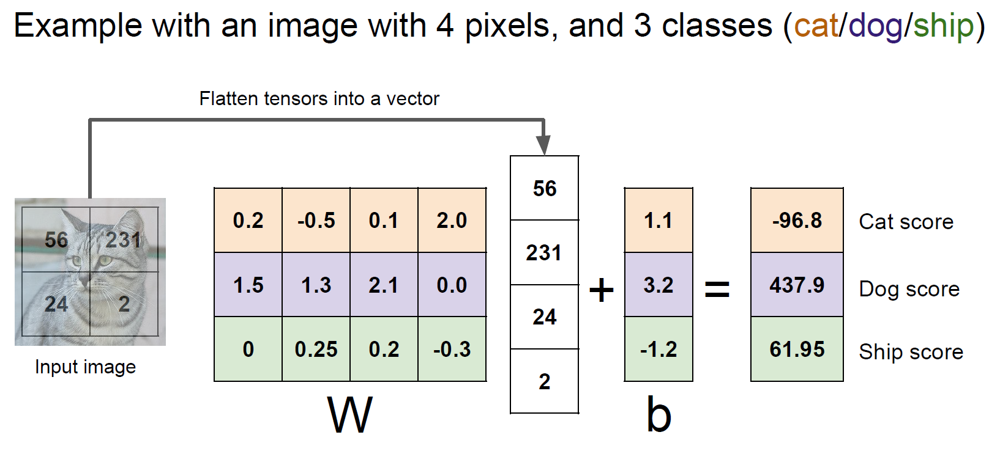
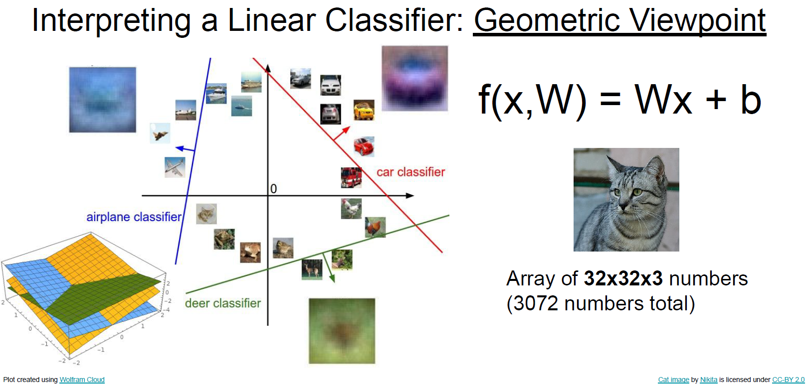
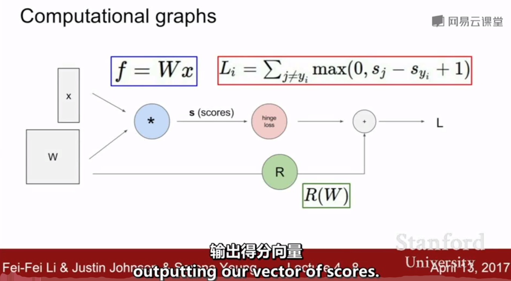
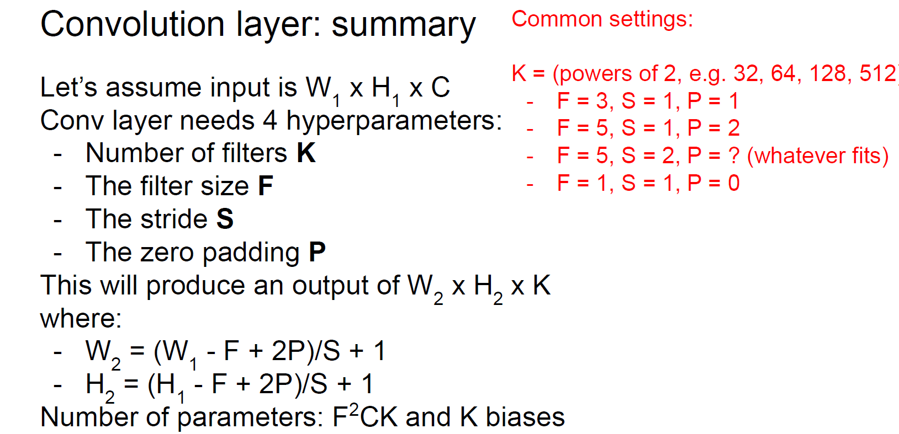

[TOC]

### [2.1 图像分类 - 数据驱动方法](https://www.bilibili.com/video/BV1nJ411z7fe?p=4)

数据驱动的方法即不使用特定的规则, 而是用大量数据.


+ 计算机看到的是数字, 如果换一个角度, 同样的猫但是图片数字可能完全不同, 算法需要做到这样的鲁棒: 光线, 遮挡, 猫变形, 背景混乱, 猫与猫之间的不同等.

+ semantic gap:

  一幅图片所表达的意思和计算机所看到的之间的差距.

#### k - Nearest Neighbor

+ train: 仅记录数据.
+ test: 计算k个最近邻, 投票分类.


我们希望的是分类器在test的时候非常快, 这样可以部署在一些普通的设备上, 训练过程可以消耗很大.

不同的度量方式:


##### 为什么要引入验证集 / 如何找到好的超参数:

找到好的超参数, 如下:

+ Idea 1: 关心的是模型在未知的数据上表现得更好, 即泛化能力, 而不是模型拟合训练数据很好就好了.
+ Idea 2: 在这组test set上的训练数据不能代表所有的, 而且这样会让模型先见到test set.


选择在validation set上表现最好的超参数, 再到test set上预测并计算各种数据. 这才是在未见数据上的预测能力.

一般采用k-fold cross validation.


##### kNN不用于图像处理的原因

+ 之前是图像上 $L_1, L_2$ 距离并用于kNN的例子, 但是实际上效果很不好, 因为如下all 3 images have same L2 distance to the one on the left: 

+ curse of dimensionality:

  

  kNN的效果建立在训练数据可以密集地分布在空间中, 图片维度高不可能收集到那么多数据. 此外高维度带来的指数增长计算复杂度也是不能接受的.


Linear Classifier


注意维度, 图片是`32 x 32 x 3`的, 然后展开成了`3072`的长向量.

例子: 这里比较简单, $W$的每行就代表对于某一类分类的权重: 

+ 第一个角度 来解释线性分类器: $W$ 的行向量 $\in \mathbb{R}^{D}$ 决定了input属于该类的权重/可能性, 线性分类器($W$的行向量) 有点像在学习这个类的模板, 或者说综合了这个类的均值, 行向量也可以还原为一个图像: 

+ 另一个角度, 线性分类器寻找的是决策面, 我感觉这个角度的解释更好: 

线性分类器无法处理线性不可分问题.


### 3.1 损失函数

如何优化 $W$, 首先找到如何判定哪些 $W$ 是好的. 引出loss function.

一些标记:

+ $\left\{\left(x_{i}, y_{i}\right)\right\}_{i=1}^{N}$ 是给定的dataset, $x_i$ 是image, $y_i$ 是label.
+ 整个数据集上的loss: $L=\frac{1}{N} \sum_{i} L_{i}\left(f\left(x_{i}, W\right), y_{i}\right)$ 为所有的平均.

#### multi-class SVM loss

$$
\begin{aligned}
L_{i} &=\sum_{j \neq y_{i}}\left\{\begin{array}{ll}
0 & \text { if } s_{y_{i}} \geq s_{j}+1 \\
s_{j}-s_{y_{i}}+1 & \text { otherwise }
\end{array}\right.\\
&=\sum_{j \neq y_{i}} \max \left(0, s_{j}-s_{y_{i}}+1\right)
\end{aligned}
$$

这种 $\max$ 啥的损失函数即Hinge Loss: 

如上述图像, 对于单个样本讨论, 损失函数关注的是 **正确类别得分 和 错误类别得分的差值**, 尽量让正确类别的得分 高于 其他错误类别. 函数解释为: (注意自变量因变量)
$$
L_i (s_{y_i}) = -s_{y_i} + \left( s_j + 1 \right)
$$
正确得分到了一定值, 落在 $s_j + 1$ 区域就是一个safety margin了.

+ 计算loss: 


##### 思考题

Q1: What happens to loss if car scores decrease by 0.5 for this
training example?
Q2: what is the min/max possible SVM loss Li?
Q3: At initialization W is small so all $s \rightarrow 0$. What is the loss Li, assuming N examples and C classes?
Q4: What if the sum was over all classes?
Q5: What if we used mean instead of sum?
Q6: $L_{i}=\sum_{j \neq y_{i}} \max \left(0, s_{j}-s_{y_{i}}+1\right)^{2}$ 如何?

+ Q1: 这里 SVM loss 的概念就在于, 上述对中间图像的分类, 如果car(正确分类)的得分变化了一点, 只要还在那个margin里面(这里是大1的), 损失函数都不会改变.

+ Q2: 观察上述图像, 就会发现SVM loss最大是 $+\infty$, 最小是0.

+ Q3: 注意到 刚开始训练的时候, $W$ 是随机初始化的, $s_j, s_{y_i}$ 都是非常靠近0的类似均匀分布的, 此时 $L_i = C - 1$, 这样总的loss大概就是 $L = C - 1$.

+ Q4: 注意到 在计算损失函数时候 $\sum$ 是跳过正确分类类别的, 如果加入这个类别, 损失函数的值将$+1$. 就是说 $L = \sum L_i$ 的最小值为1, 这样不太直观, 一般来说最小损失为0.

+ Q5: 相同.

+ Q6: 会有不同, loss function指示了什么error是算法care/trade off的.

+ 为什么要加上 1: $s_j + 1$?

  这就是损失函数的一个常数(不重要), 因为我们关心的是正确分类得分和错误分类得分的 **差值**: $\forall \ j \not= y_i, |s_j - s_{y_i}|$.


##### 模型选择

$L = 0$ 时, $W$ 不唯一, 例如 $2W$ 也可以: 

模型不只是需要拟合训练数据, 由此引入过拟合, 正则项:  

+ 模型选择: Occam's Razar.
+ 有不同的作用, 比如 $L_1$ 更鼓励稀疏, 用一个例子看 $L_1$ 和 $L_2$ 的偏好, $L_2$ 更倾向于铺开的$W$, 这可能更鲁棒(在$x_i$有较大变化时): 

上面还有一些较复杂的正则化方法, 都是在试图惩罚模型的复杂度, 而不是试图拟合数据.


#### Softmax Classifier(Multinomial Logistic Regression)

score经过softmax之后, 变成概率. 我们希望的是正确类别的预测概率接近1. 所以loss的考虑为:
$$
L_{i}=-\log P\left(Y=y_{i} \mid X=x_{i}\right)=-\log \left(\frac{e^{s y_{i}}}{\sum_{j} e^{s_{j}}}\right)
$$
注意这里还有其他的优化目标, 比如 转为预测分布和目标分布的比较:  

##### 思考题

+ $L_i$ (对于一个样本的损失) 最大值为 $+\infty$, 最小值为0.
+ 注意这里softmax loss是不断地优化, 让正确的预测概率越来越大, 而不像SVM loss一样, 只要正确类别的score最高, 即落到了那个margin里面就OK.


### 3.2 优化

#### 梯度下降


计算梯度:

+ **numerical gradient:** 有限差分法(the method of finite differences): 这回到了**梯度的极限定义**:

  

  某一维度上加一个小量 $h$, 由极限定义的梯度计算该维度上的梯度值. 实现有限差分逼近.

+ 上述有限差分是一种方法, 但是实际中我们使用微积分**直接写出梯度表达式**: 精确且快速.

+ 如何验证代码中实现的 直接计算梯度表达式 **是否正确?**

  使用 analytic gradient, 但是**gradient check的时候使用numerical gradient.**

+ 代码: 

优化梯度下降的方法(以后会讲): 1. 带momentum, 2. Adam优化.

#### 随机梯度下降

并非计算整个训练集的误差和梯度值. **而是在每次迭代中, 采样一个minibatch(大小32/64/128).** 在minibatch上估计误差, 实际梯度.


线性分类器交互网站: http://vision.stanford.edu/teaching/cs231n-demos/linear-classify/ 有点意思哈, 调整学习率感受一下.


### 4.1 神经网络 和 反向传播

#### 特征提取方法


常常需要先对数据提取特征, 上面是一个特征变换: 极坐标转换.

例子:

+ **Color Histogram:** 

  计算图片上每个像素 的颜色柱状图. 柱状图值代表频次.

+ **Histogram of Oriented Gradients (HoG) 方向梯度直方图:** 在神经网络之前, 提取图片的边缘特征, 先一张图片划分成许多许多小块, 每个小块里面识别特征, 曾经的目标检测特征表示: 

+ **Bag of Words:**

  源于NLP, 词频率表达, 这里对于图像每一块就是视觉单词; 随机块采样, K-means聚类得到簇中心, 即不同的视觉单词表示.


+ 如上描述的特征提取方法, 是直接 提取特征, 并提前记录特征, 在之后做分类.
+ 深度学习方法是 从数据中学习特征. 在整个网络中训练参数.

计算图: 

#### 反向传播 backpropagation


形象: 

反向传播将输出对输入的求导做了 **化解成一层层的小问题 的简化.** 看下面这个较复杂的例子即可体会:   


在计算图中不同 门/神经元 的反向传播梯度作用: 

矩阵求导方式与维度关系: 

推广到高维的神经网络, 就是变成梯度矩阵(Jacobian matrices)  

##### Jacobian 矩阵分析


4096 的维度, **喂给一个ReLU**, 输入输出都是4096维度, 这样它的Jacobian矩阵大小为 `4096 x 4096`, 再加上minibatch的大小, 计算量太大了.

但是 Jacobian 矩阵的特点:

+ 对角阵. 因为单层ReLU, 第$i$个输入仅和第$i$个输出有关.

一种解决方法: 

详细的例子 线性+$L_2$: 

+ $q_i$ 对 $f$ 的梯度就是 $2 q_i$, 所以直接写成 $2q$:

+ 再看 $q_k$ 对于 $W_{ij}$ 的影响: 

  注意上图中各个位置的矩阵是如何求出来的(橙色线).

  注意 $q_k$ 对 $W_{ij}$ 的梯度有 **指示函数**的限制, 这也说明了得到的Jacobian矩阵是稀疏的概念, 使用链式法则得到$2q_ix_j$(仔细考虑 求梯度时element-wise的影响范围, 可以先用几个特例试试).

  最后得出 $2q \cdot x^T$.

  

  同理有: 


 


激活函数: 


### 5.1 卷积神经网络

如果有6个卷积核, 我们可以得到:


在上图中, 每一个格子都是神经元, 一定程度上代表了神经元在寻找什么.

不同的kernel在一幅图像上卷积的结果, 比如第一个红色框的, 就像在找图片中的边缘, 更关注边缘: 

卷积操作, 和两个信号之间的卷积操作有关.


#### filter 及输出大小相关

深入探究 stride: 

在 `7 x 7` 上的图不能使用 `3 x 3` 的filter.

**计算输出尺寸的公式**, 同时可以来判断什么stride是OK的: 
$$
Output = (N - F) / stride + 1
$$

+ **使用padding:** (zero padding)

  

  padding了周围一圈 => `7 x 7` -> `9 x 9`, 注意是 加 2P.

  如上加了一圈padding之后, 输出的图片大小就和卷积之前的图片大小相同了. 保持图像尺寸.

  我们不希望多层卷积之后图片尺寸变得很小, 因为这会损失很多信息.

**例题:**


参数个数, 注意每个filter还有一个bias: 

总结关于 filter 以及输出尺寸大小的这节: 

`1 x 1` 的卷积操作也是可以的, 注意下面每个filter是 `1 x 1 x 64` 的, **每次卷积 卷积核都是对图片上所有通道上操作**, 然后有32个构成了输出深度是32的: 


#### Pooling layer

+ makes the representations smaller and more **manageable**.
+ operates over each activation map independently.


+ 不做深度上的池化处理, 深度不变.
+ 通常来说, pooling的filter是没有重叠的.
+ 一般不做zero padding, 因为pooling本身就是降采样.


上图每一层的输出都是激活映射的输出.


### 6.1 激活函数

+ **sigmoid**

  + 饱和神经元使梯度消失:

    0 (梯度) 会传递到下游结点. 当值较大或者较小的时候, 因为sigmoid那里是平的.

  + 输出不是以0为中心的, 这将导致:

    全正或全负的梯度 对于梯度的更新是低效的 zig zag path: 

    这也是为什么要使用均值为0的输入数据.

    接下来引出 以0为中心的 激活函数.

+ **tanh**

  但是仍然会存在梯度消失.

+ **ReLU**

  annoyance: <0 的区域出现梯度消失.

  dead-ReLU, 学习率太大的时候, 刚开始训练很正常, 后面ReLU结点的参数就不更新. 超平面就不动, 因为负的梯度为0不更新了.


+ **Leaky ReLU**


+ **ELU**

+ **SELU**

+ **Maxout**

  

+ **实践建议**:

  


所以为什么要做数据预处理, 在激活函数这里有一定的体现:


+ zero-centered:

  比如刚刚ReLU的例子, 不能全正/全负的输入.

+ normalize:

  所有特征在相同的值域内, 这样每个特征贡献相同.

 

#### 参数初始化

+ **Q: what happens when $W=constant$ init is used?** 对于最普通的全连接网络.

  所有神经元会做同样的事情, 它们可能不会不变, 是否不变取决于输入. 因为梯度啥的都是一样的.

+ 所以正确的初始化是从一个概率分布中**随机抽样**:

  ```python
  w = 0.01 * np.random.randn(Din, Dout)
  ```

  这在小型网络中是适用的, 但是**在深度网络中会出现问题:**

  

  

