[TOC]

### [Lecture 1 - Course introduction, problem definitions, applications](https://www.bilibili.com/video/BV1He411s7K4?p=1)

机器人训练后可以用一个铲子把物体铲到碗里, 但是如果换一个形状的铲子或者碗可能就不会了, 因为机器人就是在那个环境下训练的. 跨越多个任务的时候, It’s not practical to collect a lot of data this way. 所以在设计算法的开始, 就要注意到这些问题.

为什么需要multitask learning:

+ 某些领域没有大量的数据, 或者收集到大量数据是困难的. 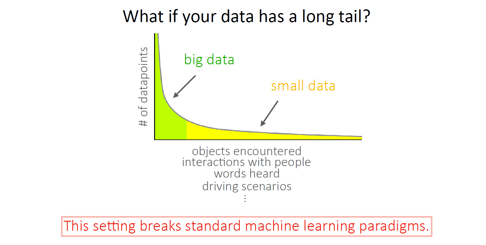
+ What if you need to quickly learn something new?
  about a new person, for a new task, about a new environment, etc.

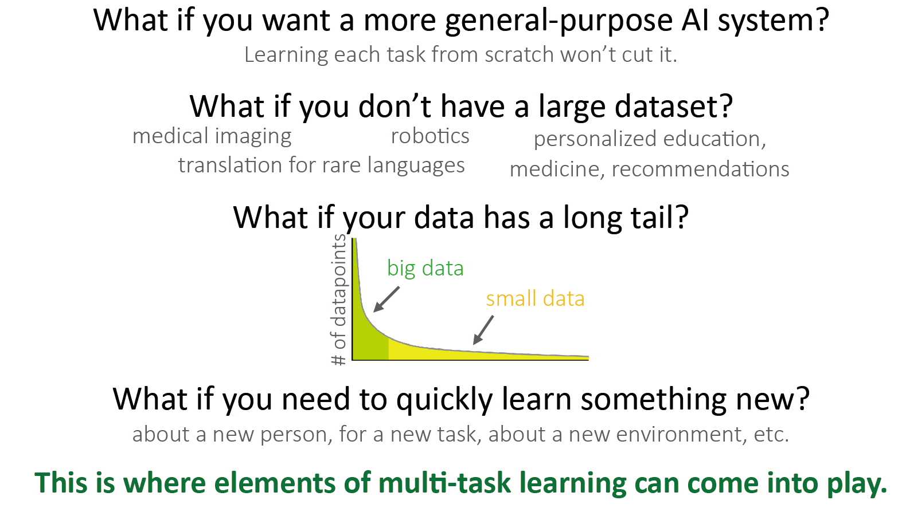

task的定义: 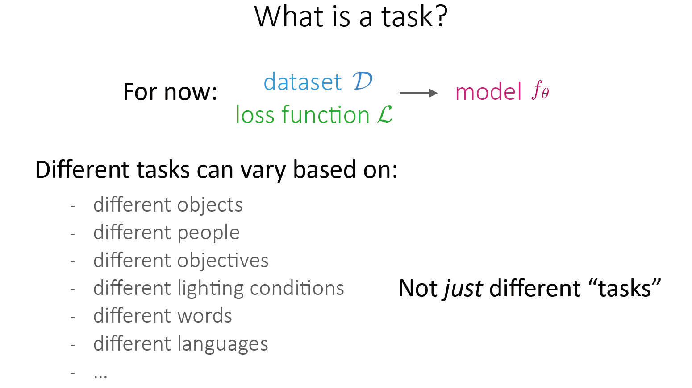

+ 关键的假设: 

  不同的任务需要共享相同的结构. 如果尝试学习的任务没有共同的结构, 那么最好单个任务单独学习.

  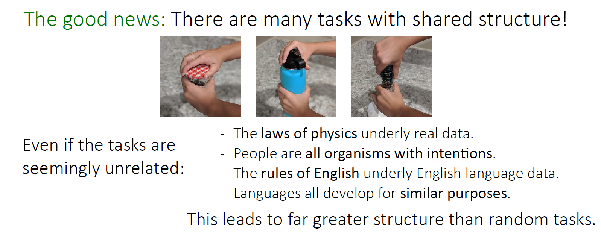

问题定义(需要研究什么): 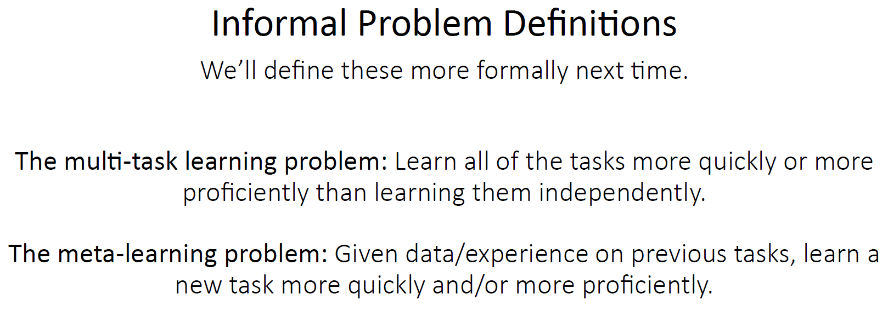

multitask learning 为什么不可以化简到单任务学习: $\mathcal{D}=\bigcup \mathcal{D}_{i}, \ \mathcal{L}=\sum \mathcal{L}_{i}$ ? 实际上聚合多任务的数据是一种学习方法, 但是我们可以根据这些不同任务的数据做得更好.

### [Lecture 2 - Supervised multi-task learning, black-box meta-learning](https://www.bilibili.com/video/BV1He411s7K4?p=2)

**符号定义**

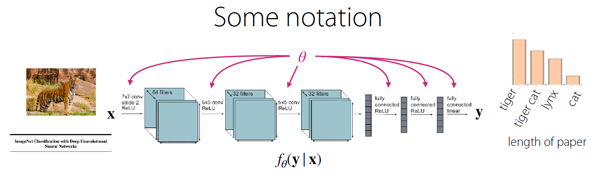

如上是一个神经网络, 输入可以为图片/paper标题等, 输出是分类等.

$\theta$ 是网络权重, $f_\theta (\boldsymbol{y} \mid \boldsymbol{x})$ 是神经网络的映射函数.

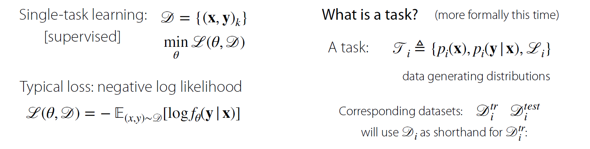

现在开始更formal地定义task:

+ $$
  \mathscr{T}_{i} \triangleq\left\{p_{i}(\mathbf{x}), p_{i}(\mathbf{y} \mid \mathbf{x}), \mathscr{L}_{i}\right\}
  $$

  input的分布, 基于该input的label分布, 以及其loss function.

  这里的分布都是生成数据的真实分布(我们得不到的)

不同任务的例子:

+ 这里不同语言的手写体识别 $\mathscr{L}_i$ 在多个不同的任务上是相同的.

  但是输入以及所对应的标签有些不同: 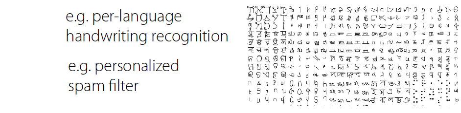

  

+ 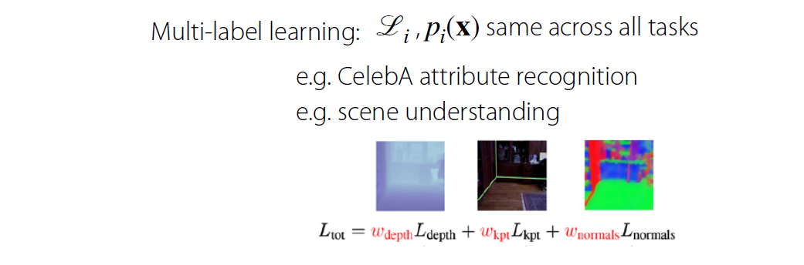

  多标签学习, $x$ 先验也是相同的, CelebA attribute recognition: 一张图片 识别有没有戴帽子, 头发是不是黄色.

+ 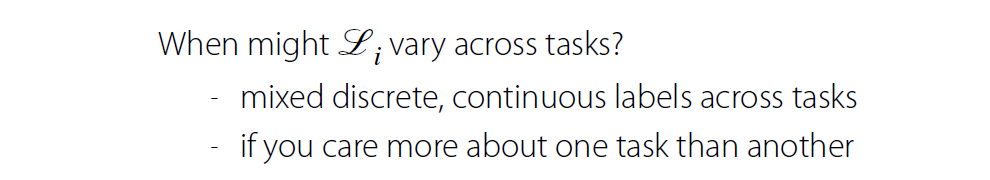

引入 $\boldsymbol{z}_i$: task descriptor, $f_\theta (\boldsymbol{y} \mid \boldsymbol{x}, \boldsymbol{z}_i)$: 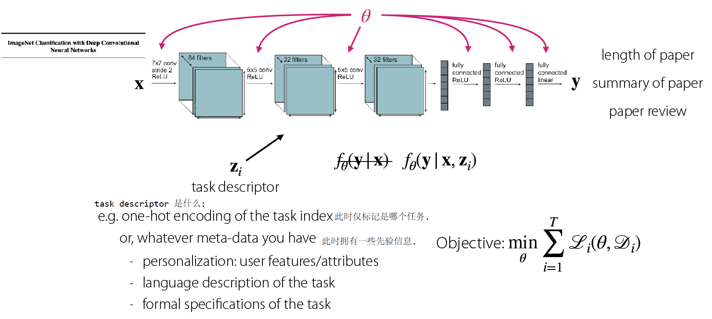

**Question**: How should you condition on the task in order to share as little as possible?

+ 完全不怎么共享: 在每个任务上建立独立的网络.

  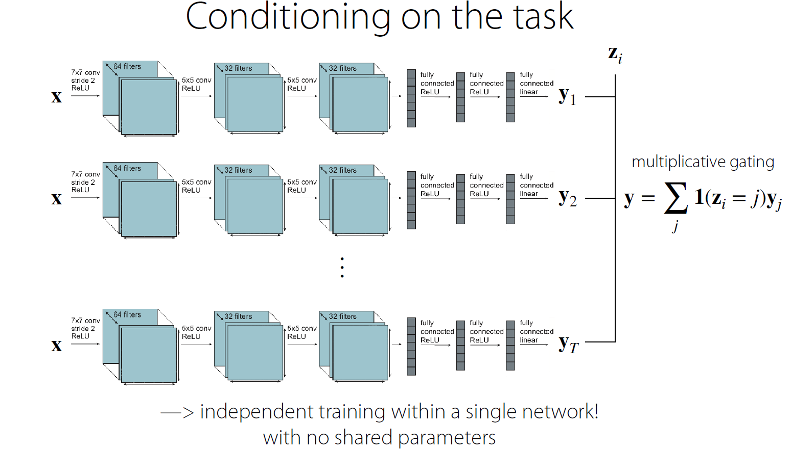

+ 共享几乎所有: 将 $\boldsymbol{z}_i$ (task index 仅标记这是哪个任务)与输入/激活层拼接, 其余几乎共享, 但是在 $\boldsymbol{z}_i$ 拼接之后的网络层会有属于特定任务的部分.

  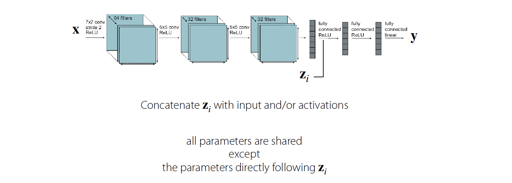

+ 不会那么极端的想法: 划分 $\theta$ 为共享的和特定于任务的.

  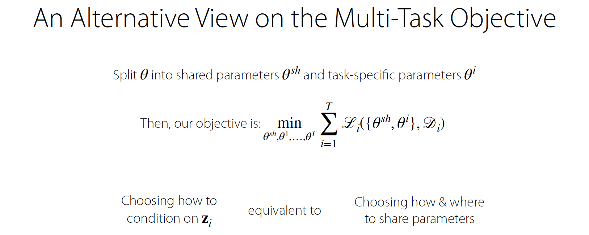

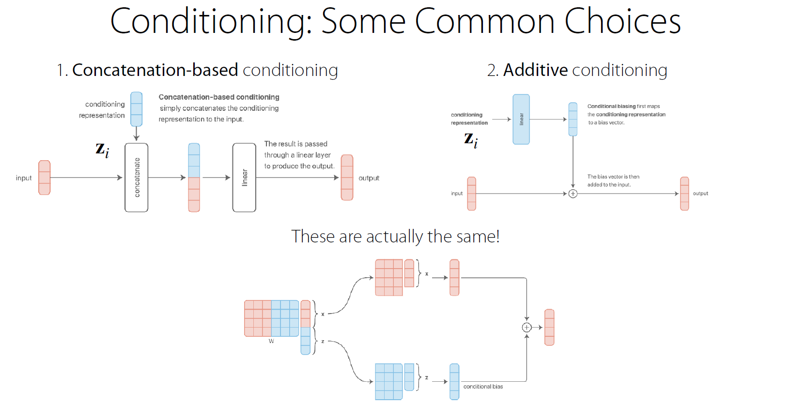 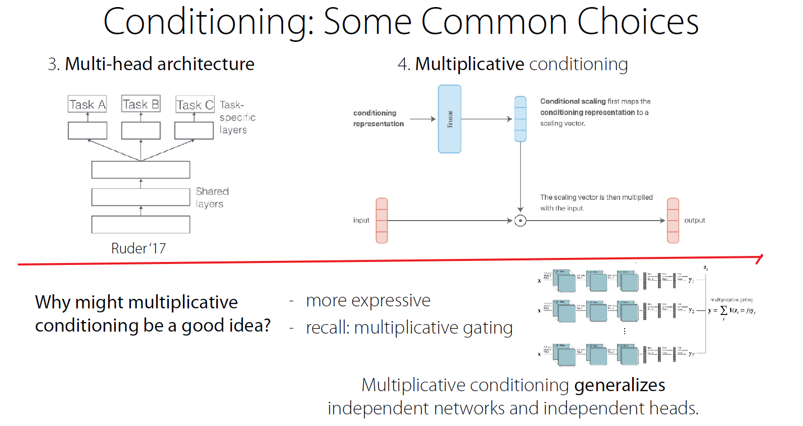

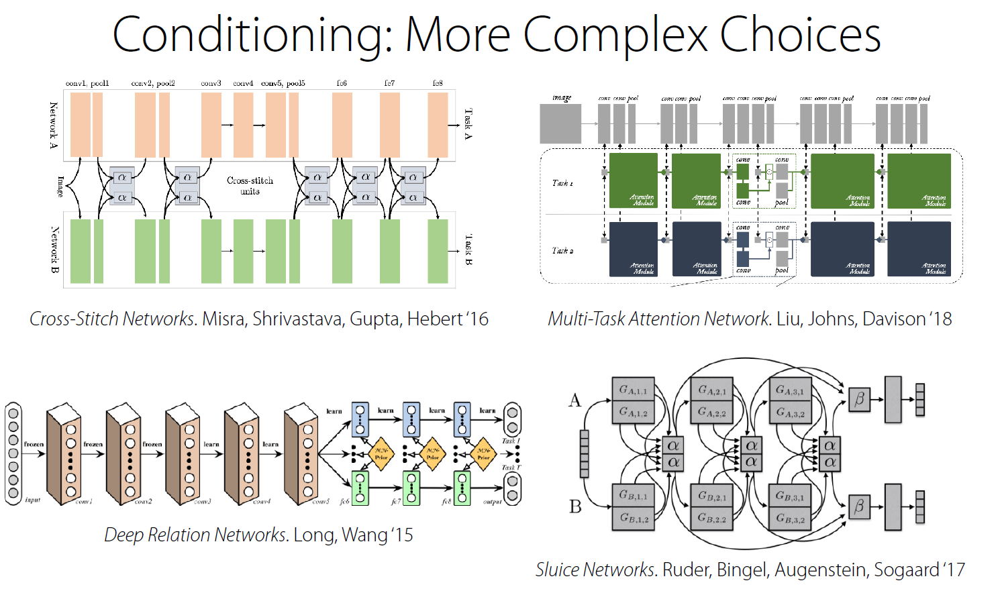

一种基础版本的优化目标: 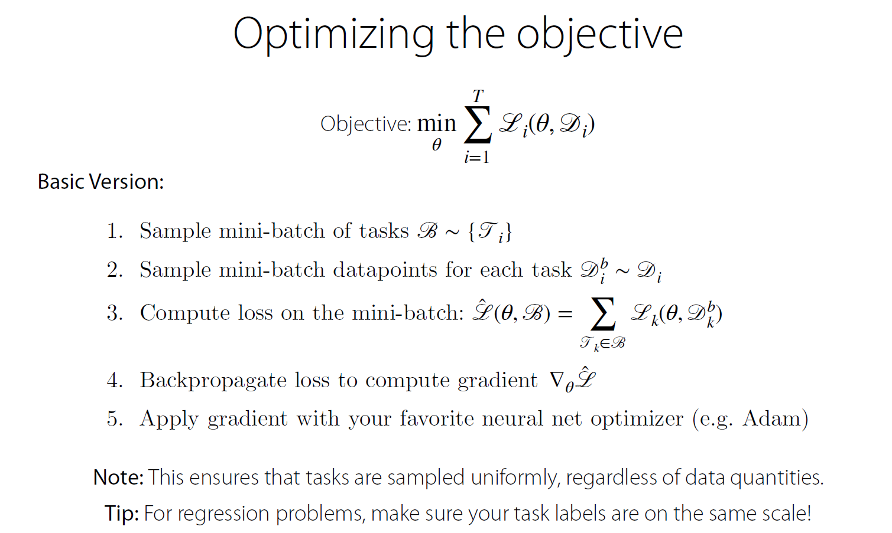

**挑战(难点)**:

+ Negative transfer:

  一些任务的数据或其他影响了其他任务的训练.

  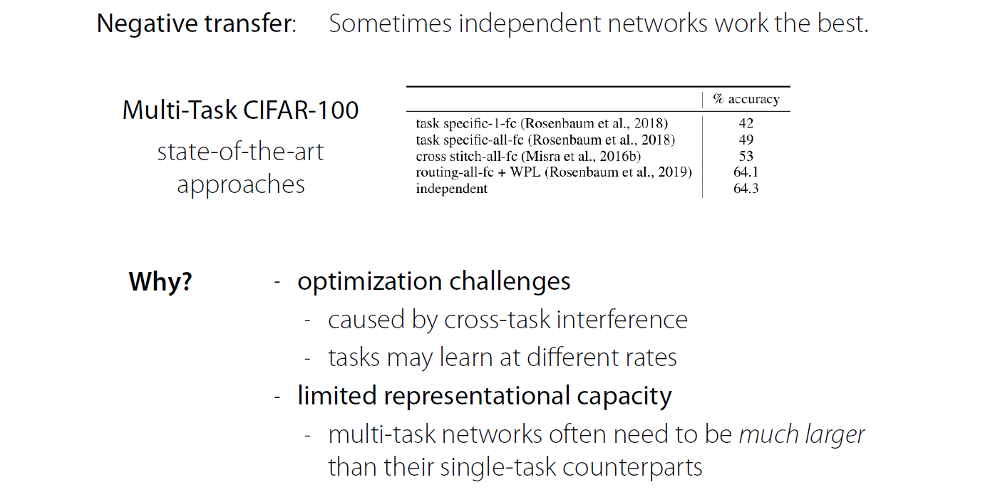

  以上列举了一些原因.

  解决方法: soft parameter sharing, 鼓励共享那些相似的参数.

  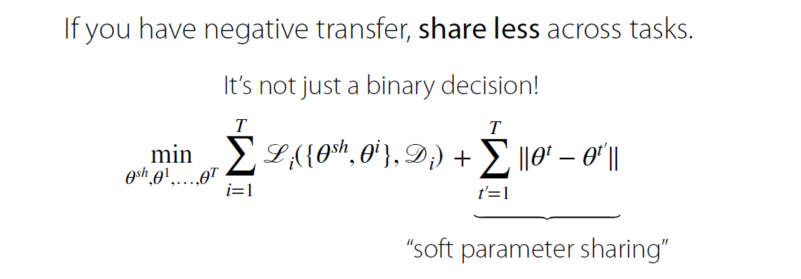

### Tensorflow (1.x) Review Session

