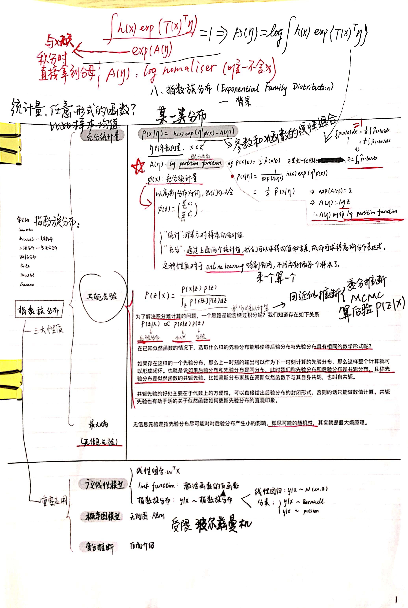
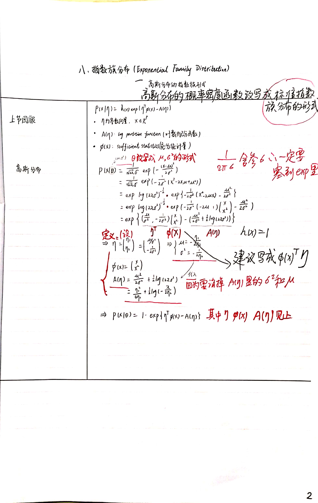
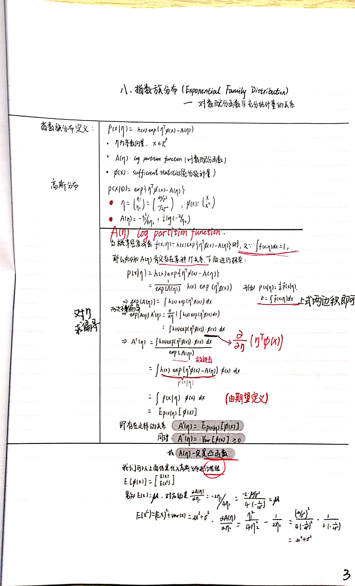
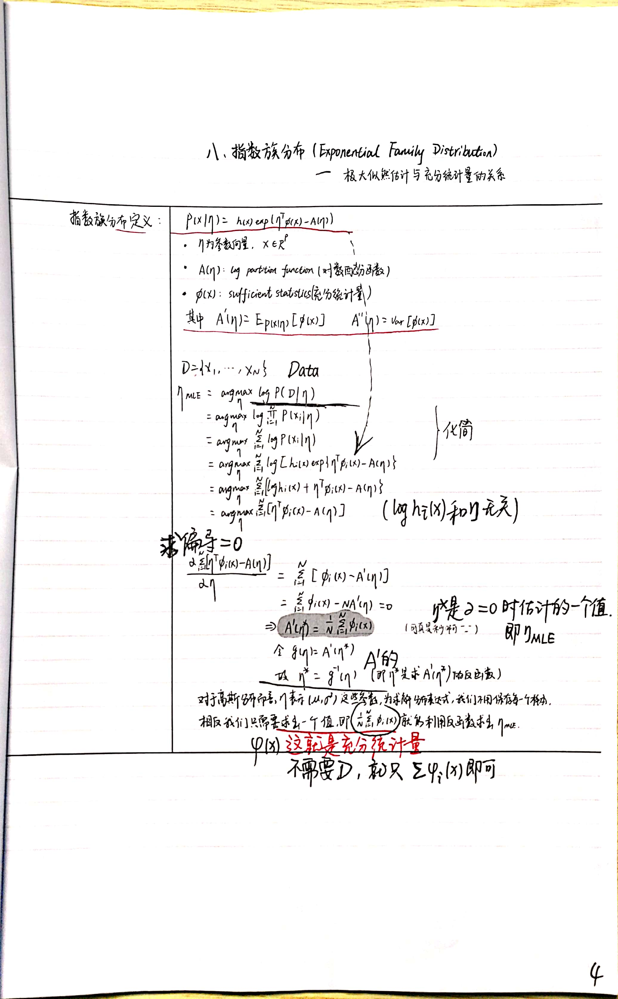
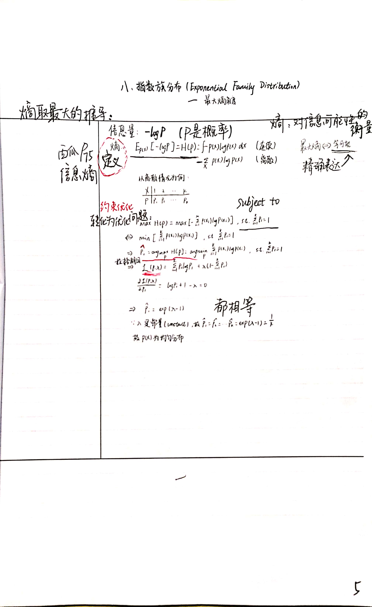
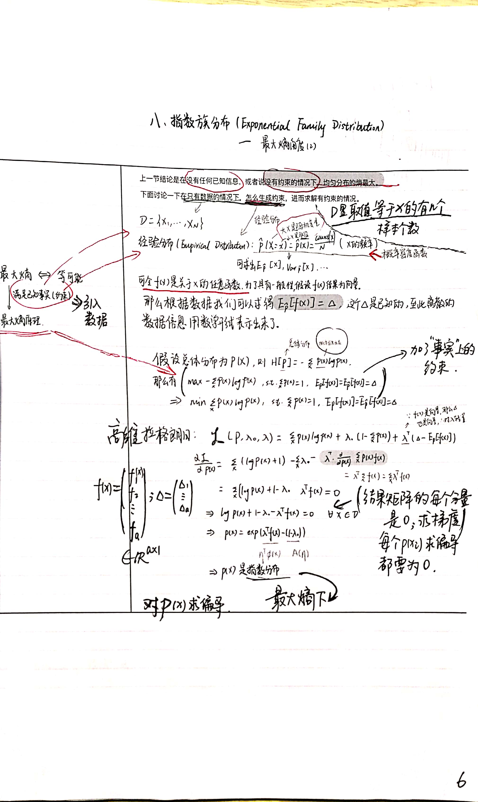
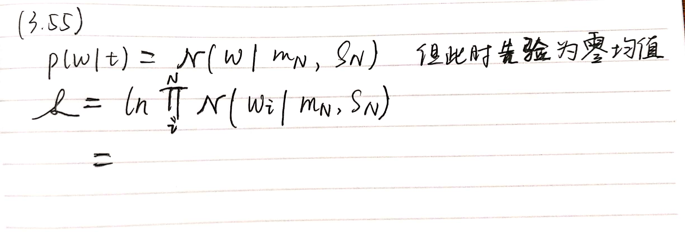
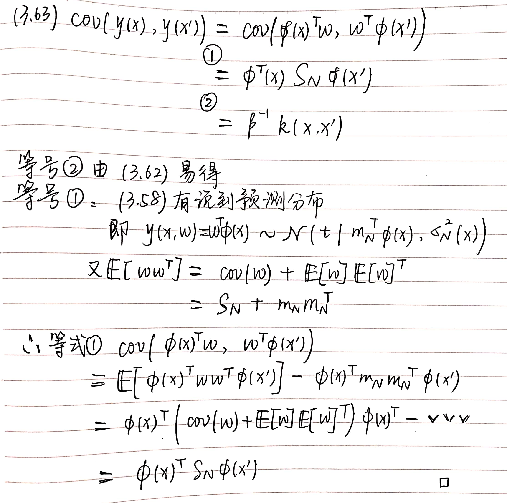

[TOC]

# 附录

#### (3.11) (3.12) (3.19) (3.20) (3.21)

赋予线性基函数的高斯白噪声, 其输出$t$的相关极大似然估计:

+ 解:

#### 3.1.4 - 最小化 $q$ 的一般正则化目标函数(3.29)形式 $\Leftrightarrow$ 在 $\sum_{j=1}^{M}\left|w_{j}\right|^{q} \leqslant \eta$ 条件下 最小化未带正则项的平方误差函数(3.12).

#### 3.1.5 - 从2.3.4节中知道多元高斯分布 均值的最大似然解与协方差无关.

+ 解:
  $$
  \frac{\partial}{\partial \boldsymbol{\mu}} \ln p(\boldsymbol{X} \mid \boldsymbol{\mu}, \boldsymbol{\Sigma})=\sum_{n=1}^{N} \boldsymbol{\Sigma}^{-1}\left(\boldsymbol{x}_{n}-\boldsymbol{\mu}\right) \\
  \mu_{M L}=\frac{1}{N} \sum_{n=1}^{N} x_{n}
  $$

#### 3.2 - 同时关于权值 $w$ 和正则化系数 $\lambda$ 来最小化正则化的误差函数会导致不正确: $\lambda = 0$.

+ 解:

  因为关于 $\lambda$ 求导后为 $\frac{1}{2} \sum_{j = 1}^{M} | w_j|^q$, 恒正.

#### 3.3.1 - 式(3.48) 推导, (3.10) 定义的似然函数 $p(t \mid w)$ 是$w$二次函数的指数形式, 所以对应的共轭先验是高斯分布.

+ 解:

  忘了好多, 还要再补.

  

  

  

  

  

  

#### 3.3.1 - 式(3.49) (3.50) (3.51) 推导.

实际上是式(2.116)的推导.

+ 解:

#### 3.3.1 - 式(3.51) 附近, 如果我们考虑一个无限宽的先验 $S_0 = \alpha^{-1} \boldsymbol{I}$, 其中 $\alpha \rightarrow 0$, 那么后验概率分布的均值就变成了公式(3.15)给出的最大似然估计值 $\boldsymbol{w}_{ML}$.

#### 3.3.1 - 式(3.55) 推导.

+ 解:

  

#### 3.3.2 - 式(3.58) (3.59) 推导.

+ 解:

  

#### 3.3.2 - 式(3.63) 推导.

+ 解:

  

#### 3.4 - 式(3.70) $\Delta w_{posterior}$ 的积分近似.

+ 解:

  因为假设了后验分布近似均匀分布, 那么它乘一个分布作为被积函数, 就是均匀分布的长度被积函数即可.

#### 3.5 - 式(3.74) 如果定义了 $\alpha, \beta$ 上的共轭Gamma先验分布, 那么对(3.74)中的$w$就可以解析地得到$w$上的t分布.

#### 3.5.1 - 式(3.77) 使用高斯模型条件概率分布的结果(2.115)计算.

#### 3.5.1 - 式(3.78) (3.79) 推导.

+ 解:

  由 (3.11) (3.12) (3.52):
  $$
  \begin{aligned}
  \ln p(\mathbf{t} \mid \boldsymbol{w}, \beta) &=\sum_{n=1}^{N} \ln \mathcal{N}\left(t_{n} \mid \boldsymbol{w}^{T} \boldsymbol{\phi}\left(\boldsymbol{x}_{n}\right), \beta^{-1}\right) \\
  &=\frac{N}{2} \ln \beta-\frac{N}{2} \ln (2 \pi)-\beta E_{D}(\boldsymbol{w})
  \end{aligned}
  $$
  $$
  E_{D}(\boldsymbol{w})=\frac{1}{2} \sum_{n=1}^{N}\left\{t_{n}-\boldsymbol{w}^{T} \boldsymbol{\phi}\left(\boldsymbol{x}_{n}\right)\right\}^{2}
  $$
  $$
  p(\boldsymbol{w} \mid \alpha)=\mathcal{N}\left(\boldsymbol{w} \mid \mathbf{0}, \alpha^{-1} \boldsymbol{I}\right)
  $$
  
  (3.78) 中的 $\left( \frac{\beta}{2 \pi} \right)^{\frac{N}{2}}$ 是 $p( \boldsymbol{t} \mid \alpha, \beta)$ 的, 另一个是 $p( \boldsymbol{w} \mid \alpha)$ 的.

#### 3.5.1 - 式(3.85) 推导: 关系到(3.79)~(3.84), 也是证据函数的计算过程.

#### 3.1.1 - 代码中, **基函数回归**里极大似然估计, 基函数(比如高斯)的**(初始化)均值会对结果产生影响**, **为什么?**

#### 3.3 - 贝叶斯线性回归有什么缺点, 好像现在用的很少?

#### 3.5.2 - 式(3.89) 求导推导.

+ 解:

  这里不用查cookbook, 行列式的求导就是先展开成特征值的乘积, 看(3.88)即可.

#### 3.5.2 - 式(3.91) 推导.

+ 解:

  由(3.90):
  $$
  \begin{aligned}
  \gamma &=M-\alpha \sum_{i} \frac{1}{\lambda_{i}+\alpha} \\
  & = \sum_i (1 - \frac{\alpha}{\lambda_{i}+\alpha})
  \end{aligned}
  $$

#### 3.5.2 - 如何理解最大化证据函数中迭代计算 $\alpha$, 直到收敛的过程?

#### 4.1.4 - 式(4.26) 推导.

#### 4.1.5 - 式(4.34) 推导.

+ 解:

  式(4.32) 除 $N$ 得到:
  $$
  \begin{aligned}
  & \sum_n^N \boldsymbol{w}^T m + w_0 - \left(\sum_{n \in N_1} t_n + \sum_{n \in N_2} t_n \right) / N \\
  = & \sum_n^N \boldsymbol{w}^T m + w_0 = 0
  \end{aligned}
  $$

#### 4.1.5 - 式(4.37) 推导 (习题4.6).

+ 解:

#### 4.1.6 - $S_B$ 秩最多 $K - 1$ 个, 向由$S_B$张成的 $K - 1$ 维空间上的投影不会改变 $J(W)$ 的值，因此通过这种方法我们不能够找到多于 $K - 1$ 个线性“特征”. 如何理解?

