# PRML

[TOC]

PRML, the Elements of statistical learning, Understanding Machine Learning, Foundations of Machine Learning.

### 1 绪论

泛化能力: 正确分类与训练集不同的新样本的能力.

强化学习: 关注在给定的条件下, 找到合适的动作, 使得奖励达到最⼤值.

#### 1.1 例子: 多项式拟合

用多项式函数: $y(x, \boldsymbol{w})=\sum_{i=0}^M w_i x_i$.

+ 预测值与目标值的平方和误差:

  损失函数求导后可以得到闭式解.

  多项式的次数$M$是超参数, 模型选择问题. 过拟合: $M$较大时损失函数为零, 但是曲线剧烈震荡.

+ 均方根误差:

  预测值与目标值的平方和 $\div$ 样本个数, 再开根号.

  以相同的基础对比不同大小的数据集.

随着$M$的增大, 系数通常会增大(暗示曲线会震荡), 但是多项式函数可以精确拟合训练集. 过分地拟合了随机噪声.

数据集规模增加, 过拟合问题变得不那么严重. 数据集规模越大, 我们能够⽤来拟合数据的模型就越复杂(即越灵活).

##### 正则化:

减少过拟合.

+ 岭回归: 平方和误差 $+$ 正则化项 $\lambda\|\boldsymbol{w}\|^2$.

&nbsp;

#### 1.2 概率论

+ 关于一个条件分布的条件期望:
  $$
  \mathbb{E}_{x}[f \mid y]=\sum_{x} p(x \mid y) f(x)
  $$

##### 1.2.3 贝叶斯概率

+ 先验: $p(\boldsymbol{w})$, 在观察数据之前, 我们有一些关于参数(比如多项式曲线例子中的$\boldsymbol{w}$)的假设.

+ 类条件概率/似然: $p(\mathcal{D} \mid \boldsymbol{w})$, 表达在不同的参数$\boldsymbol{w}$下, 观测数据出现的概率.

  似然函数不是$\boldsymbol{w}$的概率分布, 关于$\boldsymbol{w}$的积分不一定等于1.

$$
p(\boldsymbol{w} \mid \mathcal{D})=\frac{p(\mathcal{D} \mid \boldsymbol{w}) p(\boldsymbol{w})}{p(\mathcal{D})}
$$

+ 频率学家: 最大似然估计.

  $\boldsymbol{w}$ 是一个固定的参数, 由某种形式(比如数据集$\mathcal{D}$的概率分布)的"估计"来确定.

+ 贝叶斯: 包含先验概率. 实际观测到数据集$\mathcal{D}$, 参数的不确定性用$\boldsymbol{w}$的概率分布来表达. 该方法的缺点: 选择先验概率通常是选方便的而不是反映出先验知识的.

##### 1.2.4 高斯分布

高维高斯:
$$
\mathcal{N}(x \mid \mu, \Sigma)=\frac{1}{(2 \pi)^{\frac{D}{2}}} \frac{1}{|\Sigma|^{\frac{1}{2}}} \exp \left\{-\frac{1}{2}(x-\mu)^{T} \Sigma^{-1}(x-\mu)\right\}
$$

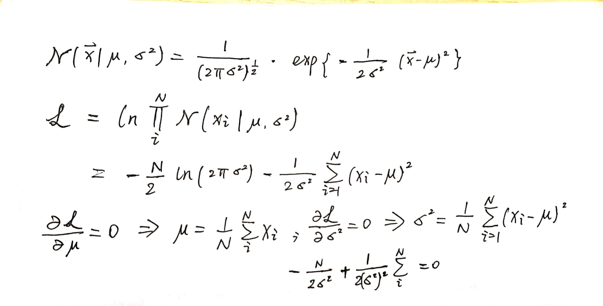 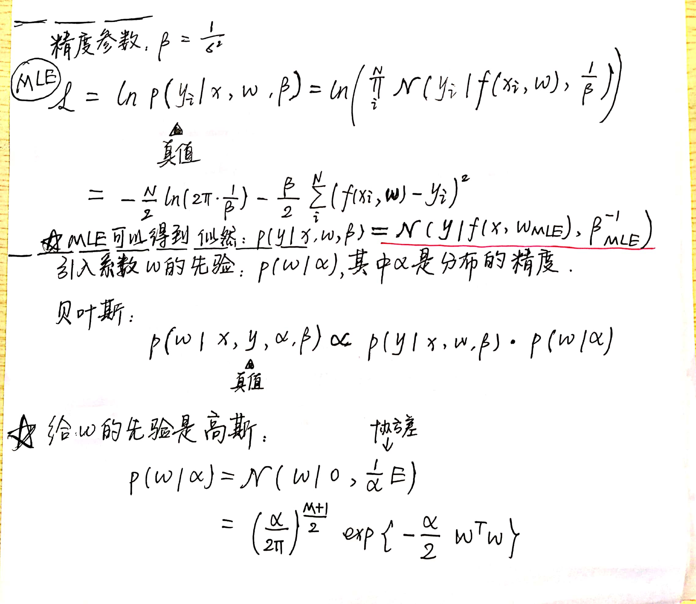

所以最大似然估计的均值可正确(是无偏估计), 但是方差被系统性地低估了(不是无偏估计).

$\mu_{MLE}$ 与 $\sigma^2_{MLE}$ 无关.

最⼤似然的偏移问题是我们在多项式曲线拟合问题中遇到的过拟合问题的核⼼:

##### 1.2.5 重新考察曲线拟合问题

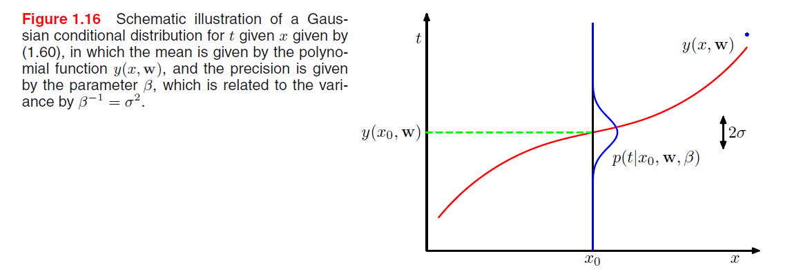

很牛!

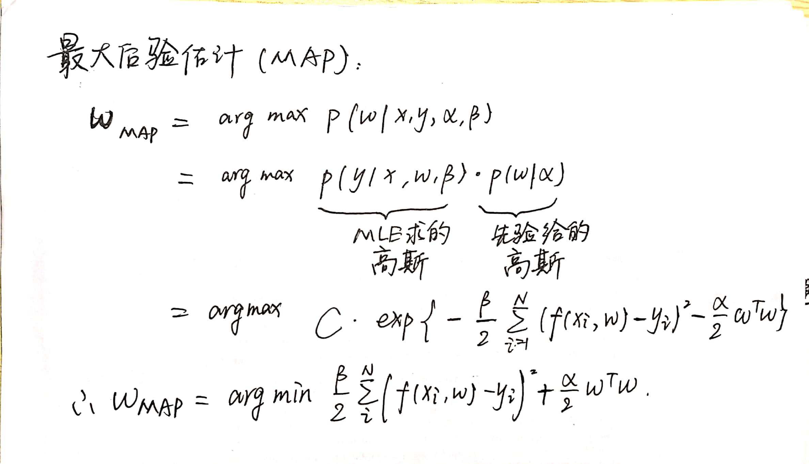

所以:

+ 在$\boldsymbol{w}$的先验是高斯, 就是上面图上那个曲线$y$轴方向的高斯.
+ 并且MLE作用于似然函数.
+ **最后MAP求解后的结果 $\Rightarrow$ 岭回归.** 这就是贝叶斯视角下的岭回归.

##### 1.2.6 贝叶斯曲线拟合

更纯的贝叶斯:

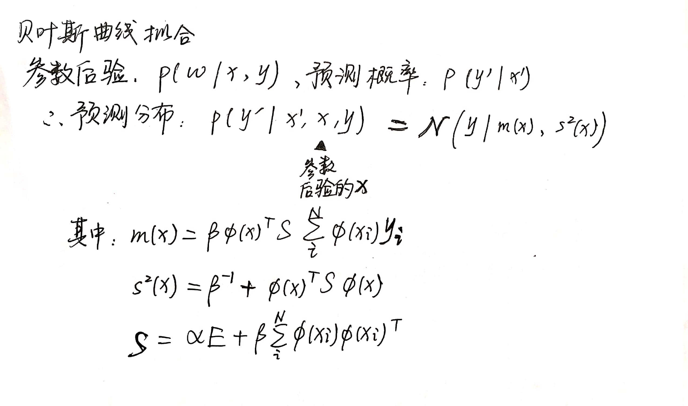

&nbsp;

#### 1.3 模型选择

交叉验证: 平均分成几份, 留一份做验证集, 其他的是训练集, 如此交替.

信息准则尝试修正最大似然的偏差, 增加惩罚项:

+ Akaike information criterion(AIC):
  $$
  \ln p(\mathcal{D}|w_{MLE}) - M
  $$
  第一项是对数似然, $M$ 是模型中可调节参数的数量.

  最大化上式.

&nbsp;

#### 1.4 维度灾难

+ 例子: 将输入空间划分成一个个单元格, 预测输入的类别就是它所在单元格中其他数据最多的类别.

  上例中单元格的数量随着空间的维数指数增大. 为了保证单元格不空, 需要指数量级的训练数据.

+ 多项式曲线拟合例子: 系数数量的增长速度类似于 $D^M$.

+ 考虑 $r = 1 - \epsilon$ 到 $r = 1$ 之间的体积 占超球总体积的百分比:
  $$
  V_D(r) = C_D \cdot r^D \\
  \frac{V_{D}(1)-V_{D}(1-\epsilon)}{V_{D}(1)}=1-(1-\epsilon)^{D}
  $$
  发现对于较大的 $D$, 即使是很小的$\epsilon$, 占比也趋近于1, 即大部分体积都聚集在表面附近的超球壳上.

但是仍有应用于高维空间的有效技术:

1. 真实数据经常被限制在有着较低的有效维度的空间区域中.
2. 真实数据通常比较光滑. 大多数情况输入数据微小改变, 目标值改变也很小.

&nbsp;

#### 1.5 决策论

先验: $p(\mathcal{C}_k)$.

后验: $p(\mathcal{C}_k | x)$.

输入与真值(真实类别)的不确定性: $p(\boldsymbol{x}, \mathcal{C}_k)$.

##### 1.5.1 最小化错误分类率

(两类)错误分类的概率, (多类)正确分类的概率:
$$
\begin{aligned}
p(\text { mistake }) &=p\left(\boldsymbol{x} \in \mathcal{R}_{1}, \mathcal{C}_{2}\right)+p\left(\boldsymbol{x} \in \mathcal{R}_{2}, \mathcal{C}_{1}\right) \\
&=\int_{\mathcal{R}_{1}} p\left(\boldsymbol{x}, \mathcal{C}_{2}\right) \mathrm{d} \boldsymbol{x}+\int_{\mathcal{R}_{2}} p\left(\boldsymbol{x}, \mathcal{C}_{1}\right) \mathrm{d} \boldsymbol{x}\\
p(\ \text{correct} \ ) &= \sum_k p\left(\boldsymbol{x} \in \mathcal{R}_{k}, \mathcal{C}_{k}\right) = \sum_{k = 1}^K \int_{\mathcal{R}_k} p(\boldsymbol{x}, \mathcal{C}_k) d \boldsymbol{x}
\end{aligned}
$$
其中$\mathcal{R}$是根据$\boldsymbol{x}$的类别划分的决策区域.

图例(很牛!):

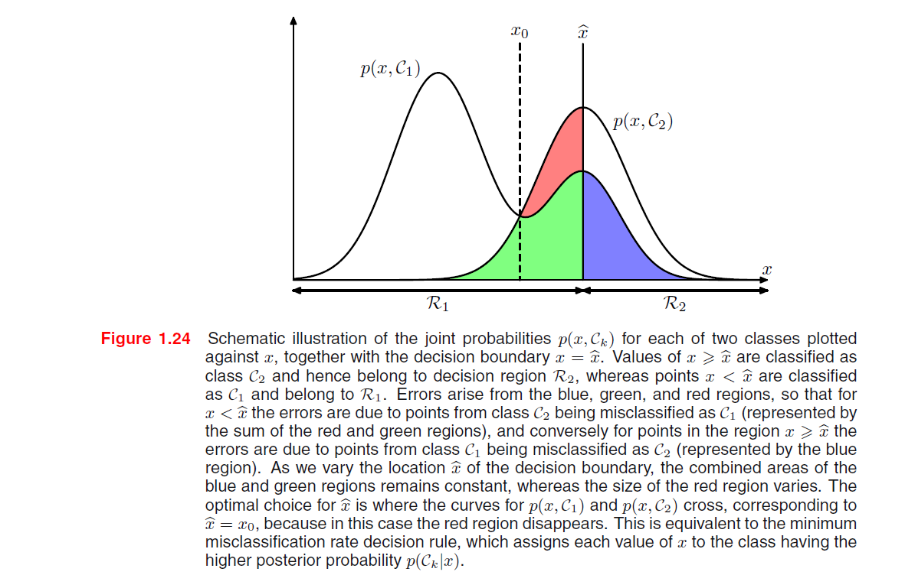

+ 上图:

  小于$\hat{x}$, 被分类为$\mathcal{C}_1$.

  横轴标的是预测类别的决策区域.

  + 把 $\mathcal{C}_1$ 分到 $\mathcal{C}_2$: 蓝色区域, 就是$p(x, \mathcal{C}_1)$在决策区域 $\mathcal{R}_2$ 的概率和.
  + 把 $\mathcal{C}_2$ 分到 $\mathcal{C}_1$: 红色区域加绿色区域, 同理这就是 $p(x, \mathcal{C}_2)$ 在决策区域 $\mathcal{R}_1$ 的概率和.

  预测时候就是改变 $\hat{x}$, 注意到此时绿色和蓝色区域总和是常数. 红色区域面积在改变. 最优时候就是 $\hat{x} = x_0$. 等价于最小化错误分类率的决策规则.

&nbsp;

##### 1.5.2 最小化期望损失

损失(代价)矩阵 $L$: 分类错误代价.

期望损失:
$$
\mathbb{E}[L]=\sum_{k} \sum_{j} \int_{\mathcal{R}_{j}} L_{k j} \cdot p\left(\boldsymbol{x}, \mathcal{C}_{k}\right) \mathrm{d} \boldsymbol{x}
$$
我们的目标是划分到最优的 $\mathcal{R}_j$.

用贝叶斯定理转换为后验, 就是西瓜书第七章前面的 最小化条件风险(风险就是期望损失), 对于一个$\boldsymbol{x}$, 它可以被分到取值最小的第$j$类:
$$
R\left(\mathcal{C}_{j} \mid \boldsymbol{x}\right)=\sum_k L_{k j} \cdot p\left(\mathcal{C}_{k} \mid \boldsymbol{x}\right)
$$

##### 1.5.3 拒绝选项

对于难以分类的情况, 拒绝分类, 交给人类.

后验概率小于某个阈值 $\theta$, 则拒绝分类: 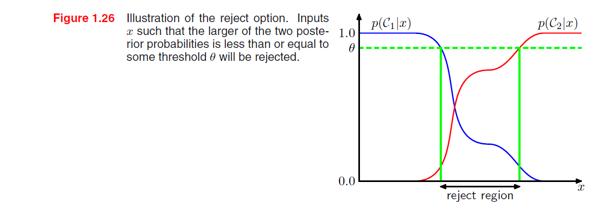

上图中间那块, 如果后验中较大的那个还是小于$\theta$, 就会落入拒绝区域.

##### 1.5.4 推断和决策

+ 推断阶段: 使用训练数据学习 $p(\mathcal{C}_k | \boldsymbol{x})$ 的模型.
+ 决策阶段: 使用后验概率进行最优分类.

##### 1.5.5 回归问题的损失函数

期望损失:
$$
\mathbb{E}[L] = \int \int L(y, f(\boldsymbol{x})) \cdot p(\boldsymbol{x}, t) \ d \boldsymbol{x} \ dt
$$
其中 $L$ 可以是平方损失.

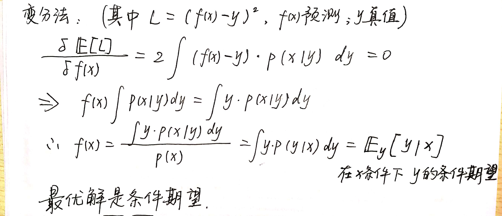 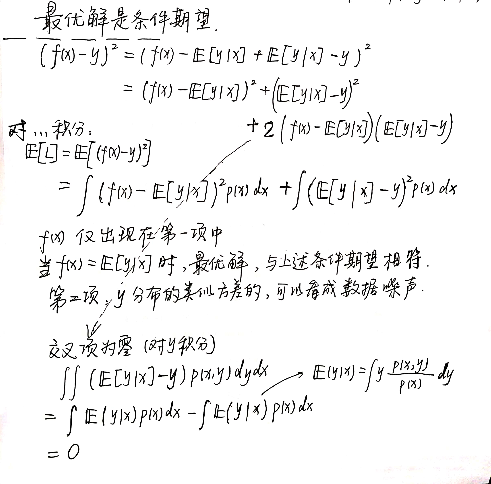

回归问题也有三种解决方式:

+ 推断 联合概率密度 $p(\boldsymbol{x}, y)$, 计算条件概率密度 $p(y | \boldsymbol{x})$, 最后 $\int y \cdot p(y | \boldsymbol{x}) \ dy$, 求条件期望.
+ 推断条件概率密度 $p(y | \boldsymbol{x})$, 其他与上一致.
+ 直接训练一个回归函数 $f(x)$

其他损失函数的期望, 闵可夫斯基损失函数:
$$
\mathbb{E}\left[L_{q}\right]=\iint|y(\mathbf{x})-t|^{q} \cdot p(\mathbf{x}, t) \mathrm{d} \mathbf{x} \mathrm{d} t
$$
其中 $q = 2$ 时就是平方损失.

&nbsp;

#### 1.6 信息论

信息熵.

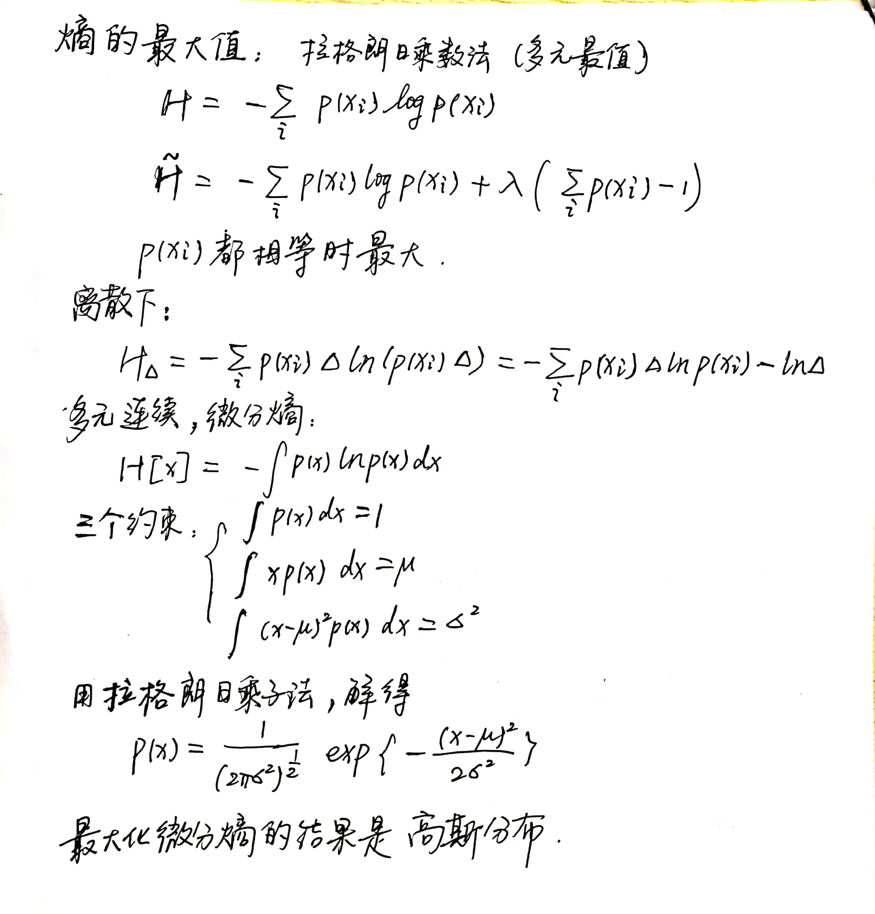

##### 1.6.1 相对熵和互信息

+ KL散度分布之间的相对熵, 就是两个相减:
  $$
  \begin{aligned}
  \mathrm{KL}(p \ \| \ q) &=-\int p(\boldsymbol{x}) \ln q(\boldsymbol{x}) \mathrm{d} \boldsymbol{x}-\left(-\int p(\boldsymbol{x}) \ln p(\boldsymbol{x}) \mathrm{d} \boldsymbol{x}\right) \\
  &=-\int p(\boldsymbol{x}) \ln \left\{\frac{q(\boldsymbol{x})}{p(\boldsymbol{x})}\right\} \mathrm{d} \boldsymbol{x}
  \end{aligned}
  $$
  KL散度不满足对称性.

+ 琴生(Jensen)不等式:

  用琴生不等式和 $-ln(x)$ 是凸函数, 证明$\mathrm{KL}$散度非负:
  $$
  \mathrm{KL}(p \| q)=-\int p(\boldsymbol{x}) \ln \left\{\frac{q(\boldsymbol{x})}{p(\boldsymbol{x})}\right\} \mathrm{d} \boldsymbol{x} \geq-\ln \int q(\boldsymbol{x}) \mathrm{d} \boldsymbol{x}=0
  $$
  放到$\ln$里面就可.

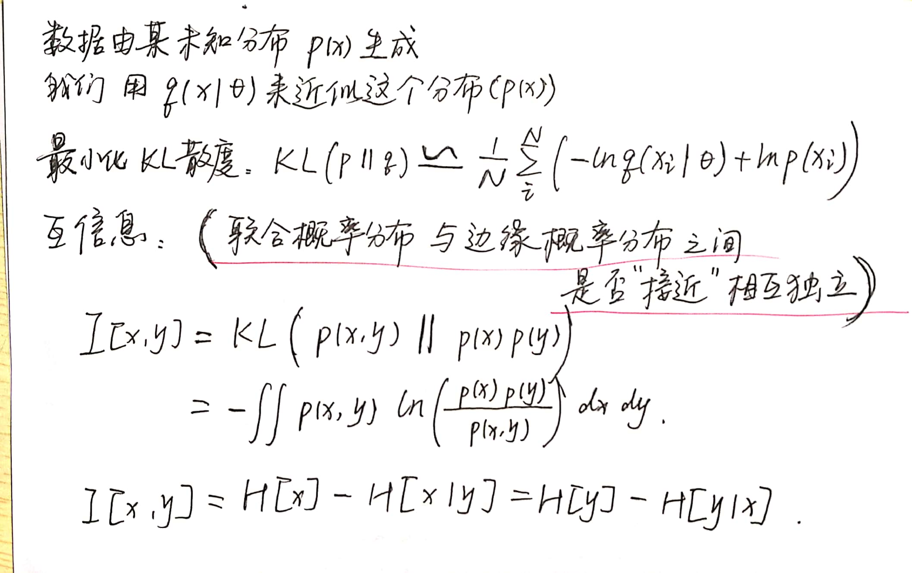

&nbsp;

#### 1.7 练习

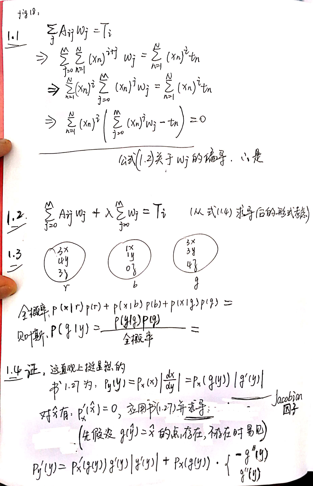

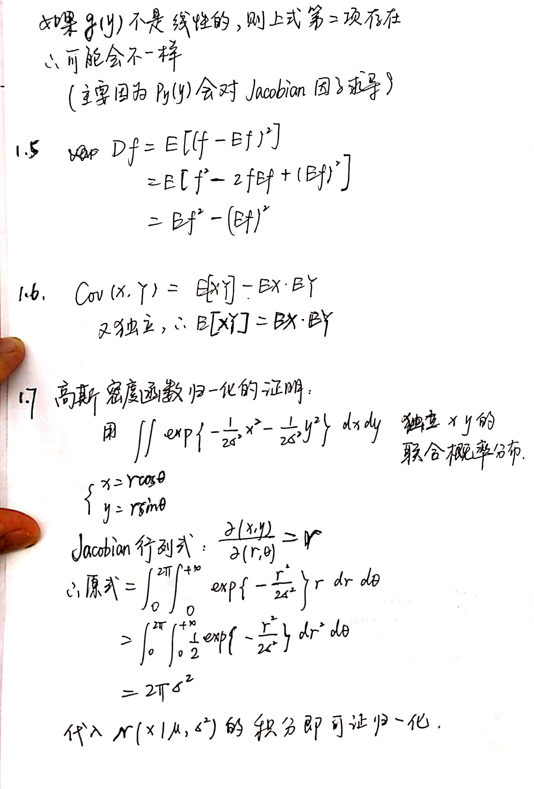

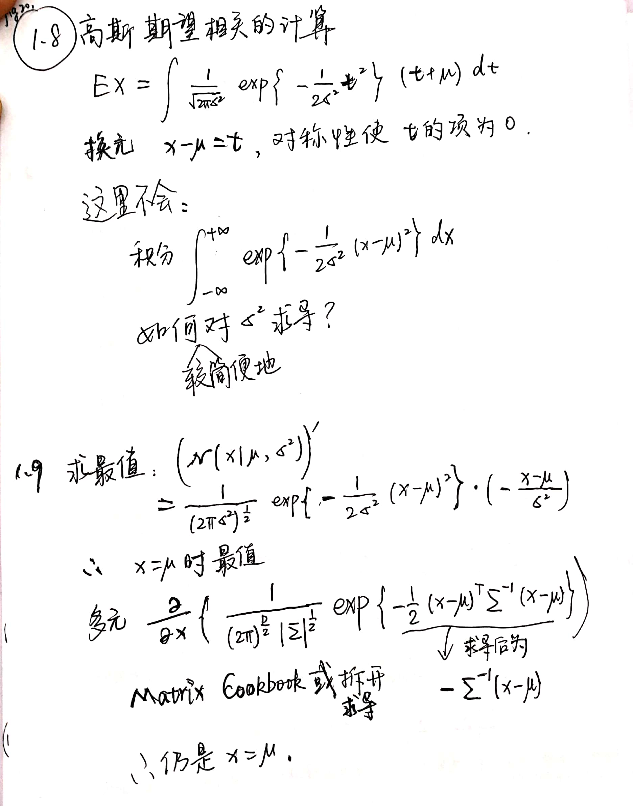

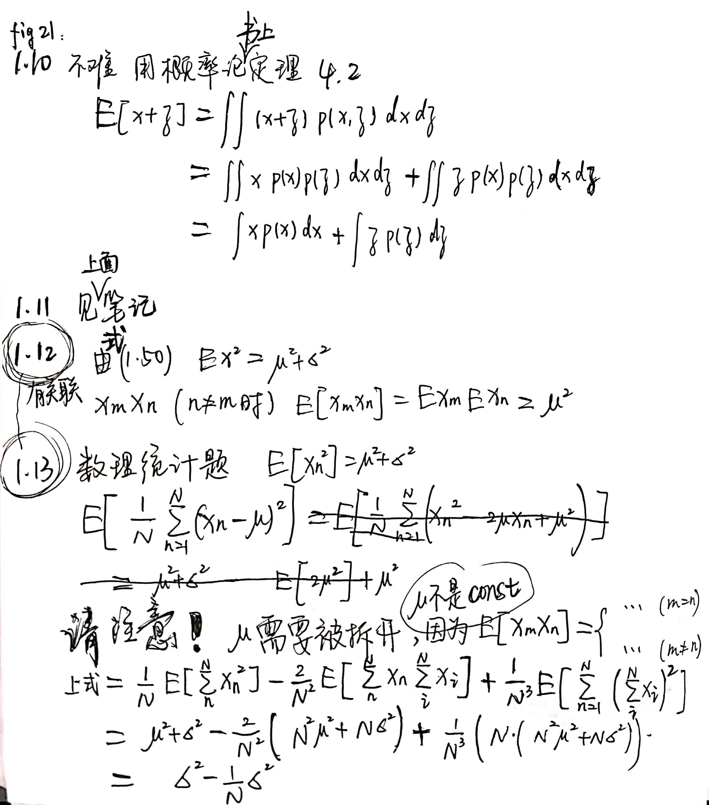

### 2 概率分布

密度估计: 在给定有限次观测 $x_1, \cdots, x_n$ 的前提下, 对随机变量的概率分布 $p(x)$ 建模.

参数分布: 少量可调节的参数控制了整个概率分布. 

+ 频率观点: 通过最优化某些准则（例如似然函数）来确定参数的具体值.

+ 贝叶斯观点: 给定观察数据, 我们引⼊参数的先验分布, 然后使⽤贝叶斯定理来计算对应后验概率分布.

  在贝叶斯估计中, 共轭先验 使 后验概率分布的函数形式与先验概率相同, 极大简化.

#### 2.1 二元变量

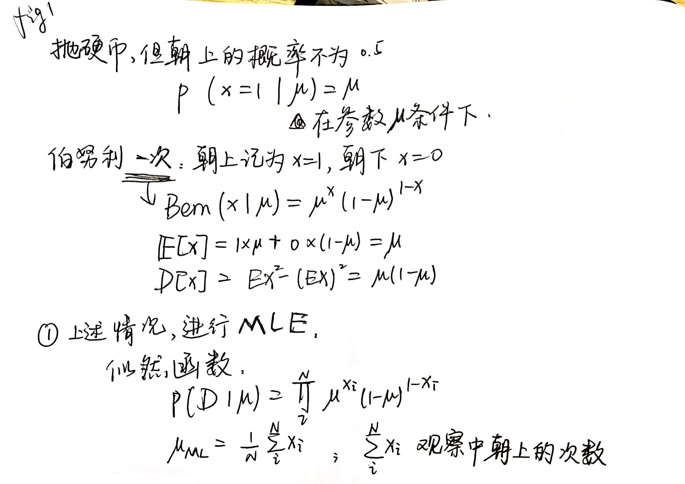

+ 上述MLE方法中, 对数似然函数只依赖 $\sum_i x_i$ 即这$N$次观察, 这个和式是这个分布下数据的充分统计量.
+ 上述 $\mu_{ML}$ 是样本均值.
+ 极大似然估计在此时可能不合理, 比如所有观察都是为正, 这样$\mu_{ML}$为1. 这是过拟合的一个极端例子.
+ 我们希望引入$\mu$的先验.

二项分布: 正面朝上的观测出现次数为 $m$ 的概率分布:
$$
\operatorname{Bin}(m \mid N, \mu)=\left(\begin{array}{l}
N \\
m
\end{array}\right) \mu^{m}(1-\mu)^{N-m}
$$

##### 2.1.1 Beta 分布

用贝叶斯观点, 引入关于 $\mu$ 的先验 $p(\mu)$.

+ 共轭先验:

  因为我们注意到似然函数是某个因子与 $\mu^x (1 - \mu)^{1 - x}$ 的乘积的形式, 如果选择一个正比于$\mu$和$1-\mu$**的幂指数**的先验分布, 那么后验分布就会有与先验分布相同的函数形式.

  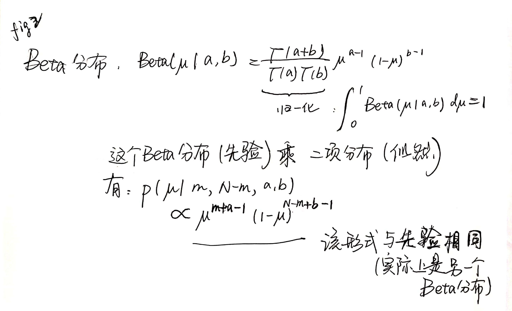

  所以选Beta分布作为先验分布:
  $$
  \operatorname{Beta}(\mu \mid a, b)=\frac{\Gamma(a+b)}{\Gamma(a) \Gamma(b)} \mu^{a-1}(1-\mu)^{b-1}
  $$

如果观测到更多的数据, 可以迭代更新:

1. 新观测值的似然函数 和 当前后验相乘 得到新的先验.
2. 新的先验归一化即获得修正后的后验分布.

上面学习过程中的 "顺序方法" 与先验和似然无关, 只取决于i.i.d.假设. MLE也可以转化为这个.

预测分布:

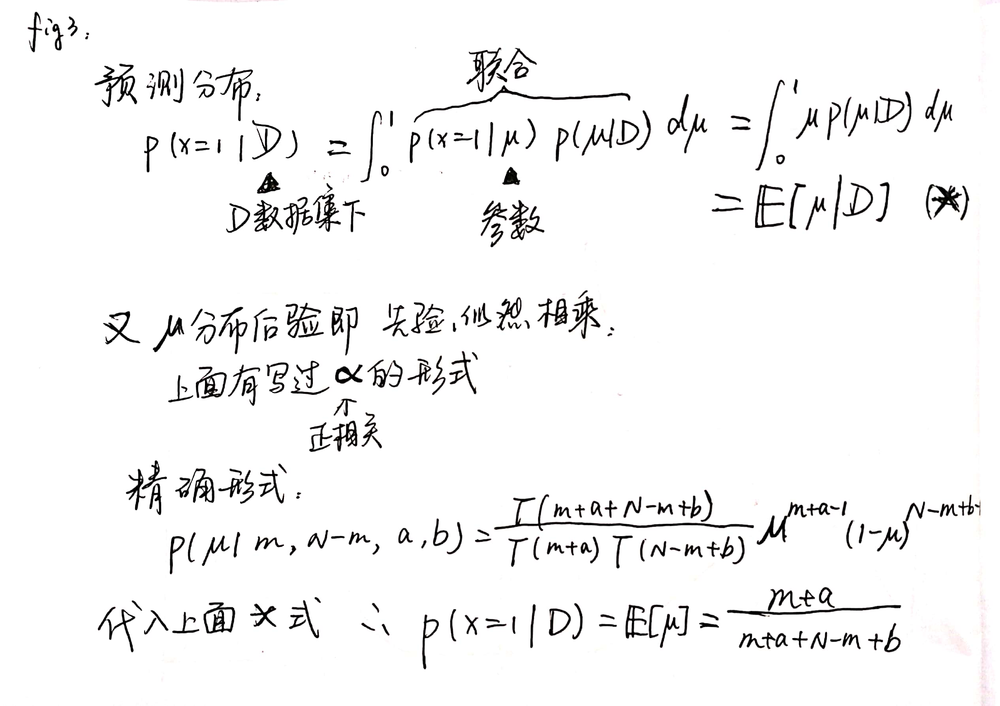

+ 贝叶斯结果和最大似然结构在数据集 $N \rightarrow + \infty$ 的情况下会趋于一致.
+ 从方差表达式中我们可以看出, 观测数据越多, 后验概率表示的不确定性会下降.

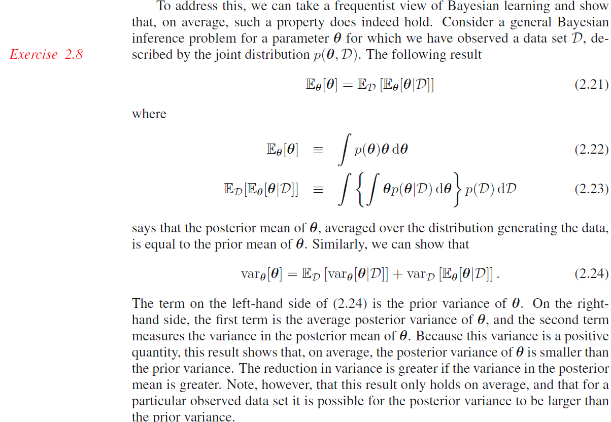

上面没懂.

#### 2.2 多项式变量

取 $k$ 个状态中的一个: 1 of $k$ 表示法: $x = (0, 1, 0, 0)^T$

$\mu_k$ 表示 $x_k = 1$ 的概率.

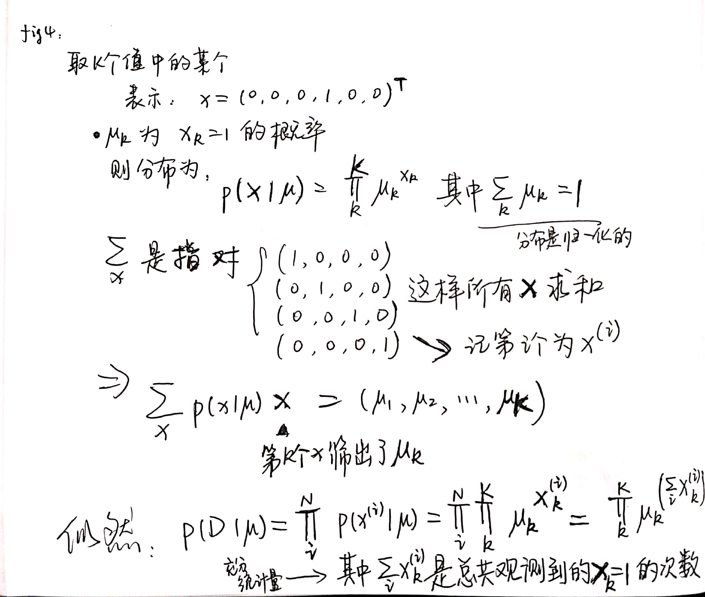 

多项式分布:
$$
\operatorname{Mult}(m_1, m_2, \cdots, m_K \mid \boldsymbol{\mu}, N)=\left(\begin{array}{c}
N \\
m_1 m_2 \dots m_K
\end{array}\right)\prod_{k = 1}^{K} \mu_k^{m_k}
$$
其中 $m_k = \sum_i x^{(i)}_k$ 表示 $N$ 次观测中 $x_k = 1$ 出现的次数, 求和 $i$ 是对所有$x$. 且有: $\sum_{k = 1}^{K} m_k = N$ (很好理解, 因为每个 $x^{(i)}$ 中就出现一个 $k$ 使 $x_k = 1$.

三个变量上的Dirichlet分布被限制在一个单纯形中(simplex).

单纯形: [https://zh.wikipedia.org/wiki/%E5%8D%95%E7%BA%AF%E5%BD%A2](https://zh.wikipedia.org/wiki/单纯形)

任何 $n+1$ 点集的非空子集的凸包定义了一个 n-单纯形.

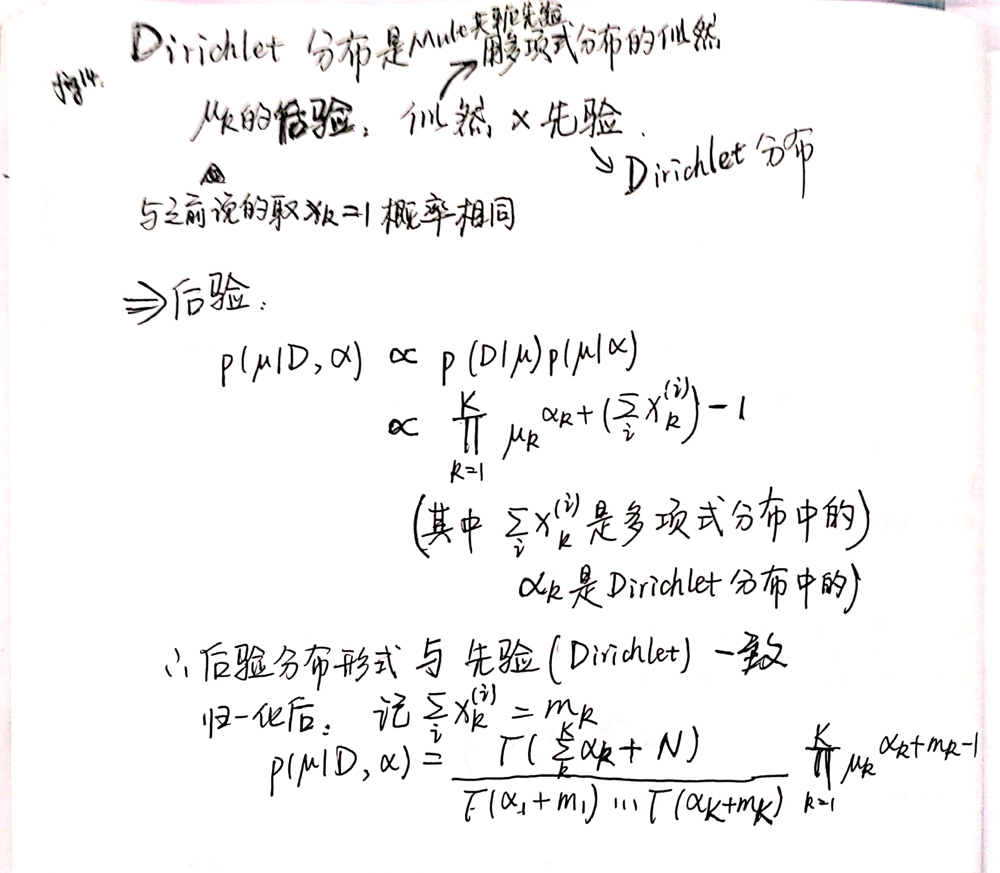

#### 2.3 高斯分布

+ 高维高斯:
  $$
  \mathcal{N}(\mathrm{x} \mid \mu, \Sigma)=\frac{1}{(2 \pi)^{D / 2}} \frac{1}{|\Sigma|^{1 / 2}} \exp \left\{-\frac{1}{2}(\mathrm{x}-\mu)^{\mathrm{T}} \Sigma^{-1}(\mathrm{x}-\mu)\right\}
  $$

+ 中心极限定理:

  ⼀组随机变量之和（当然也是随机变量）的概率分布随着和式中项的数量的增加而逐渐趋向高斯分布.

需要用以下介绍的技术熟练操作高斯分布, 下面是高维高斯几何意义:

+ 高维高斯中 $x$ 是以二次型的形式出现的:
  $$
  \Delta^2 = (\mathrm{x}-\mu)^{\mathrm{T}} \Sigma^{-1}(\mathrm{x}-\mu)
  $$
  这里 $\Delta$ 是马氏距离. (西瓜书第十章)

+ 协方差矩阵特征值分解:
  $$
  \Sigma \boldsymbol{\xi}_i = \lambda_i \boldsymbol{\xi}_i
  $$
  做一步施密特正交化:
  $$
  \boldsymbol{\xi}_i^T \boldsymbol{\xi}_j = 1(i = j) \ \ / \ \ 0 (i \neq j)
  $$

+ 用正交化 单位化后的向量表达 $\Sigma^{-1}$:
  $$
  \Sigma^{-1} = \sum_{i= 1}^D \frac{1}{\lambda_i} \xi_i\xi^T
  $$

+ 把外面的 $(x-\mu)$ 乘进去.
  $$
  \Delta^2 = \sum_{i = 1}^D \frac{\left(\boldsymbol{\xi_i^T} (\boldsymbol{x} - \boldsymbol{\mu})\right)^2}{\lambda_i}
  $$

+ 注意上面的形式, 我们定义 $y_i = \boldsymbol{\xi_i^T} (\boldsymbol{x} - \boldsymbol{\mu})$, 这里 $y_i$ 是平移和旋转过后的新坐标.

  所以有 $\boldsymbol{y} = \boldsymbol{\xi} (\boldsymbol{x} - \boldsymbol{\mu})$, 因为施密特正交化了, 所以 $\boldsymbol{\xi}$ 是一个正交阵.

+ 几何意义:

  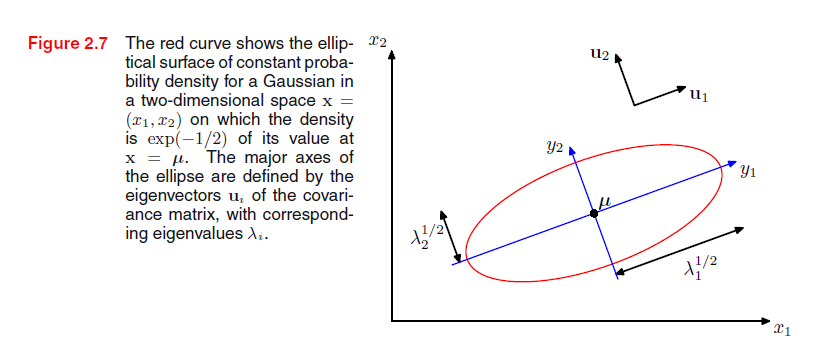
  $$
  \Delta^2 = \sum_{i = 1}^D \frac{y_i^2}{\lambda_i}
  $$
  这样的二次型如上式是一个椭球. 椭球中⼼位于 $\boldsymbol{\mu}$, 椭球的轴的方向沿着 $\boldsymbol{\xi}_i$, 沿着轴向的缩放因⼦为 $\sqrt{\lambda_i}$.

+ 证明高斯协方差矩阵是正定的:

  看概率论基础 李贤平:

  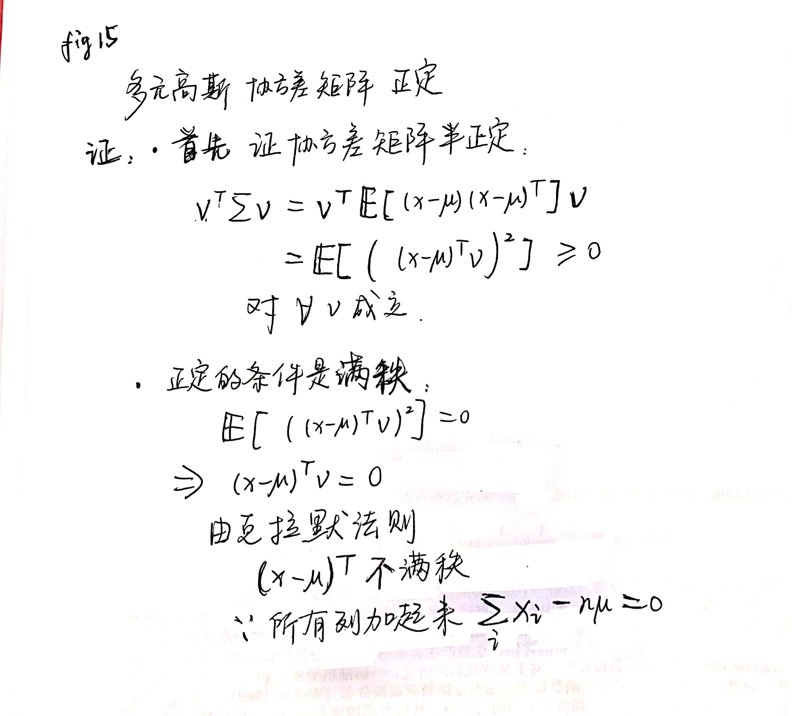
  
  上面我好像证出了高维高斯的协方差矩阵不是正定的? 为什么会这样?

有了上述正交化特征向量的分解之后:

+ $\Delta^2$ 代入, 有:
  $$
  p(\boldsymbol{y})=p(\boldsymbol{x})|\boldsymbol{J}|=\prod_{j=1}^{D} \frac{1}{\left(2 \pi \lambda_{j}\right)^{\frac{1}{2}}} \exp \left\{-\frac{y_{j}^{2}}{2 \lambda_{j}}\right\}
  $$
  特征向量定义了⼀个新的平移、旋转后的坐标系. 在这个坐标系中, 联合概率分布可以分解成独立分布的乘积.

  请注意这里的平移就是 $x - \mu$, 旋转就是左乘单位正交向量 $\xi_i^T$.

  

+ 此时推导二阶原点矩:

  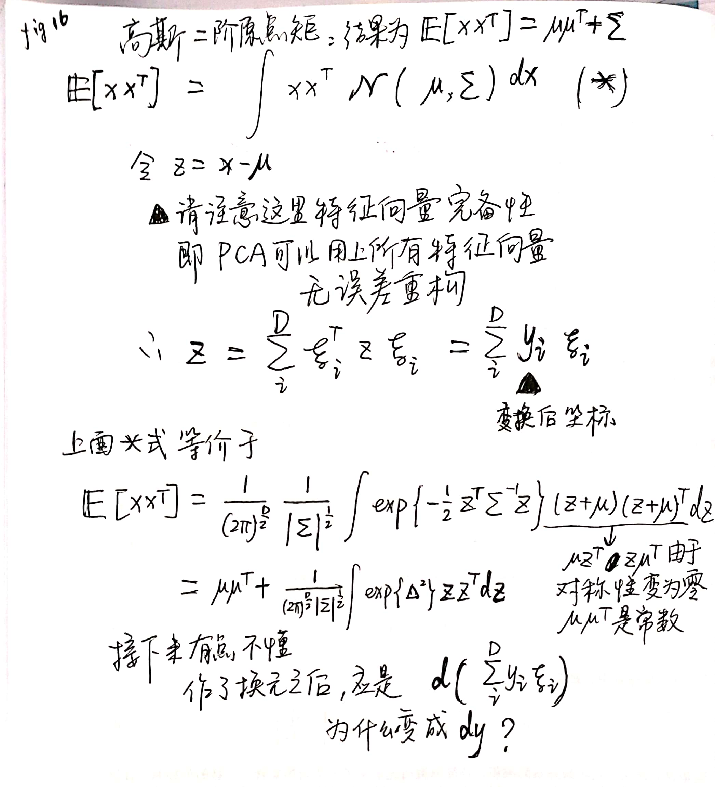

+ 由上可以很容易得到协方差: $var[\boldsymbol{x}] = \Sigma$.

+ 各向同性的协方差 (isotropic): 只有对角线有非零元素.

+ 概率图模型, 混合高斯分布, 在以后会讲.

##### 2.3.1 条件高斯分布

划分 $\boldsymbol{x}$ 的分量是允许的: $\left( x_a, x_b \right)$, 协方差矩阵也可以做相应的划分, 用协方差的逆比较方便, 协方差矩阵的逆称为精度矩阵:
$$
\Sigma^{1} = \Lambda = \left( \begin{aligned} \Lambda_{aa} \ & \ \Lambda_{ab} \\ \Lambda_{ba} \ & \ \Lambda_{bb} \end{aligned} \right)
$$
以下目的是写出 $p(x_a | x_b)$ 均值和协方差的表达式:

对于高斯分布指数次幂里面的项, 我们有:
$$
\begin{array}{l}
-\frac{1}{2}(\boldsymbol{x}-\boldsymbol{\mu})^{T} \boldsymbol{\Sigma}^{-1}(\boldsymbol{x}-\boldsymbol{\mu})= \\
-\frac{1}{2}\left(\boldsymbol{x}_{a}-\boldsymbol{\mu}_{a}\right)^{T} \boldsymbol{\Lambda}_{a a}\left(\boldsymbol{x}_{a}-\boldsymbol{\mu}_{a}\right)-\frac{1}{2}\left(\boldsymbol{x}_{a}-\boldsymbol{\mu}_{a}\right)^{T} \boldsymbol{\Lambda}_{a b}\left(\boldsymbol{x}_{b}-\boldsymbol{\mu}_{b}\right) \\
-\frac{1}{2}\left(\boldsymbol{x}_{b}-\boldsymbol{\mu}_{b}\right)^{T} \boldsymbol{\Lambda}_{b a}\left(\boldsymbol{x}_{a}-\boldsymbol{\mu}_{a}\right)-\frac{1}{2}\left(\boldsymbol{x}_{b}-\boldsymbol{\mu}_{b}\right)^{T} \boldsymbol{\Lambda}_{b b}\left(\boldsymbol{x}_{b}-\boldsymbol{\mu}_{b}\right)
\end{array}
$$

+ 一个常见的对高斯分布操作: ‘completing the square’

  注意到高斯分布指数项可以写为:
  $$
  -\frac{1}{2}(\mathrm{x}-\mu)^{\mathrm{T}} \Sigma^{-1}(\mathrm{x}-\mu)=-\frac{1}{2} \mathrm{x}^{\mathrm{T}} \Sigma^{-1} \mathrm{x}+\mathrm{x}^{\mathrm{T}} \Sigma^{-1} \mu+\mathrm{const}
  $$
  考虑 $x_a, x_b$ 表达的指数项, 把 $x_b$ 当做常数, 选出所有的 $x_a$ 的二阶项.

  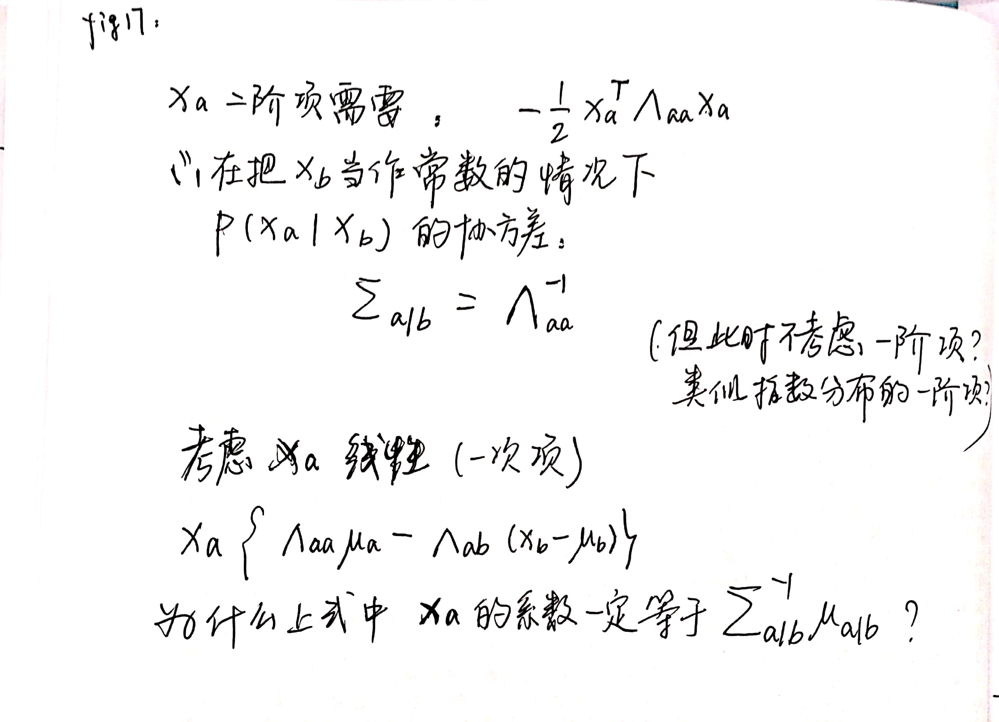

  上面的问题很简单, 只需要直接写条件分布展开就行:
  $$
  -\frac{1}{2}(x-\mu_{a|b})^{T} \Sigma_{a|b}^{-1}(x-\mu_{a|b})
  $$
  

$$
\frac{d}{dx} \int_{\alpha(x)}^{\beta(x)} f(x, y) dy \\ = \int_{\alpha(x)}^{\beta(x)} f_x' (x, y) dy + f(x, \beta(x)) \beta'(x) - f(x, \alpha(x)) \alpha'(x)
$$

##### 2.3.3 高斯变量的贝叶斯定理

向量 $x$ -> $(x_a, x_b)$, 由此得到条件概率分布 $p(x_a|x_b)$ 和边缘概率分布 $p(x_a)$ 的表达式.

## FAQ

##### 1 频率和贝叶斯视角的区别是什么?

+ 上面笔记中出现的: [跳转](#2020-7-18 jump point 1), [跳转](#2020-7-18 jump point 2)
+ 频率视角为事件本身建模, 事件频率趋于极限就是概率(或, 贝叶斯视角在先验下通过已观测的数据推断.

##### 2 信息论在以前机器学习课程中是怎么用的, 可能在哪些方面用到?

TODO

+ 机器学习/模式识别课程:
  + 决策树, 划分准则.
  + 最大熵原理.
  + 特征选择.

##### 3 什么生成式模型和判别式模型

(西瓜书148页有提到)

+ 判别式模型: 直接对 $p(y|x)$ 建模(或是直接学习从输入映射到输出的函数).
+ 生成式模型: 对 $p(y, x)$ 进行建模(比如用贝叶斯定理综合似然和先验), 再获得后验.
+ 举例略, 理解了一个方法就懂.

