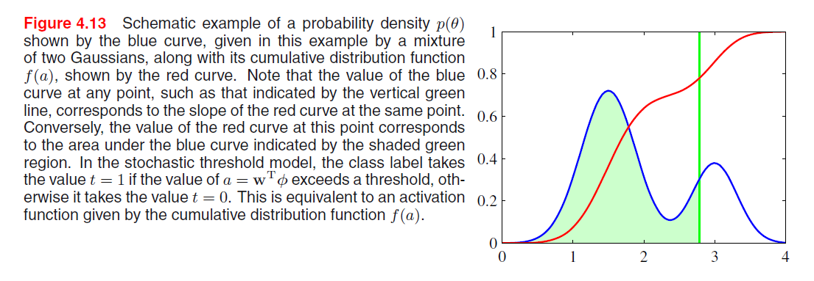

[TOC]

## 4 Linear Models for Classification

分类目标: 将输入变量$x$分到$K$个离散的类别 $\mathcal{C}_k$ 中的某一类.

输入空间被划分为不同的决策区域, 它的边界被称为决策边界/决策面. 输出用one-hot方式编码.

第一章中提出的三种方法:

+ 构造判别函数, 直接把向量$x$分到具体的类别中.
+ 推断阶段对条件概率分布 $p(\mathcal{C}_k \mid x)$ 直接建模, 然后使用该概率分布进行最优决策:
  + 直接对条件概率分布建模, 将条件概率分布表示为参数模型, 用训练集优化.
  + 生成式方法, 对类条件概率密度 $p(x \mid \mathcal{C}_k)$ 以及类先验概率分布 $p(\mathcal{C}_k)$ 建模, 然后使用贝叶斯定理计算后验.

### 4.1 判别函数

输入 $x$, 输出 $\mathcal{C}_k$.

#### 4.1.1 二分类

线性判别函数:
$$
y(\boldsymbol{x})=\boldsymbol{w}^{T} \boldsymbol{x}+w_{0}
$$
$\boldsymbol{x} \in \mathbb{R}^D$, 则 $y(\boldsymbol{x}) = 0$ 对应一个 $D - 1$ 维的超平面.

+ $\boldsymbol{w}$ 决定了决策面的方向:
  $$
  \boldsymbol{w}^{T}\left(\boldsymbol{x}_{A}-\boldsymbol{x}_{B}\right)=0
  $$

+ $w_0$ 决定了决策面的位置:
  $$
  \frac{\boldsymbol{w}^{T} \boldsymbol{x}}{\|\boldsymbol{w}\|}=-\frac{w_{0}}{\|\boldsymbol{x}\|}
  $$

+ 任意一点 $\boldsymbol{x}$ 到决策面的距离 $r$:
  $$
  \boldsymbol{x}=\boldsymbol{x}_{\perp}+r \frac{\boldsymbol{w}}{\|\boldsymbol{w}\|} \\
  r=\frac{y(\boldsymbol{x})}{\|\boldsymbol{w}\|}
  $$

#### 4.1.2 多分类

+ **第一种方法:** one-versus-one: $\frac{K(K - 1)}{2}$ 个二分类器, 但是仍然会造成无法分类的区域:

  

  

+ **第二种方法:** 引入 $K$ 类判别函数, $K$ 个, 判别属于 $\mathcal{C}_k$ 的概率.

  此时类别 $\mathcal{C}_{k}$ 和 $\mathcal{C}_{j}$ 之间的决策面为 $y_{k}(\boldsymbol{x})=y_{j}(\boldsymbol{x})$, 并且对应于一个 $(D-1)$ 维超平面, 形式为:
  $$
  \left(\boldsymbol{w}_{k}-\boldsymbol{w}_{j}\right)^{T} \boldsymbol{x}+\left(w_{k 0}-w_{j 0}\right)=0
  $$
  + 此时决策区域是单连通的, 并且是凸的.

    证明如下, $\boldsymbol{x}_A, \boldsymbol{x}_B$ 是位于决策区域 $\mathcal{R}_k$ 中任意两点, $0 \leq \lambda \leq 1$:
    $$
    \widehat{\boldsymbol{x}}=\lambda \boldsymbol{x}_{A}+(1-\lambda) \boldsymbol{x}_{B}
    $$
    其中$0 \leq \lambda \leq 1$, 根据判别函数的线性性质, 有:
    $$
    y_{k}(\widehat{\boldsymbol{x}})=\lambda y_{k}\left(\boldsymbol{x}_{A}\right)+(1-\lambda) y_{k}\left(\boldsymbol{x}_{B}\right)
    $$
    由于 $x_{A}$ 和 $x_{B}$ 位于 $\mathcal{R}_{k}$ 内部, 因此对于所有 $j \neq k$, 都有 $y_{k}\left(\boldsymbol{x}_{A}\right)>y_{j}\left(\boldsymbol{x}_{A}\right)$ 以及 $y_{k}\left(\boldsymbol{x}_{B}\right)>y_{j}\left(\boldsymbol{x}_{B}\right)$, 因此 $y_{k}(\widehat{\boldsymbol{x}})>y_{j}(\widehat{\boldsymbol{x}})$, 从而 $\hat{x}$ 也位于 $\mathcal{R}_{k}$ 内部, 即 $\mathcal{R}_{k}$ 是单连通的并且是凸的.

#### 4.1.3 用于分类的最小平方方法

沿用上述第二种方法, 每个类别 $\mathcal{C}_k$ 由自己的线性模型表述.
$$
y_{k}(\boldsymbol{x})=\boldsymbol{w}_{k}^{T} \boldsymbol{x}+w_{k 0} \\
\boldsymbol{y}(\boldsymbol{x})=\tilde{\boldsymbol{W}}^{T} \tilde{\boldsymbol{x}}
$$
如上整理成带有 $x$ 全一, 并且带有 $w_0$ 的全部矩阵表述, 同理目标输出 $t$ (注意这里目标输出就是**one-hot类型的, 属于某个类的向量**) 也整理成矩阵:
$$
E_{D}(\tilde{\boldsymbol{W}})=\frac{1}{2} \operatorname{Tr}\left\{(\tilde{\boldsymbol{X}} \tilde{\boldsymbol{W}}-\boldsymbol{T})^{T}(\tilde{\boldsymbol{X}} \tilde{\boldsymbol{W}}-\boldsymbol{T})\right\}
$$
$$
\tilde{\boldsymbol{W}}=\left(\tilde{\boldsymbol{X}}^{T} \tilde{\boldsymbol{X}}\right)^{-1} \tilde{\boldsymbol{X}}^{T} \boldsymbol{T}=\tilde{\boldsymbol{X}}^{\dagger} \boldsymbol{T}
$$
其中 $\tilde{X}^{\dagger}$ 是矩阵 $\tilde{X}$ 的伪逆矩阵, 这样得到了判别函数:
$$
y(\boldsymbol{x})=\tilde{\boldsymbol{W}}^{T} \tilde{\boldsymbol{x}}=\boldsymbol{T}^{T}\left(\tilde{\boldsymbol{X}}^{\dagger}\right)^{T} \tilde{\boldsymbol{x}}
$$

##### + 最小平方方法缺陷

对于离群点缺少鲁棒性, 与logistic回归模型比较: 

而且, 因为最小平方 对应于 高斯条件分布假设下的最大似然(在第1, 2章有证明), 但是目标向量的概率分布不是高斯分布: 

#### 4.1.4 Fisher 线性判别分析

+ 度量类别之间分开程度的方式(v1.0): 类别均值投影后的距离 $\boldsymbol{w}^T (\boldsymbol{m}_2 - \boldsymbol{m}_1)$ 尽量大, 限制 $\sum w_i^2 = 1$, 则可以用拉格朗日乘数法求解.

+ (v2.0) 仅如上分类会产生一个问题: 

  所以引入 同时让类内方差最小, 从而最小化类间的重叠.

$$
J(\boldsymbol{w})=\frac{\left(m_{2}-m_{1}\right)^{2}}{s_{1}^{2}+s_{2}^{2}}
$$
$$
J(\boldsymbol{w})=\frac{\boldsymbol{w}^{T} \boldsymbol{S}_{B} \boldsymbol{w}}{\boldsymbol{w}^{T} \boldsymbol{S}_{W} \boldsymbol{w}}
$$

$$
w \propto S_{W}^{-1}\left(m_{2}-m_{1}\right)
$$

上式即 Fisher 线性判别函数. 到这里(式(4.30)), 求解和西瓜书几乎一样呀, 上式立即给出了 $w$ 最优的投影方向.

#### 4.1.5 与最小平方的关系

对于二分类问题, Fisher准则是最小平方的一个特例. 要使用一种稍微不同的表达方法:

+ $t_n = \frac{N}{N_1}$, 如果该样本属于 $\mathcal{C}_1$. $N_1$ 是第1类中样本数量.
+ $t_n = - \frac{N}{N_2}$, 如果该样本属于 $\mathcal{C}_2$.

$$
E=\frac{1}{2} \sum_{n=1}^{N}\left(\boldsymbol{w}^{T} \boldsymbol{x}_{n}+w_{0}-t_{n}\right)^{2}
$$
令$E$关于$w_0$和$\boldsymbol{w}$的导数等于零:
$$
\begin{aligned}
\sum_{n=1}^{N}\left(\boldsymbol{w}^{T} \boldsymbol{x}_{n}+w_{0}-t_{n}\right) &=0 \\
\sum_{n=1}^{N}\left(\boldsymbol{w}^{T} \boldsymbol{x}_{n}+w_{0}-t_{n}\right) \boldsymbol{x}_{n} &=0
\end{aligned}
$$
1. 综合 $t_n$ 的表达, 得到偏置的表达式, $\boldsymbol{m}$ 为均值.
   $$
   w_{0}=-\boldsymbol{w}^{T} \boldsymbol{m}
   $$

2. 同理, 由上述第二个式子推出:
   $$
   \left(S_{W}+\frac{N_{1} N_{2}}{N} S_{B}\right) w=N\left(m_{1}-m_{2}\right)
   $$
   上式移项, 将 $\frac{N_{1} N_{2}}{N} S_{B} w$ 移到等式对面, 发现 $S_B w$ 总是在 $(m_2 - m_1)$ 的方向上:
   $$
   \boldsymbol{w} \propto \boldsymbol{S}_{W}^{-1}\left(\boldsymbol{m}_{2}-\boldsymbol{m}_{1}\right)
   $$

#### 4.1.6 多分类的Fisher判别函数

推广, 类内协方差矩阵:
$$
\begin{array}{c}
S_{W}=\sum_{k=1}^{K} S_{k} \\
S_{k}=\sum_{n \in \mathcal{C}_{k}}\left(\boldsymbol{x}_{n}-\boldsymbol{m}_{k}\right)\left(\boldsymbol{x}-\boldsymbol{m}_{k}\right)^{T} \\
\boldsymbol{m}_{k}=\frac{1}{N_{k}} \sum_{n \in \mathcal{C}_{k}} \boldsymbol{x}_{n}
\end{array}
$$

$$
S_{B}=\sum_{k=1}^{K} N_{k}\left(m_{k}-m\right)\left(m_{k}-m\right)^{T}
$$

最大化:
$$
J(\boldsymbol{W})=\operatorname{Tr}\left\{\left(\boldsymbol{W}^{T} \boldsymbol{S}_{W} \boldsymbol{W}\right)^{-1}\left(\boldsymbol{W}^{T} \boldsymbol{S}_{B} \boldsymbol{W}\right)\right\}
$$
注意, $S_B$ 是$K$个类, $K$个矩阵的和, 每个矩阵都是外积, 所以秩最大为1, 但是因为(4.44) 均值 $\boldsymbol{m}$ 的定义: $m=\frac{1}{N} \sum_{n=1}^{N} x_{n}=\frac{1}{N} \sum_{k=1}^{K} N_{k} m_{k}$, 所以最多只有 $K - 1$ 个相互独立的, 因此 $S_B$ 的秩最大是 $K - 1$.

#### 4.1.7 感知机算法

二分类线性模型:
$$
y(\boldsymbol{x}) = f(\boldsymbol{w}^T \phi(\boldsymbol{x}))
$$
$f$ 是一个分类的阶梯函数, 自变量小于0时为-1(类), 大于0为1.

+ 感知机准则:

  寻找一个权向量 $\boldsymbol{w}$ 使正类: $\boldsymbol{w}^T \phi(x) > 0$, 对于分错的, 比如是正类但是 $\boldsymbol{w}^T \phi(x) < 0$, 最小化:
  $$
  E_{P}(\boldsymbol{w})=-\sum_{n \in \mathcal{M}} \boldsymbol{w}^{T} \boldsymbol{\phi}(\boldsymbol{x}_n) t_{n}
  $$

+ 随机梯度下降作用于感知机:
  $$
  \boldsymbol{w}^{(\tau+1)}=\boldsymbol{w}^{(\tau)}-\eta \nabla E_{P}(\boldsymbol{w})=\boldsymbol{w}^{(\tau)}+\eta \boldsymbol{\phi}(\boldsymbol{x}_{n}) t_{n}
  $$
  

  从左到右, 由上 梯度下降的式子, 如果分类错误, 对于正类即 $\eta \boldsymbol{\phi}(\boldsymbol{x}_{n})$ 加到权向量 $\boldsymbol{w}$ 上.

  如上第一幅图, 黑色为 $\boldsymbol{w}$, 红色为 $\eta \boldsymbol{\phi}(\boldsymbol{x}_{n})$ ($\eta = 1$), 加上去后新的 $\boldsymbol{w}$ 见第二幅图.

  每一次更新 $\boldsymbol{w}$ 可能导致之前正确分类的向量误分类, 感知机收敛定理: 如果存在线性可分的数据, 感知机算法可以保证在有限步内找到一个精确解.

#### 4.1 回顾

+ 4.1.1: 线性判别函数二分类的基本形式.
+ 4.1.2: 二分类器用于多分类问题的两种解决方法.
+ 4.1.3: 分类输出用one-hot编码, 损失为最小平方, 得到该形式下的判别函数, 并分析这种方法为什么不鲁棒.
+ 4.1.4: Fisher, 引入类内方差最小的原因; 详细求解过程.
+ 4.1.5: 证明 对于二分类问题, Fisher准则是最小平方的一个特例. 关键是对数据真值(loss function里面的ground truth)的表达进行修改. 推导未懂.
+ 4.1.6: 多分类的Fisher判别函数.
+ 4.1.7: 感知机目标函数, 梯度下降的几何直观表述.

### 4.2 概率生成式模型

与西瓜书相似.

+ 补充:  sigmoid 的反函数, *logit* function, the log of **the ratio of** probabilities $\ln [\frac{p(\mathcal{C}_1 \mid x)}{p(\mathcal{C}_2 \mid x)}]$, 也是 log odds 函数:
  $$
  a=\ln \left(\frac{\sigma}{1-\sigma}\right)
  $$
  请注意上面的$a$是怎么来的, 是因为(4.57), $p(\mathcal{C}_1 \mid \boldsymbol{x})$ 代出来的.

#### 4.2.1 连续输入

类条件概率给高斯(注意: **假设每个类的协方差矩阵相同**), 先验直接 $p(\mathcal{C}_k)$ 表达, 二类的得到后验:
$$
\begin{array}{c}
p\left(\mathcal{C}_{1} \mid \boldsymbol{x}\right)=\sigma\left(\boldsymbol{w}^{T} \boldsymbol{x}+w_{0}\right) \\
\boldsymbol{w}=\boldsymbol{\Sigma}^{-1}\left(\boldsymbol{\mu}_{1}-\boldsymbol{\mu}_{2}\right) \\
w_{0}=-\frac{1}{2} \boldsymbol{\mu}_{1}^{T} \boldsymbol{\Sigma}^{-1} \boldsymbol{\mu}_{1}+\frac{1}{2} \boldsymbol{\mu}_{2}^{T} \boldsymbol{\Sigma}^{-1} \boldsymbol{\mu}_{2}+\ln \frac{p\left(\mathcal{C}_{1}\right)}{p\left(\mathcal{C}_{2}\right)}
\end{array}
$$
没看懂决策边界为什么在输入空间是线性的, 应该不是关于$\boldsymbol{x}$的线性函数?

先验概率只出现在偏置参数中, 所以仅平移决策边界.

#### 4.2.2 最大似然解

关于上面推出的类条件, 用MLE解出最优的参数: $\pi, \mu, \Sigma$.

因为似然函数是下面这样, 所以要给一个先验 $\pi$, 等等最大似然会解出来:
$$
p\left(\mathbf{t}, \boldsymbol{X} \mid \pi, \boldsymbol{\mu}_{1}, \boldsymbol{\mu}_{2}, \boldsymbol{\Sigma}\right)=\prod_{n=1}^{N} p(\boldsymbol{x}_n, \mathcal{C}_1)^{t_n} p(\boldsymbol{x}_n, \mathcal{C}_2)^{1 - t_n} \\ = \prod_{n=1}^{N}\left[\pi \mathcal{N}\left(\boldsymbol{x}_{n} \mid \boldsymbol{\mu}_{1}, \boldsymbol{\Sigma}\right)\right]^{t_{n}}\left[(1-\pi) \mathcal{N}\left(\boldsymbol{x}_{n} \mid \boldsymbol{\mu}_{2}, \boldsymbol{\Sigma}\right)\right]^{1-t_{n}}
$$
求解略, 不难, 得到

+ $\pi = \frac{N_1}{N_1 + N_2}$
+ $\mu_{1}=\frac{1}{N_{1}} \sum_{n=1}^{N} t_{n} x_{n}$
+ $\boldsymbol{\Sigma}$ 的.

#### 4.2.3 离散特征

考虑二元特征 $x_i \in \{ 0, \ 1\}$, 朴素贝叶斯 条件独立性假设:
$$
p\left(\boldsymbol{x} \mid \mathcal{C}_{k}\right)=\prod_{i=1}^{D} \mu_{k i}^{x_{i}}\left(1-\mu_{k i}\right)^{1-x_{i}}
$$
离散变量也有类似的结果.

#### 4.2.4 指数族分布

挺重要的.

如上, 无论是服从高斯**类条件**概率还是离散**类条件**概率,
**后验**概率密度都是由一般的线性模型和logistic sigmoid(类别数 $K = 2$)或者softmax($K > 2$)激活函数的方式给出.

类条件概率密度 $p(\boldsymbol{x} \mid \mathcal{C}_k)$ 是指数族分布的成员, 后验都是这种一般结果的特例.

TODO

#### 4.2 回顾

+ 4.2.1: 概率生成式模型角度, 假设所有类协方差相等的**高斯** 类条件概率, (由全概率公式) 式(4.57)(4.58) 得到后验.
+ 4.2.2: 上节的高斯类条件做MLE, 解出最优的参数: $\pi, \mu, \Sigma$.
+ 4.2.3: 离散变量也有类似的结果.
+ 4.2.4: 较难.

### 4.3 概率判别模型

之前已经用贝叶斯定理, 从类条件概率 -> 后验. 类条件概率分布确定形式之后, 还可以用MLE估计最优参数以及类别先验.

以上: 类条件 $p(\boldsymbol{x} \mid \mathcal{C}_k)$, 类别先验 $p(\mathcal{C}_k)$, 后验 $p(\mathcal{C}_k \mid \boldsymbol{x})$.

寻找一般线性模型的间接方法是分别寻找类条件概率密度和类别先验... (没看懂, 应该是个综述, 后面还会讲)

#### 4.3.1 固定基函数

先对 $\boldsymbol{x}$ 做一个固定的非线性变换 $\boldsymbol{\phi}(x)$, 在特征空间 $\boldsymbol{\phi}$ 中线性可分未必在原始空间中线性可分. 
恰当的非线性变换能够让后验概率在建模的过程中变得简单. 
固定基函数模型在实际应用中很关键, 虽然这限制了基函数自身根据数据进行调节.

#### 4.3.2 logistic 回归

结合西瓜书.

logistic回归是一个分类模型.

+ 后验(**生成式方法导出的**): $\sigma(a) = \sigma(\boldsymbol{w}^T \boldsymbol{\phi})$ (4.2节有说到).

+ 写似然:
  $$
  \prod_n p(\mathcal{C}_1 \mid \phi(x_n))^{t_n} \left( 1- p(\mathcal{C}_1 \mid \phi(x_n)) \right)^{1 - t_n}
  $$

+ 对似然取负对数: 交叉熵形式 (**交叉熵**就是**这样导**出来的)

+ 关于 $\boldsymbol{w}$ 取误差函数的梯度, 这里用随机梯度下降更新(使用顺序算法), 得到简单的形式:
  $$
  \nabla E(\boldsymbol{w})=\sum_{n=1}^{N}\left(y_{n}-t_{n}\right) \boldsymbol{\phi}_{n}
  $$
  

#### 4.3.3 迭代重加权最小平方

logistic回归不再有解析解, 误差函数此时可以SGD, 也可以用下面这种:

迭代方法, 基于**Newton-Raphson迭代最优化框架**:
$$
\boldsymbol{w}^{\text { new }}=\boldsymbol{w}^{\text { old }}-\boldsymbol{H}^{-1} \nabla E(\boldsymbol{w})
$$
其中 $H$ 是一个Hessian矩阵, 它的元素由 $E(w)$ 关于$w$的**二阶**导数组成, 这里 $E(w)$ 是误差函数, 在logistic中为交叉熵.

1. 如上Newton-Raphson框架应用于之前的基函数回归模型:
   $$
   \begin{aligned}
   \nabla E(\boldsymbol{w}) &=\sum_{n=1}^{N}\left(\boldsymbol{w}^{T} \boldsymbol{\phi}_{n}-t_{n}\right) \boldsymbol{\phi}_{n}=\boldsymbol{\Phi}^{T} \boldsymbol{\Phi} \boldsymbol{w}-\boldsymbol{\Phi}^{T} \mathbf{t} \\
   \boldsymbol{H} &=\nabla \nabla E(\boldsymbol{w})=\sum_{n=1}^{N} \boldsymbol{\phi}_{n} \boldsymbol{\phi}_{n}^{T}=\boldsymbol{\Phi}^{T} \boldsymbol{\Phi}
   \end{aligned}
   $$
   $\boldsymbol{\Phi}$是之前基函数回归模型的design matrix, 如下更新的形式, 请注意下面直接得出了精确解 $w^{\text{old}}$ 消去了:
   $$
   \begin{aligned}
   \boldsymbol{w}^{\text { new }} &=\boldsymbol{w}^{\text { old }}-\left(\boldsymbol{\Phi}^{T} \boldsymbol{\Phi}\right)^{-1}\left\{\boldsymbol{\Phi}^{T} \boldsymbol{\Phi} \boldsymbol{w}^{\text { old }}-\mathbf{\Phi}^{T} \mathbf{t}\right\} \\
   &=\left(\boldsymbol{\Phi}^{T} \boldsymbol{\Phi}\right)^{-1} \boldsymbol{\Phi}^{T} \mathbf{t}
   \end{aligned}
   $$

2. 用到交叉熵误差函数上:
   $$
   \begin{array}{c}
   \nabla E(\boldsymbol{w})=\sum_{n=1}^{N}\left(y_{n}-t_{n}\right) \boldsymbol{\phi}_{n}=\boldsymbol{\Phi}^{T}(\mathbf{y}-\mathbf{t}) \\
   \boldsymbol{H}=\nabla \nabla E(\boldsymbol{w})=\sum_{n=1}^{N} y_{n}\left(1-y_{n}\right) \boldsymbol{\phi}_{n} \boldsymbol{\phi}_{n}^{T}=\boldsymbol{\Phi}^{T} \boldsymbol{R} \boldsymbol{\Phi}
   \end{array}
   $$
   其中 $\boldsymbol{R}_{nn} = y_n (1 - y_n)$.
   $$
   w^{\text{new}} =\left(\boldsymbol{\Phi}^{T} \boldsymbol{R} \boldsymbol{\Phi}\right)^{-1} \boldsymbol{\Phi}^{T} \boldsymbol{R} \boldsymbol{z}
   $$

   $$
   \boldsymbol{z}=\mathbf{\Phi} \boldsymbol{w}^{\text { old }}-\boldsymbol{R}^{-1}(\boldsymbol{y}-\boldsymbol{t})
   $$
   
   如上过程, $w^{\text{old}}$ 是仍然存在的, 所以必须迭代地计算.
   
   这就是 迭代重加权最小平方 IRLS.

#### 4.3.4 多类logistic回归

推广到多类, 然后使用最大似然方法, 样本个数 $N$, 类别数 $K$:
$$
p\left(\mathcal{C}_{k} \mid \phi\right)=y_{k}(\phi)=\frac{\exp \left(a_{k}\right)}{\sum_{j} \exp \left(a_{k}\right)}
$$
不太明白这里 $a_j$ 的具体形式表达;
MLE, 先做准备工作, $y_k$ 关于 $a_j$ 求导:
$$
\frac{\partial y_{k}}{\partial a_{j}}=y_{k}\left(I_{k j}-y_{j}\right)
$$
似然函数:
$$
p\left(\boldsymbol{T} \mid \boldsymbol{w}_{1}, \ldots, \boldsymbol{w}_{K}\right)=\prod_{n=1}^{N} \prod_{k=1}^{K} p\left(\mathcal{C}_{k} \mid \boldsymbol{\phi}_{n}\right)^{t_{n k}}=\prod_{n=1}^{N} \prod_{k=1}^{K} y_{n k}^{t_{n k}}
$$
其中 $y_{nk} = y_k(\phi_n)$.

与上文套路一样, 进一步得出交叉熵:
$$
E\left(\boldsymbol{w}_{1}, \ldots, \boldsymbol{w}_{K}\right)=-\ln p\left(\boldsymbol{T} \mid \boldsymbol{w}_{1}, \ldots, \boldsymbol{w}_{K}\right)=-\sum_{n=1}^{N} \sum_{k=1}^{K} t_{n k} \ln y_{n k}
$$
接下来求梯度, 用Newton-Raphson框架求解.

#### 4.3.5 probit回归

(基于probit激活函数的一般线性线性模型)

##### + 小回顾

4.2 节说的从类条件概率 -> 后验, 对于由指数族分布描述的一大类 类条件概率分布, 最后求出的后验都是 作用在特征变量上的logistic(或者softmax)变换.

但是不是所有类条件概率都有这样的简单后验概率函数形式. (例如: 如果类条件概率密度由高斯混合模型建模).

##### + probit 回归出发点 (关于激活函数定义)

本章 回到二分类情形, 再次使用一般的线性模型框架.
$$
p( t = 1 \mid a) = f(a)
$$
其中 $a = \boldsymbol{w}^T \boldsymbol{\phi}$, $f(\cdot)$ 是激活函数: 
**如果这个激活函数是 $a > \theta$ 的时候分类到正类**, 其余情况分类到负类, 这里的**阈值 $\theta$ 从一个分布 $p(\theta)$ 中选取**.
那么在给定 $a$ 的情况下, 分类到正类概率就是: 
$$
P \{ \theta < a\} = \int_{- \infty}^a p(\theta) d\theta = p(t =1 \mid a)
$$
这就是激活函数的一种形式, 如下图: 

以下为 $p(\theta)$ 是零均值, 单位方差的高斯概率密度的例子:

激活函数(由上, 累积分布函数给出):
$$
\Phi(a)=\int_{-\infty}^{a} \mathcal{N}(\theta \mid 0,1) \mathrm{d} \theta
$$
这是 **inverse probit**函数, sigmoid形: 

计算上述函数与下面这个密切相关:
$$
\operatorname{erf}(a)=\frac{2}{\sqrt{\pi}} \int_{0}^{a} \exp \left(-\theta^{2} / 2\right) \mathrm{d} \theta
$$
这是erf/error function, 与probit函数的关系:
$$
\Phi(a)=\frac{1}{2}\left\{1+\frac{1}{\sqrt{2}} \operatorname{erf}(a)\right\}
$$

##### + 离群点/错误标记

没理解, 为什么probit激活函数是 $e^{-x^2}$ 衰减?

有一种处理错误标记点的方法: 引入目标值被错误标记的概率 $\epsilon$:
$$
\begin{aligned}
p(t \mid \boldsymbol{x}) &=(1-\epsilon) \sigma(\boldsymbol{x})+\epsilon(1-\sigma(\boldsymbol{x})) \\
&=\epsilon+(1-2 \epsilon) \sigma(\boldsymbol{x})
\end{aligned}
$$

#### 4.3.6 标准链接函数

唉, 看不懂...

#### 4.3 回顾

+ 4.3.1: 固定基函数的模型.
+ 4.3.2: logistic 回归初步, 类条件由生成式方法导出 $\sigma(a) = \sigma(\boldsymbol{w}^T \boldsymbol{\phi})$, 写似然(类条件的)然后似然函数负对数的形式导出了**交叉熵**. 这样就可以用顺序方法求解.
+ 4.3.3: Newton-Raphson迭代最优化框架, $\boldsymbol{w}^{\text { new }}=\boldsymbol{w}^{\text { old }}-\boldsymbol{H}^{-1} \nabla E(\boldsymbol{w})$, 将其用在基函数回归和交叉熵上.
+ 4.3.4: 推广到多类的logistic回归.
+ 4.3.5: probit回归, 1. 先讲带阈值的激活函数, 阈值先验为高斯则推出inverse probit函数, 与erf函数的计算相关.

### 4.4 拉普拉斯近似

为什么要说这种近似方法? 因为接下来在4.5节要讨论logistic回归的贝叶斯观点, (此时联系3.3, 3.5节的线性回归贝叶斯), logistic回归的贝叶斯(生成式方法)不能精确地关于参数向量 $\boldsymbol{x}$ 求积分. 因为后验不再是高斯.

目标是找到定义在一组连续变量上的**概率密度 $p(z)$ 的高斯近似**, (令 $p(z) = \frac{1}{Z} f(z)$, 对 $f(z)$ 操作):

1. 找 $p(z)$ 的众数, 即寻找一个点 $z_0$, 使 $p'(z_0) = 0$. 这也是 $f(\cdot)$ 的.

2. 考虑 $\ln f(z)$ 在**一阶导为0**的泰勒展开:
   $$
   \ln f(z) \simeq \ln f\left(z_{0}\right)-\frac{1}{2} A\left(z-z_{0}\right)^{2}
   $$
   其中:
   $$
   A=-\left.\frac{\mathrm{d}^{2}}{\mathrm{d} z^{2}} \ln f(z)\right|_{z=z_{0}}
   $$
   用 $\ln$ 在驻点展开的值去估计实际的值, 然后在两边取 $e$ 还原一下:

3. 两边取 $e$:
   $$
   f(z) \simeq f\left(z_{0}\right) \exp \left\{-\frac{A}{2}\left(z-z_{0}\right)^{2}\right\}
   $$

4. 最后做一个归一化, 高斯近似 $q(z)$:
   $$
   q(z)=\left(\frac{A}{2 \pi}\right)^{\frac{1}{2}} \exp \left\{-\frac{A}{2}\left(z-z_{0}\right)^{2}\right\}
   $$

注意上式在$A>0$才是良好定义的高斯, 所以 $z_0$ 是一个极大值点.

关键就是在对 $\ln f(z_0)$ 进行泰勒展开.

##### **推广到高维**, 同理高斯变成高维高斯:

$$
\ln f(\boldsymbol{z}) \simeq \ln f\left(\boldsymbol{z}_{0}\right)-\frac{1}{2}\left(\boldsymbol{z}-\boldsymbol{z}_{0}\right)^{T} \boldsymbol{A}\left(\boldsymbol{z}-\boldsymbol{z}_{0}\right) \\
\boldsymbol{A}=-\left.\nabla \nabla \ln f(\boldsymbol{z})\right|_{\boldsymbol{z}=\boldsymbol{z}_{0}}
$$

$$
f(\boldsymbol{z}) \simeq f\left(\boldsymbol{z}_{0}\right) \exp \left\{-\frac{1}{2}\left(\boldsymbol{z}-\boldsymbol{z}_{0}\right)^{T} \boldsymbol{A}\left(\boldsymbol{z}-\boldsymbol{z}_{0}\right)\right\}
$$
归一化后:
$$
q(\boldsymbol{z})=\frac{|\boldsymbol{A}|^{\frac{1}{2}}}{(2 \pi)^{\frac{M}{2}}} \exp \left\{-\frac{1}{2}\left(\boldsymbol{z}-\boldsymbol{z}_{0}\right)^{T} \boldsymbol{A}\left(\boldsymbol{z}-\boldsymbol{z}_{0}\right)\right\}=\mathcal{N}\left(\boldsymbol{z} \mid \boldsymbol{z}_{0}, \boldsymbol{A}^{-1}\right)
$$
良定义的前提是 $\boldsymbol{A}$ 是正定的.

+ 实际中, 众数$z_0$通常通过运行某种形式的数值最优化算法得到.
+ 缺陷: 拉普拉斯近似以高斯分布为基础, 因此只能应用于实值变量. 其他情况要先对变量做变换.

#### 4.4.1 模型比较和BIC

~~似乎是比较多且难的内容?~~ 关键在: 用上述拉普拉斯近似中归一化常数的结果$Z = \cdots$, 然后令$Z = p\left(\mathcal{D} \mid \mathcal{M}_{i}\right)$, 对模型证据进行估计.

通过对上述归一化常数 $Z = p\left(\mathcal{D} \mid \mathcal{M}_{i}\right)$, 尝试对模型证据进行近似(结合3.4节), 由贝叶斯定理, 模型证据:
$$
p\left(\mathcal{D} \mid \mathcal{M}_{i}\right)=\int p\left(\mathcal{D} \mid \boldsymbol{\theta}, \mathcal{M}_{i}\right) p\left(\boldsymbol{w} \mid \mathcal{M}_{i}\right) \mathrm{d} \boldsymbol{\theta}
$$
接下来结合 $q(z)$ 归一化后的式子, 直接写出:
$$
\begin{aligned}
Z &=\int f(\boldsymbol{z}) \mathrm{d} \boldsymbol{z} \\
& \simeq f\left(\boldsymbol{z}_{0}\right) \int \exp \left\{-\frac{1}{2}\left(\boldsymbol{z}-\boldsymbol{z}_{0}\right)^{T} \boldsymbol{A}\left(\boldsymbol{z}-\boldsymbol{z}_{0}\right)\right\} \mathrm{d} \boldsymbol{z} \\
&=f\left(\boldsymbol{z}_{0}\right) \frac{(2 \pi)^{\frac{M}{2}}}{|\boldsymbol{A}|^{\frac{1}{2}}}
\end{aligned}
$$
令 $f(\boldsymbol{z_0})=p(\mathcal{D} \mid \boldsymbol{z_0}) p(\boldsymbol{z_0})$ 代入上式, $z_0$ 为 $\boldsymbol{\theta}_{MAP}$ 后验概率分布众数的位置, 得到对模型证据的估计:
$$
\ln p(\mathcal{D} \mid \boldsymbol{\mathcal{M}}_i) \simeq \ln p\left(\mathcal{D} \mid \boldsymbol{\theta}_{\mathrm{MAP}}\right)+\underbrace{\ln p\left(\boldsymbol{\theta}_{\mathrm{MAP}}\right)+\frac{M}{2} \ln (2 \pi)-\frac{1}{2} \ln |\mathbf{A}|}_{\text {Occam factor }}
$$

##### + BIC 贝叶斯信息准则 (Schwarz准则)

? 有点不懂.

如果我们假设参数的高斯先验分布比较宽, 且Hessian矩阵是满秩的, 那么我们可以使用下式来非常粗略地近似公式:
$$
\ln p(\mathcal{D}) \simeq \ln p\left(\mathcal{D} \mid \boldsymbol{\theta}_{M A P}\right)-\frac{1}{2} M \ln N
$$
这个信息准则对模型的惩罚更严重.

#### 4.4 回顾

+ 拉普拉斯近似方法: logistic回归的贝叶斯(生成式方法)不能精确地关于参数向量 $\boldsymbol{x}$ 求积分. 因为后验不再是高斯.

  找众数, 泰勒暴展, 两边取$e$, 高斯归一化.

+ 4.4.1: 拉普拉斯对模型证据进行估计.

### 4.5 贝叶斯logistic回归

做了这么多准备工作, 主角登场.

出发点, 为什么要这么做: logistic回归中不能精确地贝叶斯推断, 因为计算后验要对 先验和似然的乘积 进行归一化, 但是似然函数本身由一系列logistic sigmoid函数的乘积组成, 每个数据点都有一个logistic sigmoid函数. 对于预测分布的计算类似地也无法处理.

#### 4.5.1 拉普拉斯近似

1. 找后验的众数.
2. 找众数的高斯 (加$\ln$, 在众数处展开).

需要计算二阶导($\ln$ 展开时), 等价于计算Hessian矩阵.

对logistic回归做拉普拉斯近似: **同样的讨论, 按步骤来**:

+ 找后验的众数, 但是后验是什么呢:
  $$
  p(\boldsymbol{w} \mid \mathbf{t}) \propto p(\boldsymbol{w}) p(\mathbf{t} \mid \boldsymbol{w})
  $$
  所以要先给一个先验 $p(\boldsymbol{w})$, 并给出 $p(\mathbf{t} \mid \boldsymbol{w})$ 似然:

  + **先验**给高斯:
    $$
    p(\boldsymbol{w})=\mathcal{N}\left(\boldsymbol{w} \mid \boldsymbol{m}_{0}, \boldsymbol{S}_{0}\right)
    $$

  + logistic回归的**似然** $p(\mathbf{t} \mid \boldsymbol{w})$ 前面给过了(4.3.2):
    $$
    \prod_n p(\mathcal{C}_1 \mid \phi(x_n))^{t_n} \left( 1- p(\mathcal{C}_1 \mid \phi(x_n)) \right)^{1 - t_n}
    $$

+ 取 $\ln$, 此时令 $y_n = p(\mathcal{C}_1 \mid \phi(x_n)) = \sigma (\boldsymbol{w}^T \boldsymbol{\phi}_n)$:
  $$
  \begin{aligned}
  \ln p(\boldsymbol{w} \mid \mathbf{t}) &=-\frac{1}{2}\left(\boldsymbol{w}-\boldsymbol{m}_{0}\right)^{T} \boldsymbol{S}_{0}^{-1}\left(\boldsymbol{w}-\boldsymbol{m}_{0}\right) \\
  &+\sum_{n=1}^{N}\left\{t_{n} \ln y_{n}+\left(1-t_{n}\right) \ln \left(1-y_{n}\right)\right\}+ const
  \end{aligned}
  $$

+ 这样我们就得到了后验, 接下来找众数, 就是最大后验估计, 得到的解 $\boldsymbol{w}_{MAP}$ 定义了近似的高斯分布的均值. 协方差的逆为二阶导数矩阵: (这里似乎和(4.134)的过程是全一致的)
  $$
  \boldsymbol{S}_{N}^{-1}=-\nabla \nabla \ln p(\boldsymbol{w} \mid \mathbf{t})=S_{0}^{-1}+\sum_{n=1}^{N} y_{n}\left(1-y_{n}\right) \boldsymbol{\phi}_{n} \boldsymbol{\phi}_{n}^{T}
  $$
  高斯近似:
  $$
  q(\boldsymbol{w})=\mathcal{N}\left(\boldsymbol{w} \mid \boldsymbol{w}_{M A P}, \boldsymbol{S}_{N}\right)
  $$
  

#### 4.5.2 预测分布

关于上面的后验概率分布的高斯近似 求积分来进行预测.

### 4.6 练习

