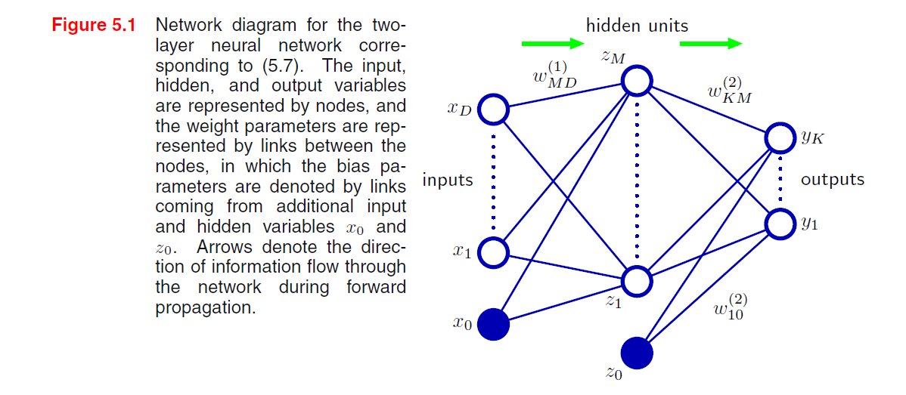
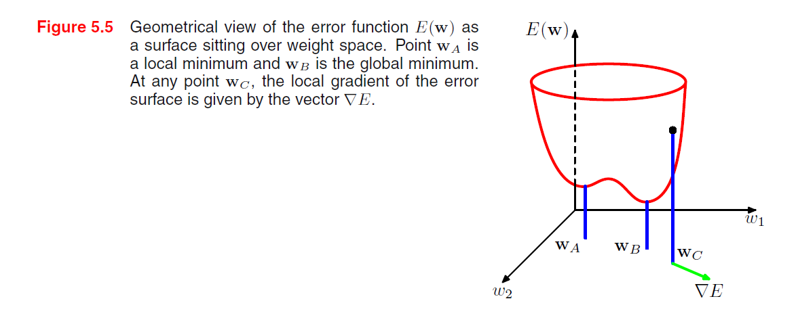
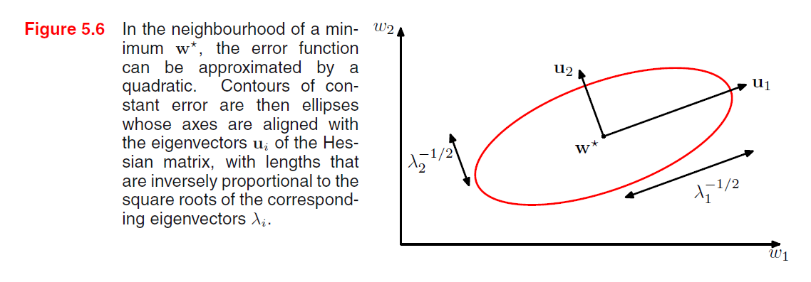

[TOC]

## 5 Neural Network

加入根据数据调节基函数. 可以固定基函数的数量, 但是基函数可调节. 非线性最优化问题的解.

### 5.1 前馈神经网络

前向传播:
$$
y_{k}(\boldsymbol{x}, \boldsymbol{w})=\sigma\left(\sum_{j=1}^{M} w_{k j}^{(2)} h\left(\sum_{i=1}^{D} w_{j i}^{(1)} x_{i}+w_{j 0}^{(1)}\right)+w_{k 0}^{(2)}\right)
$$
$w$ 的上标对应于网络的第几层. $D$ 就是第一层神经元个数, $M$ 是第二层, 得到的 $y_k$ 是第三层. $h(\cdot)$ 一般是非线性函数.

每层线性组合完 套一个激活函数, 激活函数输出在套一个线性组合. 依次类推.

+ 神经网络在hidden layer使用的是连续的sigmoid非线性函数, 但是感知机使用阶梯函数.

隐含层神经元数量 $<$ 输入神经元数量: 维度降低造成了信息损失.

神经网络的另一个扩展: 引入跨层链接, 每个跨层链接都对应一个可调节参数. 有sigmoid隐含神经元的网络总能模拟跨层链接: 足够小的第一层权值(使隐含层单元是线性的) + 隐层到输出足够大进行补偿.

#### 5.1.1 权空间对称性

对多个不同的权向量 $w$ 的选择, 网络可能产生同样的从输入到输出的映射函数.

对于 $M$ 个隐层结点, 都会有$M$个这样的"符号改变"对称性, 任何给定的权向量都是 $2^M$ 个等价的权向量中的一个. 任何给定的权向量都属于这种交换对称性产生的$M!$个等价的权向量中的一个, 它对应于$M!$个不同的隐层单元的顺序, 于是网络有一个整体的全空间对称性因子 $M! 2^M$.

#### 5.2 网络训练

神经网络就是 从输入变量 $x$ 到输出变量 $y$ 的参数化非线性函数中的一大类.

假设一元目标变量 $t$ 服从高斯分布:
$$
p(t \mid \boldsymbol{x}, \boldsymbol{w})=\mathcal{N}\left(t \mid y(\boldsymbol{x}, \boldsymbol{w}), \beta^{-1}\right)
$$
似然函数取负对数, 有:
$$
\frac{\beta}{2} \sum_{n=1}^{N}\left\{y(\boldsymbol{x}, \boldsymbol{w})-t_{n}\right\}^{2}-\frac{N}{2} \ln \beta+\frac{N}{2} \ln (2 \pi)
$$
在回归问题中, 我们可以把神经网络看成具有一个恒等输出激活函数的模型, 对于分类问题, 使用交叉熵误差函数而不是平方和误差函数, 会使训练速度更快, 同时提升泛化性能.

上图, 神经网络第一层的权向量由各个输出所共享. 神经网络不同的输出之间共享特征可以节省计算量, 同时也提升了泛化能力.

##### 5.2.1 参数最优化

考虑寻找能使选定的误差函数 $E(w)$ 达到最小值的权向量 $w$. 注意这里 $E(w)$ 是光滑的连续函数, 也就是梯度下降那一套: 
$$
\delta E \simeq \delta {w}^{\mathrm{T}} \nabla E({w}) \\
to: \nabla E({w})=0
$$
梯度为0的点: 驻点, 进一步分为极大/小值点, 鞍点.

问题是: 误差函数通常与权值和偏置参数的关系是高度非线性的, 也就是说权值空间中会有很多梯度为零的点. 即 global minimum / local minima.

迭代的优化方法:
$$
{w}^{(\tau+1)}={w}^{(\tau)}+\Delta {w}^{(\tau)}
$$
不同算法涉及到 $\Delta \mathbf{w}^{(\tau)}$ **的不同选择.**

##### 5.2.2 局部二次近似

考虑误差函数基于泰勒展开的局部近似. $E(w)$ 在权值空间某点 $\widehat{\boldsymbol{w}}$ 处的泰勒展开:
$$
E(\boldsymbol{w}) \simeq E(\widehat{\boldsymbol{w}})+(\boldsymbol{w}-\widehat{\boldsymbol{w}})^{T} \boldsymbol{b}+\frac{1}{2}(\boldsymbol{w}-\widehat{\boldsymbol{w}})^{T} \boldsymbol{H}(\boldsymbol{w}-\widehat{\boldsymbol{w}})
$$
其中立方项和更高阶的项已经被省略掉了, 这里 $b$ 被定义为 $E$ 的梯度在 $\widehat{\boldsymbol{w}}$ 处的值:
$$
\left.b \equiv \nabla E\right|_{w=\widehat{w}}
$$
Hessian矩阵 $\boldsymbol{H}=\nabla \nabla E$ 的元素为:
$$
\left.(\boldsymbol{H})_{i j} \equiv \frac{\partial E}{\partial w_{i} \partial w_{j}}\right|_{w=\widehat{w}}
$$
在回归问题中, 把神经网络看成一个恒等输出激活函数的模型, $y_k = a_k$, 平方和误差函数有: $\frac{\partial E}{\partial a_{k}}=y_{k}-t_{k}$, **梯度的局部近似为:**
$$
\nabla E \simeq b+H(w-\widehat{w})
$$

+ 考虑在 $w^*$ 处的近似, 此时 $\nabla E = 0$:
  $$
  E(\boldsymbol{w}) \simeq E(\widehat{\boldsymbol{w}})+\frac{1}{2}(\boldsymbol{w}-{\boldsymbol{w}^*})^{T} \boldsymbol{H}(\boldsymbol{w}-{\boldsymbol{w}^*})
  $$

+ 以下证: $\boldsymbol{H}$ 是正定的.

  特征值分解, 分解后的特征向量构成了完备的单位正交集合.

  从正定的定义出发, $\boldsymbol{x}^T\boldsymbol{H}\boldsymbol{x} > 0$, 将 $\boldsymbol{x}$ 用特征向量表出, 代入 $\boldsymbol{x}^T\boldsymbol{H}\boldsymbol{x}$ 即可.

由上知道, $\boldsymbol{H}$ 的特征值都为正, 并且在特征向量构成的坐标系中, 二次型, 所以 $E = const$ 的轮廓线: 

对于一维权值空间, 驻点 $\boldsymbol{w}^*$ 满足如下时取最小值:
$$
\left.\frac{\partial^{2} E}{\partial w^{2}}\right|_{\boldsymbol{w}^{*}}>0
$$

##### 5.2.3 使用梯度信息

梯度下降法是一个较差的算法, 改进: 一个在线的版本, 顺序梯度下降/随机梯度下降. 权值更新每次值依赖于一个数据点:
$$
\boldsymbol{w}^{(\tau+1)}=\boldsymbol{w}^{(\tau)}-\eta \nabla E_{n}\left(\boldsymbol{w}^{(\tau)}\right)
$$
这个更新在数据集上循环重复进⾏, 并且既可以顺序地处理数据, 也可以随机地有重复地选择数据点. 当然也有折中的⽅法, 即每次更新依赖于数据点的⼀⼩部分.

如上在线方法的优点是: 更高效地处理数据中的冗余性.

#### 5.3 误差反向传播

1. 计算误差函数关于权值的导数.
2. 使用计算的导数调整权值.

##### 5.3.1 误差函数导数的计算

以单隐层 sigmoid, 平方和误差函数为例:

最简单的结果: $y_{n k}=y_{k}\left(\boldsymbol{x}_{n}, \boldsymbol{w}\right)$. 这个误差函数关于一个权值 $w_{j i}$ 的梯度为:
$$
\frac{\partial E_{n}}{\partial w_{j i}}=\left(y_{n j}-t_{n j}\right) x_{n i}
$$
更复杂的: 每个单元会计算输入的一个加权和, 然后经过非线性函数激活:
$$
z_j = h(a_{j})=h\left(\sum_{i} w_{j i} z_{i}\right)
$$
结合上式, 应用chain rule:
$$
\frac{\partial E_{n}}{\partial w_{j i}}=\frac{\partial E_{n}}{\partial a_{j}} \frac{\partial a_{j}}{\partial w_{j i}}
$$
这里 $\delta_{j} = \frac{\partial E_{n}}{\partial a_{j}}$ 被记为误差(error), 反向传播:
$$
\delta_{j}=h^{\prime}\left(a_{j}\right) \sum_{k} w_{k j} \delta_{k}
$$

##### 5.3.2 一个简单的例子

##### 5.3.3 反向传播的效率

| 周次 | 教学内容                                                     |
| ---- | ------------------------------------------------------------ |
| 1    | Introduction： Methods of elementary integrations            |
| 2    | Central motions and Kepler's Law                             |
| 3    | Existence and uniqueness of ODEs： Picard-Lindel\"{o}f Theorem |
| 4    | Extensibility of solutions                                   |
| 5    | Some applications                                            |
| 6    | Linear systems：Matrix exponential； First-order autonomous linear systems |
| 7    | High order autonomous linear equations； The Tacoma Narrows bridge |
| 8    | First order nonautonomous linear equations                   |
| 9    | Nonhomogeneous case                                          |
| 10   | High order nonautonomous linear equations                    |
| 11   | Volterra-Lotka system                                        |
| 12   | Analysis of equilibrium points                               |
| 13   | Lyapunov methods                                             |
| 14   | First-order linear equations with periodic coefficients      |
| 15   | Topology of trajectories： Positively invariant set；$\omega$ limit set of a trajectory |
| 16   | Ponicar\'{e}-Bendixson theorem（optional）                   |
| 17   | Index theorem in the plane（optional）                       |