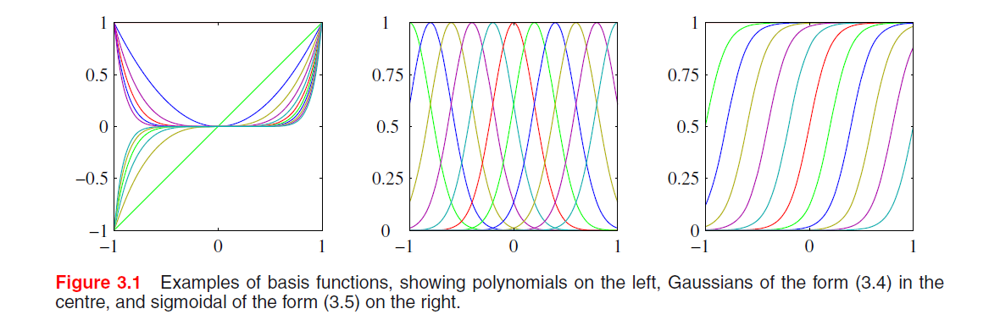
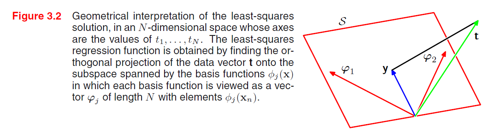
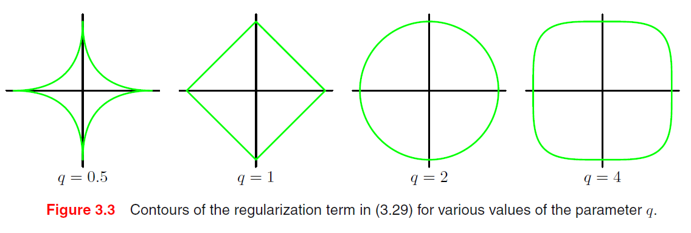
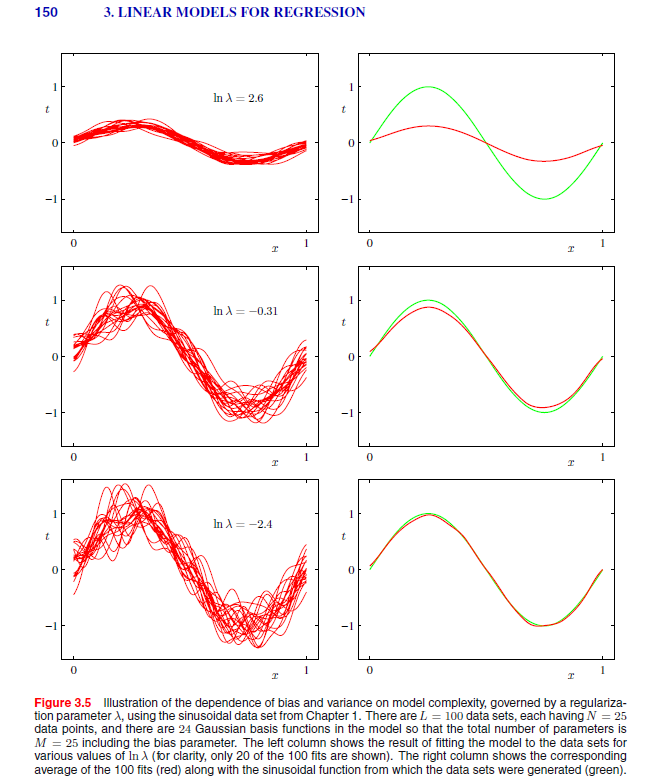
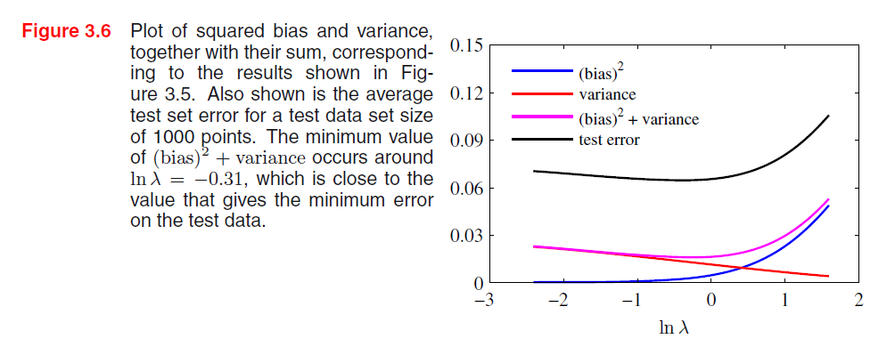
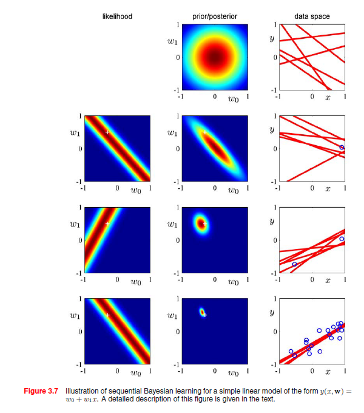
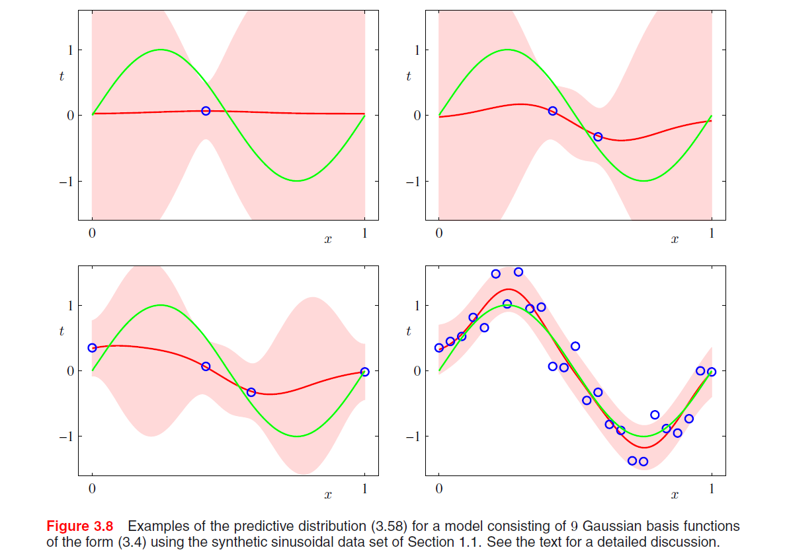
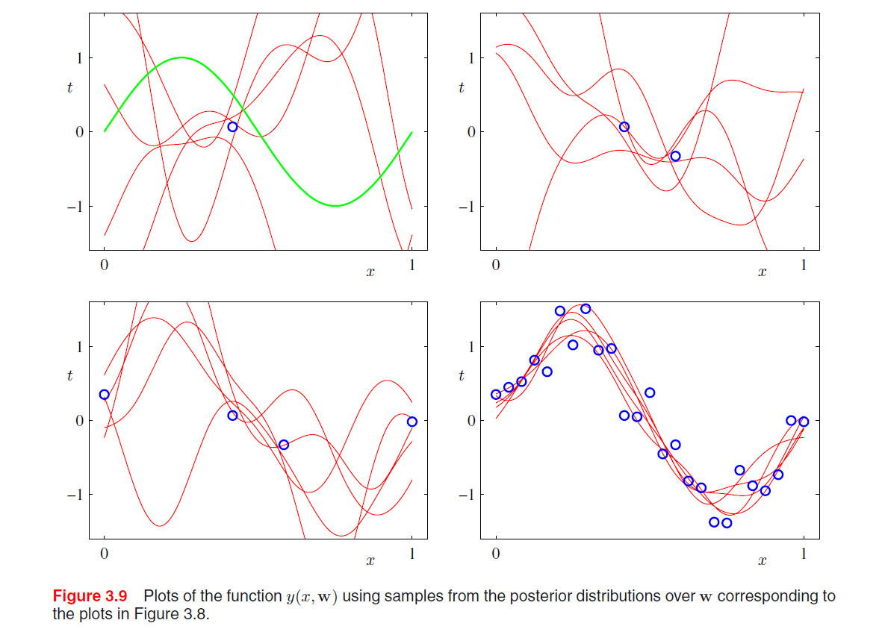
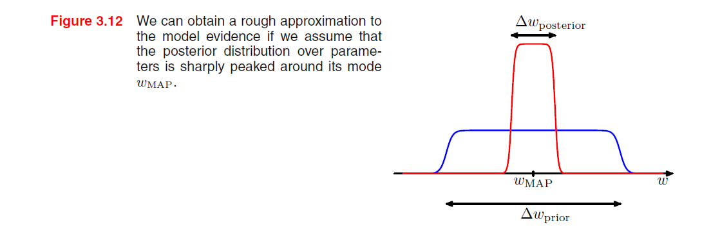
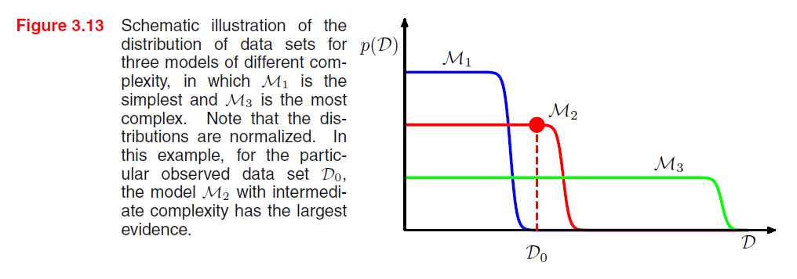

[TOC]

## 3 Linear Models for Regression

回归问题的目标: 在给定 $D$ 维输入变量 $x$ (input)的情况下, 预测一个或多个连续目标变量 $t$ (target)的值.

### 3.1 线性基函数模型

$$
y(\boldsymbol{x}, \boldsymbol{w})=w_{0}+\sum_{j=1}^{M-1} w_{j} \phi_{j}(\boldsymbol{x}) = \sum_{j=0}^{M-1} w_{j} \phi_{j}(\boldsymbol{x})=\boldsymbol{w}^{T} \boldsymbol{\phi}(\boldsymbol{x})
$$

其中令 $\phi_0(\boldsymbol{x}) = 1$, $w_0$ 是bias.

基函数(basis function) $\phi_{j}(\boldsymbol{x})$: 输入变量$\boldsymbol{x}$的非线性函数. 请注意这里模型是参数$w$的线性函数(这极大简化了对模型的分析), 但同时关于输入变量是非线性的.

基函数的选择, 还可以有傅里叶基函数(?wavelets):


#### 3.1.1 最大似然与最小平方

**维度表达:** $\boldsymbol{x} \in \mathbb{R}^M$, $| \mathcal{D} | = N$, $\boldsymbol{x}_n \in \mathcal{D}$ 表示第$n$个数据, $\phi_j(\boldsymbol{x}_n)$ 表示对 $\boldsymbol{x}_n$ 的第$j$个分量经过基函数.

##### 0 平方误差

$$
E_{D}(\boldsymbol{w})=\frac{1}{2} \sum_{n=1}^{N}\left\{t_{n}-w_{0}-\sum_{j=1}^{M-1} w_{j} \phi_{j}\left(\boldsymbol{x}_{n}\right)\right\}^{2} =\frac{1}{2} \sum_{n=1}^{N}\left\{t_{n}-\boldsymbol{w}^{T} \boldsymbol{\phi}\left(\boldsymbol{x}_{n}\right)\right\}^{2}
$$

##### 1 $\boldsymbol{w}_{ML}$ 求解

如上, 给输出 $y(\boldsymbol{x}, \boldsymbol{w})$ 附加高斯噪声 $\epsilon$ (零均值, 精度(方差倒数)为$\beta$), 此时后验为:
$$
p(target \mid \boldsymbol{x}, \boldsymbol{w}, \beta)=\mathcal{N}\left(target \mid y(\boldsymbol{x}, \boldsymbol{w}), \beta^{-1}\right)
$$
极大似然估计, 关于 $w$ 求偏导后为0, 得到:
$$
\begin{array}{c}0=\sum_{n=1}^{N} t_{n} \phi\left(\boldsymbol{x}_{n}\right)^{T}-\boldsymbol{w}^{T}\left(\sum_{n=1}^{N} \phi\left(\boldsymbol{x}_{n}\right) {\phi}\left(\boldsymbol{x}_{n}\right)^{T}\right) \\ \text{normal equation: } \boldsymbol{w}_{M L}=\left(\boldsymbol{\Phi}^{T} \boldsymbol{\Phi}\right)^{-1} \boldsymbol{\Phi}^{T} \mathbf{t}\end{array}
$$
其中design matrix $\boldsymbol{\Phi} \in \mathbb{R}^{N \times M}$:
$$
\boldsymbol{\Phi}=\left(\begin{array}{cccc}\phi_{0}\left(\boldsymbol{x}_{1}\right) & \phi_{1}\left(\boldsymbol{x}_{1}\right) & \cdots & \phi_{M-1}\left(\boldsymbol{x}_{1}\right) \\\phi_{0}\left(\boldsymbol{x}_{2}\right) & \phi_{1}\left(\boldsymbol{x}_{2}\right) & \cdots & \phi_{M-1}\left(\boldsymbol{x}_{2}\right) \\\vdots & \vdots & \ddots & \vdots \\\phi_{0}\left(\boldsymbol{x}_{N}\right) & \phi_{1}\left(\boldsymbol{x}_{N}\right) & \cdots & \phi_{M-1}\left(\boldsymbol{x}_{N}\right)\end{array}\right)
$$

##### **代码实现**

在实现时, $\boldsymbol{\Phi}$ 中的每一个高斯基函数均值是 a~b 相同间隔的数, 就是直接输入数据的 $x$ 对应的高斯.

```python
def fit(self, X:np.ndarray, t:np.ndarray):
    # 3.17 MLE的 w = 伪逆(\Phi) @ t
    self.w = np.linalg.pinv(X) @ t
    self.var = np.mean(np.square(X @ self.w - t))
```

带有正则项的实现:

```python
def fit(self, X:np.ndarray, t:np.ndarray):
    self.w = np.linalg.inv(self.alpha * eye + X.T @ X) @ np.transpose(X) @ t
```


##### 2 $\boldsymbol{w}_{0 \ ML}$ 求解

显示地写出偏置参数(bias)$w_0$, 再极大似然估计后对$w_0$求偏导为0, 得到:
$$
\begin{array}{l}w_{0}=\bar{t}-\sum_{j=1}^{M-1} w_{j} \bar{\phi}_{j} \\\text{where: }\bar{t}=\frac{1}{N} \sum_{n=1}^{N} t_{n}, \ \bar{\phi}_{j}=\frac{1}{N} \sum_{n=1}^{N} \phi_{j}\left(\boldsymbol{x}_{n}\right)\end{array}
$$
偏置$w_0$直接加到参数输出上, 补偿了训练集上目标值的平均值, 与基函数加权求和, 之间的差.


##### 3 $\beta_{ML}^{-1}$ 求解

$$
\frac{1}{\beta_{M L}}=\frac{1}{N} \sum_{n=1}^{N}\left\{t_{n}-\boldsymbol{w}_{M L}^{T} \boldsymbol{\phi}\left(\boldsymbol{x}_{n}\right)\right\}^{2}
$$


#### 3.1.2 最小平方的几何描述


$$
\boldsymbol{\Phi}=\left(\begin{array}{cccc}\phi_{0}\left(\boldsymbol{x}_{1}\right) & \phi_{1}\left(\boldsymbol{x}_{1}\right) & \cdots & \phi_{M-1}\left(\boldsymbol{x}_{1}\right) \\\phi_{0}\left(\boldsymbol{x}_{2}\right) & \phi_{1}\left(\boldsymbol{x}_{2}\right) & \cdots & \phi_{M-1}\left(\boldsymbol{x}_{2}\right) \\\vdots & \vdots & \ddots & \vdots \\\phi_{0}\left(\boldsymbol{x}_{N}\right) & \phi_{1}\left(\boldsymbol{x}_{N}\right) & \cdots & \phi_{M-1}\left(\boldsymbol{x}_{N}\right)\end{array}\right)
$$
**理论分析** 平方误差形式中 $\sum^N_n$ 可以被放到内层:
$$
\begin{aligned}E_{D}(\boldsymbol{w})= &\frac{1}{2} \sum_{n=1}^{N}\left\{t_{n}-\sum_{j=1}^{M} w_{j} \phi_{j}\left(\boldsymbol{x}_{n}\right)\right\}^{2} \\= & \frac{1}{2} \sum_{j=1}^M \left\{  \right\}\end{aligned}
$$
子空间 $\mathcal{S}$: $\boldsymbol{\Phi}$ 的第$j$列所张成的空间, 即基函数作用于**所有**$\boldsymbol{x_n}$的某一个分量, 在$n$个数据点估计的基函数值.

看不懂, 为什么$M$维度?


#### 3.1.3 Sequential learning

顺序算法中, 模型在每观测到一个数据点后即更新.

##### 1 stochastic gradient descent(sequential gradient descent)

在如上平方误差问题中:
$$
\boldsymbol{w}^{(\tau+1)}=\boldsymbol{w}^{(\tau)}+\eta\left(t_{n}-\boldsymbol{w}^{(\tau) T} \boldsymbol{\phi}_{n}\right) \boldsymbol{\phi}_{n}
$$


#### 3.1.4 正则化最小平方

误差函数添加正则项控制过拟合, 使确定模型复杂度问题 从确定合适基函数数量 转换到 确定合适的正则化系数 $\lambda$:
$$
\frac{1}{2} \sum_{n=1}^{N}\left\{t_{n}-\boldsymbol{w}^{T} \boldsymbol{\phi}\left(\boldsymbol{x}_{n}\right)\right\}^{2}+\frac{\lambda}{2} \boldsymbol{w}^{T} \boldsymbol{w}
$$
解出 $\boldsymbol{w}$ 为:
$$
\boldsymbol{w}=\left(\lambda \boldsymbol{I}+\boldsymbol{\Phi}^{T} \boldsymbol{\Phi}\right)^{-1} \boldsymbol{\Phi}^{T} \mathbf{t}
$$
更一般的正则化项 ($q$ 次):
$$
\frac{1}{2} \sum_{n=1}^{N}\left\{t_{n}-\boldsymbol{w}^{T} \boldsymbol{\phi}\left(\boldsymbol{x}_{n}\right)\right\}^{2}+\frac{\lambda}{2} \sum_{j=1}^{M}\left|w_{j}\right|^{q}
$$


+ $q = 1$: lasso, 此时如果 $\lambda$ 充分大, 某些$w_j$将为0, 从而产生了一个稀疏模型, 即输入中某些维度(基函数作用后)不产生作用.

**定理:** 最小化上述 $q$ 的一般正则化目标函数形式 $\Leftrightarrow$ 在 $\sum_{j=1}^{M}\left|w_{j}\right|^{q} \leqslant \eta$ 条件下 最小化未带正则项的平方误差函数.


#### 3.1.5 多个输出 ($K$ 个)

多个输出对应的基函数都不一样 即对于某一个$\boldsymbol{x}$, 有 $\boldsymbol{\phi}(\boldsymbol{x}) \in \mathbb{R}^M$, $\boldsymbol{W} \in \mathbb{R}^{M\times K}$:
$$
\boldsymbol{y}(\boldsymbol{x}, \boldsymbol{w})=\boldsymbol{W}^{T} \boldsymbol{\phi}(\boldsymbol{x})
$$
对数似然函数:
$$
\begin{aligned}\ln p(\boldsymbol{T} \mid \boldsymbol{X}, \boldsymbol{W}, \beta) &=\sum_{n=1}^{N} \ln \mathcal{N}\left(\boldsymbol{t}_{n} \mid \boldsymbol{W}^{T} \boldsymbol{\phi}\left(\boldsymbol{x}_{n}\right), \beta^{-1} \boldsymbol{I}\right) \\&=\frac{N K}{2} \ln \left(\frac{\beta}{2 \pi}\right)-\frac{\beta}{2} \sum_{n=1}^{N}\left\|\boldsymbol{t}_{n}-\boldsymbol{W}^{T} \boldsymbol{\phi}\left(\boldsymbol{x}_{n}\right)\right\|^{2}\end{aligned}
$$
可否分解成 $K$ 个独立的回归问题? 可以, 因为 $\boldsymbol{W}$ 仅与高斯噪声分布的均值有关, 从2.3.4节中知道多元高斯分布均值的最大似然解与协方差无关.


#### 3.1 回顾

从线性基函数模型出发:

+ 3.1.1: 该模型平方误差下最大似然的求解($w$ 与附加高斯噪声的 $\beta^{-1}$).
+ 3.1.2: 最小平方误差的几何描述(但是没看懂).
+ 3.1.3: 非常简要的梯度下降.
+ 3.1.4: 带有正则化项的线性基函数模型(介绍了一般形式的正则项及其作用).
+ 3.1.5: $\boldsymbol{x}$ 是多个维度的, 在后面代码实现中都是这样.


### 3.2 偏置 - 方差分解

考虑正则化系数 $\lambda$ 的大小?

+ 过大: 导致一些$w$变得很小, 限制了模型描述数据中有趣且重要规律的灵活性.
+ 过小: 导致过拟合.

所以从频率角度研究模型复杂度: 偏置 - 方差分解.


#### 1 最优的预测

由条件概率分布的期望给出:
$$
h(\boldsymbol{x})=\mathbb{E}[t \mid \boldsymbol{x}]=\int t p(t \mid \boldsymbol{x}) \mathrm{d} t
$$
平方损失函数的期望:
$$
\mathbb{E} [ \mathcal{L}] = \int \{ y( \boldsymbol{x}) - h(\boldsymbol{x})\}^2p ( \boldsymbol{x})d \boldsymbol{x} + \int \int \{h(\boldsymbol{x}) - t \}^2 p(\boldsymbol{x}, t)d \boldsymbol{x} dt
$$
找到一个$y(\boldsymbol{x})$使第一项最小, 而与$y(\boldsymbol{x})$无关的第二项是由数据本身的噪声造成的, 表示期望损失能够到达的最小值.


#### 2 分解关于 $y(\boldsymbol{x})$ 的第一项

$h(\boldsymbol{x})$ 是由参数向量$\boldsymbol{w}$控制的函数$y(\boldsymbol{x}, \boldsymbol{w})$进行建模的. 每个数据集都独立同分布地从 $p(t, \boldsymbol{x})$ 中抽取, 我们的学习算法在此基础上得到一个$y(\boldsymbol{x}, \mathcal{D})$, **对第一项分解:**
$$
\{ y( \boldsymbol{x}) - h(\boldsymbol{x})\}^2 = \left\{y(\boldsymbol{x} ; \mathcal{D})-\mathbb{E}_{\mathcal{D}}[y(\boldsymbol{x} ; \mathcal{D})]+\mathbb{E}_{\mathcal{D}}[y(\boldsymbol{x} ; \mathcal{D})]-h(\boldsymbol{x})\right\}^{2} \\ = \left\{y(\boldsymbol{x} ; \mathcal{D})-\mathbb{E}_{\mathcal{D}}[y(\boldsymbol{x} ; \mathcal{D})]\right\}^{2}+\left\{\mathbb{E}_{\mathcal{D}}[y(\boldsymbol{x} ; \mathcal{D})]-h(\boldsymbol{x})\right\}^{2} \\\quad+2\left\{y(\boldsymbol{x} ; \mathcal{D})-\mathbb{E}_{\mathcal{D}}[y(\boldsymbol{x} ; \mathcal{D})]\right\}\left\{\mathbb{E}_{\mathcal{D}}[y(\boldsymbol{x} ; \mathcal{D})]-h(\boldsymbol{x})\right\}
$$
对上式关于 $\mathcal{D}$ 求期望, 最后交叉项为零(展开即可). 所以:
$$
\begin{array}{l}\mathbb{E}_{\mathcal{D}}\left[\{y(\boldsymbol{x} ; \mathcal{D})-h(\boldsymbol{x})\}^{2}\right] \\=\underbrace{\left\{\mathbb{E}_{\mathcal{D}}[y(\boldsymbol{x} ; \mathcal{D})]-h(\boldsymbol{x})\right\}^{2}}_{\text {(偏置) }^{2}}+\underbrace{\mathbb{E}_{\mathcal{D}}\left[\left\{y(\boldsymbol{x} ; \mathcal{D})-\mathbb{E}_{\mathcal{D}}[y(\boldsymbol{x} ; \mathcal{D})]\right\}^{2}\right]}_{\text {方差}}\end{array}
$$
所以期望损失 $\mathbb{E} [ \mathcal{L}]$ 被分解成了 偏置的平方 + 方差 + 噪声(注意, 上述每一项都是期望/积分形式):
$$
\begin{array}{c}\text { 偏置 }^{2}=\int\left\{\mathbb{E}_{\mathcal{D}}[y(\boldsymbol{x} ; \mathcal{D})]-h(\boldsymbol{x})\right\}^{2} p(\boldsymbol{x}) \mathrm{d} \boldsymbol{x} \\\text { 方差 }=\int \mathbb{E}_{\mathcal{D}}\left[\left\{y(\boldsymbol{x} ; \mathcal{D})-\mathbb{E}_{\mathcal{D}}[y(\boldsymbol{x} ; \mathcal{D})]\right\}^{2}\right] p(\boldsymbol{x}) \mathrm{d} \boldsymbol{x} \\\text { 噪声 }=\iint\{h(\boldsymbol{x})-t\}^{2} p(\boldsymbol{x}, t) \mathrm{d} \boldsymbol{x} \mathrm{d} t\end{array}
$$


#### 3 trade-off



+ 偏置 - 方差trade-off, 上图: 100个数据集, 每个数据集包含独立从sin函数中取样的25个数据点; 这100个数据集, 每一个拟合了带有多个高斯基函数的回归模型.
  
+ 上图: $\lambda$ 较大时, (左图)这100个数据集拟合的函数较接近(偏置小), (右图)但是他们的平均离真实的sin函数(右图绿色)较远(方差大).
  
+ 定量计算:
  $$
  \begin{array}{c}
  \text { 偏置 }^{2}=\frac{1}{N} \sum_{n=1}^{N}\left\{\bar{y}\left(x_{n}\right)-h\left(x_{n}\right)\right\}^{2} \\
  \text { 方差 }=\frac{1}{N} \sum_{n=1}^{N} \frac{1}{L} \sum_{l=1}^{L}\left\{y^{(l)}\left(x_{n}\right)-\bar{y}\left(x_{n}\right)\right\}^{2}
  \end{array}
  $$
  其中 $\bar{y}\left(x\right) = \frac{1}{L} \sum y^{(l)}(x)$, 即100个数据集上拟合的函数之平均. 这里所有数据以相同概率被采样.

+ 局限性: 偏置 - 方差分解需要对所有"相似"训练集求平均.




#### 3.2 回顾

出发点: 从频率角度研究模型复杂度, $\lambda$ 对模型的影响量化分析.

+ 1: 平方损失函数分解为两部分, 考虑与模型有关的第一项.
+ 2: 期望损失 $\mathbb{E} [ \mathcal{L}]$ 被分解成了 偏置$^2$ + 方差 + 噪声.
+ 3: 多个模型(不同$\lambda$)对数据集拟合, 输出(所有函数的比较) 和 (所有的函数平均与真实采样函数的比较), 偏置方差都可以定量计算, 考虑偏置方差的trade-off.


### 3.3 贝叶斯线性回归

MLE会产生过于复杂的模型并过拟合, 而且需要对模型基函数的数量和形式进行选择.


#### 3.3.1 参数分布

线性基函数拟合 共轭先验:
$$
p(\boldsymbol{w})=\mathcal{N}\left(\boldsymbol{w} \mid \boldsymbol{m}_{0}, \boldsymbol{S}_{0}\right)
$$
后验分布也是高斯分布:
$$
\begin{aligned}
p(\boldsymbol{w} \mid \mathbf{t})= &\mathcal{N}\left(\boldsymbol{w} \mid \boldsymbol{m}_{N}, \boldsymbol{S}_{N}\right) \\
\boldsymbol{m}_{N}=&\boldsymbol{S}_{N}\left(\boldsymbol{S}_{0}^{-1} \boldsymbol{m}_{0}+\beta \boldsymbol{\Phi}^{T} \mathbf{t}\right) \\
\boldsymbol{S}_{N}^{-1}=&\boldsymbol{S}_{0}^{-1}+\beta \boldsymbol{\Phi}^{T} \boldsymbol{\Phi}
\end{aligned}
$$
最大后验估计(MAP), 最大化后验分布(众数), 所以此时 $\boldsymbol{w}_{MAP} = \boldsymbol{m}_N$, 

##### + 为简化, 考虑零均值高斯先验

那么如上后验分布参数为:
$$
\begin{aligned}
\boldsymbol{m}_{N} &=\beta \boldsymbol{S}_{N} \boldsymbol{\Phi}^{T} \mathbf{t} \\
\boldsymbol{S}_{N}^{-1} &=\alpha \boldsymbol{I}+\beta \boldsymbol{\Phi}^{T} \boldsymbol{\Phi}
\end{aligned}
$$
后验分布的对数似然:
$$
\ln p(\boldsymbol{w} \mid \mathbf{t})=-\frac{\beta}{2} \sum_{n=1}^{N}\left\{t_{n}-\boldsymbol{w}^{T} \boldsymbol{\phi}\left(\boldsymbol{x}_{n}\right)\right\}^{2}-\frac{\alpha}{2} \boldsymbol{w}^{T} \boldsymbol{w}+\text { 常数 }
$$
后验分布关于$w$的最大化等价于对平方和误差函数加上⼀个二次正则项进行最小化. 形如(3.27), 其中$\lambda = \frac{\alpha}{\beta}$.


##### **代码实现**

请结合下面一节.

```python
# 获得先验:
# 先验受到上一层迭代的 self.w_mean, self.w_precision 影响.
mean_prev, precision_prev = self._get_prior(np.size(X, 1))
# 主要就是下面 由 先验(上一层的w_mean, w_precision), X 以及模型基本参数, 对w_mean, w_precision更新.
# 上面那句话是关键.
# (3.51):
w_precision = precision_prev + self.beta * X.T @ X
# (3.50) 移项:
w_mean = np.linalg.solve(
    w_precision,
    precision_prev @ mean_prev + self.beta * X.T @ t
)
self.w_mean = w_mean
self.w_precision = w_precision
# w_mean 就是一轮迭代下来的 超参数结果.
self.w_cov = np.linalg.inv(self.w_precision)
```


##### + 例子: 线性基函数的贝叶斯学习过程

线性模型: $y(x, \boldsymbol{w}) = w_0 + w_1 x$.

生成数据: 从 $U(-1, 1)$ 中取 $x_n$, 代入 $f(x_n, a) = -0.3 + 0.5x_n$, 并附加$\delta = 0.2$的高斯噪声得到 $t_n$



方差已知, 所以 $\beta = (1/0.2)^2 = 25$, $\alpha = 2$.

+ p.s. 上图左列和中间列都是 二维的概率分布图像.

+ 上图第一行: 上图第一幅(第一行中间列)代表$w_0$的先验, 第一行右列表示从先验(中间列)中抽取的$w$后(就是本节最开始讲的生成数据).

+ 上图第二行: 此时观测到了数据点(蓝色圆圈), 左列是似然 $p(t, \boldsymbol{w})$ 关于 $\boldsymbol{w}$ 的图像.

  似然的限制为直线必须穿过数据点附近的位置, 其中附近位置的范围由噪声精度确定.

  + **迭代:**

    第二行左列的似然函数与第一行先验相乘, 归一化后即得到第二行的后验, 也是接下来第三行的先验.

+ 上图第三行: 因为两个点可以确定一条直线, 所以得到后验概率分布也相对好.

+ 如果继续往下, 有无穷多个数据点, 那么后验会变成一个 delta 函数.

以上考虑的是高斯先验, 但是还有其他形式的先验:
$$
p(\boldsymbol{w} \mid \alpha)=\left[\frac{q}{2}\left(\frac{\alpha}{2}\right)^{\frac{1}{q}} \frac{1}{\Gamma\left(\frac{1}{q}\right)}\right]^{M} \exp \left(-\frac{\alpha}{2} \sum_{j=0}^{M-1}\left|w_{j}\right|^{q}\right)
$$
$q = 2$ 即为高斯. 此时$\boldsymbol{w}$最大后验估计(如上) $\Leftrightarrow$ 找到正则化误差函数的最小值.


#### 3.3.2 预测分布

关注对于新的 $\boldsymbol{x}$ 预测出的 $t$, 即 "预测分布":
$$
p(t \mid \boldsymbol{x}, \mathbf{t}, \alpha, \beta)=\mathcal{N}\left(t \mid \boldsymbol{m}_{N}^{T} \boldsymbol{\phi}(\boldsymbol{x}), \sigma_{N}^{2}(\boldsymbol{x})\right)\\
\sigma_{N}^{2}(\boldsymbol{x})=\frac{1}{\beta}+\boldsymbol{\phi}(\boldsymbol{x})^{T} \boldsymbol{S}_{N} \boldsymbol{\phi}(\boldsymbol{x})
$$
其中方差 $\sigma_{N}^{2}(\boldsymbol{x})$ 中第一项表述数据中的噪声, 第二项反映了与参数$\boldsymbol{w}$关联的不确定性.



这里就相当于把上一节中说到的 $w_0 + w_1 x$ 换成了 $sin(2 \pi x)$:

+ 其中绿色线是上一节采样的函数 $sin(2 \pi x)$, 蓝色是生成的数据点(有高斯噪声), 红色阴影区域是均值两侧一个标准差范围.



上图是 $y(x, \boldsymbol{w})$ 图像, 与上一节最右列一致, 使用了服从 $\boldsymbol{w}$ 上的后验概率的样本.

请注意上述过程的共轭先验是建立在 $\boldsymbol{w}, \beta$ 都已知, 如果未知则共轭为Gamma分布, 此时预测分布为t分布.


#### 3.3.3 等价核

##### + 通过线性基函数模型输出引出等价核

之前MAP, 解取的是众数(对于高斯即均值), (3.53) 零均值共轭先验的后验概率分布 的MAP结果代入线性基函数模型:
$$
\begin{aligned}
y(\boldsymbol{x}, \boldsymbol{w})& =  y(\boldsymbol{x}, \boldsymbol{m}_N) = \boldsymbol{m}_{N}^{T} \boldsymbol{\phi}(\boldsymbol{x})=\beta \boldsymbol{\phi}(\boldsymbol{x})^{T} \boldsymbol{S}_{N} \boldsymbol{\Phi}^{T} \mathbf{t}=\sum_{n=1}^{N} \beta \boldsymbol{\phi}(\boldsymbol{x})^{T} \boldsymbol{S}_{N} \boldsymbol{\phi}\left(\boldsymbol{x}_{n}\right) t_{n} \\
 & = \sum_n^N k(\boldsymbol{x}, \boldsymbol{x}_n) t_n
\end{aligned}
$$
其中, 以下被称为等价核(equivalent kernel)或平滑矩阵(smoother matrix):
$$
k\left(\boldsymbol{x}, \boldsymbol{x}^{\prime}\right)=\beta \boldsymbol{\phi}(\boldsymbol{x})^{T} \boldsymbol{S}_{N} \boldsymbol{\phi}\left(\boldsymbol{x}^{\prime}\right)
$$

##### + 相关性质

+ 可以表示为非线性函数的内积形式, 即:
  $$
  k(\boldsymbol{x}, \boldsymbol{z}) = \psi(\boldsymbol{x})^T \psi(\boldsymbol{z}) \\
  where: \quad \psi(\boldsymbol{x})=\beta^{\frac{1}{2}} \boldsymbol{S}_{N}^{\frac{1}{2}} \boldsymbol{\psi}(\boldsymbol{x})
  $$

+ 考虑 $y(\boldsymbol{x})$ 和 $y(\boldsymbol{x}')$ 的协方差:
  $$
  \begin{aligned}
  \operatorname{cov}\left[y(\boldsymbol{x}), y\left(\boldsymbol{x}^{\prime}\right)\right] &=\operatorname{cov}\left[\boldsymbol{\phi}(\boldsymbol{x})^{T} \boldsymbol{w}, \boldsymbol{w}^{T} \boldsymbol{\phi}\left(\boldsymbol{x}^{\prime}\right)\right] \\
  &=\boldsymbol{\phi}(\boldsymbol{x})^{T} \boldsymbol{S}_{N} \boldsymbol{\phi}\left(\boldsymbol{x}^{\prime}\right)=\beta^{-1} k\left(\boldsymbol{x}, \boldsymbol{x}^{\prime}\right)
  \end{aligned}
  $$

+ 一个等价核定义了模型的权值, 训练集里面的和新的$\boldsymbol{x}$组合, 可以证明这些权值为1:

$$
\sum_n^N k(\boldsymbol{x}, \boldsymbol{x_n}) = 1
$$

#### 3.3 回顾

比较有趣的一节:

+ 3.3.1: 共轭先验导出后验概率分布的形式, 为简化可以采用零均值先验. 之后讲解了贝叶斯线性回归的迭代学习过程, 上一轮得到的后验作为下一轮的先验.
+ 3.3.2: $w_0 + w_1 x$ 换成了 $sin(2 \pi x)$, 具体的方差等也有写变化, 但是没看懂.
+ 3.3.3: 等价核以及相关性质.


### 3.4 贝叶斯模型比较

#### + 从贝叶斯角度考虑模型选择问题

模型比较的贝叶斯观点仅仅涉及到**使用概率来表示**模型选择的不确定性, 数据由第 $i$ 个模型生成的 先验概率为: $p(\mathcal{M}_i)$. 我们想估计后验分布:
$$
p\left(\mathcal{M}_{i} \mid \mathcal{D}\right) \propto p\left(\mathcal{M}_{i}\right) p\left(\mathcal{D} \mid \mathcal{M}_{i}\right)
$$
由此有 多个模型的预测 混合分布, 即对各个模型的预测分布加权平均:
$$
p(t \mid \boldsymbol{x}, \mathcal{D})=\sum_{i=1}^{L} p\left(t \mid \boldsymbol{x}, \mathcal{M}_{i}, \mathcal{D}\right) p\left(\mathcal{M}_{i} \mid \mathcal{D}\right)
$$
注意估计后验分布时的模型证据: $p(\mathcal{D} \mid \mathcal{M}_i)$, 由全概率公式, 贝叶斯公式(模型证据在其中作为归一化项):
$$
p\left(\mathcal{D} \mid \mathcal{M}_{i}\right)=\int p\left(\mathcal{D} \mid \boldsymbol{w}, \mathcal{M}_{i}\right) p\left(\boldsymbol{w} \mid \mathcal{M}_{i}\right) \mathrm{d} \boldsymbol{w} \\
p\left(\boldsymbol{w} \mid \mathcal{D}, \mathcal{M}_{i}\right)=\frac{p\left(\mathcal{D} \mid \boldsymbol{w}, \mathcal{M}_{i}\right) p\left(\boldsymbol{w} \mid \mathcal{M}_{i}\right)}{p\left(\mathcal{D} \mid \mathcal{M}_{i}\right)}
$$
现在作如下假设: 

假设后验分布在 $w_{MAP}$ 附近是尖峰(类似均匀分布的), 先验也是, 宽度分别为 $\Delta w_{sth}$:
$$
p(\mathcal{D})=\int p(\mathcal{D} \mid w) p(w) \mathrm{d} w \simeq p\left(\mathcal{D} \mid w_{\mathrm{MAP}}\right) \frac{\Delta w_{\text {posterior }}}{\Delta w_{\text {prior }}}
$$
接下来有个图看不懂: 

#### + 贝叶斯模型比较会倾向于选择出正确的模型

考虑模型 $\mathcal{M}_1, \mathcal{M}_2$, 将贝叶斯因子 $\frac{p\left(\mathcal{D} \mid \mathcal{M}_{1}\right)}{p\left(\mathcal{D} \mid \mathcal{M}_{2}\right)}$ 在数据集分布上进行平均
$$
\int p\left(\mathcal{D} \mid \mathcal{M}_{1}\right) \ln \frac{p\left(\mathcal{D} \mid \mathcal{M}_{1}\right)}{p\left(\mathcal{D} \mid \mathcal{M}_{2}\right)} \mathrm{d} \mathcal{D}
$$
即 KL-散度.


#### 3.4 回顾

这一节不是看的很懂.

+ 不太明白那个 $p(\mathcal{D})$ 想表达什么. 用近似均匀分布的后验和先验近似计算了.


### 3.5 证据近似

**经验贝叶斯** (第二类最大似然): 对 $w$ 或者超参数的积分可能没有解析解, 这里讨论一种近似方法: 首先对参数$w$求积分, 得到边缘似然函数, 然后通过最大化边缘似然函数, 确定超参数的值.

引入 $\alpha$ 和 $\beta$ 上的超先验分布, 预测分布可以通过对 $w, \alpha, \beta$ 求积分的方法得到:
$$
p(t \mid \boldsymbol{t}) = \iiint p(t \mid \boldsymbol{w}, \beta) p(\boldsymbol{w} \mid \mathbf{t}, \alpha, \beta) p(\alpha, \beta \mid \mathbf{t}) \mathrm{d} \boldsymbol{w} \mathrm{d} \alpha \mathrm{d} \beta
$$
上式如果定义了 $\alpha, \beta$ 上的共轭Gamma先验分布, 那么对上式中的$w$就可以解析地得到$w$上的t分布. 虽然此时在 $w$ 上的积分将不再有解析解(但可以用拉普拉斯近似的方法).

如果后验在 $\hat{\alpha}, \hat{\beta}$ 附近有尖峰(近似均匀分布), 那么上述积分可近似为:
$$
p(t \mid \boldsymbol{t}) \simeq p(t \mid \mathbf{t}, \widehat{\alpha}, \widehat{\beta})=\int p(t \mid \boldsymbol{w}, \widehat{\beta}) p(\boldsymbol{w} \mid \mathbf{t}, \widehat{\alpha}, \widehat{\beta}) \mathrm{d} \boldsymbol{w}
$$


#### 3.5.1 计算证据函数

在证据框架中, $\hat{\alpha}, \hat{\beta}$ 可以通过最大化边缘似然函数 $p(\boldsymbol{t} \mid \alpha, \beta)$ 来获得, 边缘似然函数 $p(\boldsymbol{t} \mid \alpha, \beta)$ 是全概率公式对$w$积分得到的:
$$
p(\boldsymbol{t} \mid \alpha, \beta) = \int p(\boldsymbol{t} \mid \boldsymbol{w}, \beta) p(\boldsymbol{w} \mid \alpha) d \boldsymbol{w}
$$
接下来使用 对指数项配平方, 然后使用高斯分布归一化形式:
$$
p(\mathbf{t} \mid \alpha, \beta)=\left(\frac{\beta}{2 \pi}\right)^{\frac{N}{2}}\left(\frac{\alpha}{2 \pi}\right)^{\frac{M}{2}} \int \exp \{-E(\boldsymbol{w})\} \mathrm{d} \boldsymbol{w}
\\
\begin{aligned}
E(\boldsymbol{w}) &=\beta E_{D}(\boldsymbol{w})+\alpha E_{W}(\boldsymbol{w}) \\
&=\frac{\beta}{2}\|\mathbf{t}-\boldsymbol{\Phi} \boldsymbol{w}\|^{2}+\frac{\alpha}{2} \boldsymbol{w}^{T} \boldsymbol{w}
\end{aligned}
$$
如果忽略一些比例常数, 对 $w$ 配平方:
$$
E(\boldsymbol{w})=E\left(\boldsymbol{m}_{N}\right)+\frac{1}{2}\left(\boldsymbol{w}-\boldsymbol{m}_{N}\right)^{T} \boldsymbol{A}\left(\boldsymbol{w}-\boldsymbol{m}_{N}\right)
$$
其中令
$$
\boldsymbol{A}=\alpha \boldsymbol{I}+\beta \boldsymbol{\Phi}^{T} \boldsymbol{\Phi}
$$
有之前的 $\boldsymbol{S}_N^{-1} = \boldsymbol{A}$, 以及
$$
E\left(\boldsymbol{m}_{N}\right)=\frac{\beta}{2}\left\|\mathbf{t}-\boldsymbol{\Phi} \boldsymbol{m}_{N}\right\|^{2}+\frac{\beta}{2} \boldsymbol{m}_{N}^{T} \boldsymbol{m}_{N}
$$
其中:
$$
\boldsymbol{m}_{N}=\beta \boldsymbol{A}^{-1} \boldsymbol{\Phi}^{T} \mathbf{t}
$$
上式与之前定义的 $\boldsymbol{m}_N$ 是完全一致的, 表示后验概率分布均值.

由此 $E(\boldsymbol{w})$ 被整理成了较好的高斯形式, 从而证据函数内的积分计算如下:
$$
\begin{aligned}
\int & \exp \{-E(\boldsymbol{w})\} \mathrm{d} \boldsymbol{w} \\
&=\exp \left\{-E\left(\boldsymbol{m}_{N}\right)\right\} \int \exp \left\{-\frac{1}{2}\left(\boldsymbol{w}-\boldsymbol{m}_{N}\right)^{T} \boldsymbol{A}\left(\boldsymbol{w}-\boldsymbol{m}_{N}\right)\right\} \mathrm{d} \boldsymbol{w} \\
&=\exp \left\{-E\left(\boldsymbol{m}_{N}\right)\right\}(2 \pi)^{\frac{M}{2}}|\boldsymbol{A}|^{-\frac{1}{2}}
\end{aligned}
$$
所以证据函数(边缘似然函数)的对数:
$$
\ln p(\mathbf{t} \mid \alpha, \beta)=\frac{M}{2} \ln \alpha+\frac{N}{2} \ln \beta-E\left(\boldsymbol{m}_{N}\right)-\frac{1}{2} \ln |\boldsymbol{A}|-\frac{N}{2} \ln (2 \pi)
$$

#### **代码实现**

```python
def _log_prior(self, w):
    return -0.5 * self.alpha * np.sum(w ** 2)
def _log_likelihood(self, X, t, w):
    return -0.5 * self.beta * np.square(t - X @ w).sum()

def _log_posterior(self, X, t, w):
    # 式(3.82)
    return self._log_likelihood(X, t, w) + self._log_prior(w)
def log_evidence(self, X:np.ndarray, t:np.ndarray):
    # 式(3.86)计算证据函数的对数.
    N = len(t)
    D = np.size(X, 1)
    return 0.5 * (
        D * np.log(self.alpha) + N * np.log(self.beta)
        - np.linalg.slogdet(self.w_precision)[1] - D * np.log(2 * np.pi)
    ) + self._log_posterior(X, t, self.w_mean)
```


#### 3.5.2 最大化证据函数

+ 证据函数的对数 对 $\alpha$ 求导:

  上一节 证据函数的对数中出现了$\ln |\boldsymbol{A}|$, 对 $|\boldsymbol{A}|$ 展开之后才比较好求导, 所以要用到其特征值:

  + 由(3.81), 定义 $\boldsymbol{A}$ 的特征值为 $\alpha + \lambda_i$:
    $$
    \boldsymbol{A}=\alpha \boldsymbol{I}+\beta \boldsymbol{\Phi}^{T} \boldsymbol{\Phi}
    $$

  + 证据函数的对数求导(关于 $\alpha$), 整理:
    $$
    \begin{array}{l}
    0=\frac{M}{2 \alpha}-\frac{1}{2} m_{N}^{T} m_{N}-\frac{1}{2} \sum_{i} \frac{1}{\lambda_{i}+\alpha} \\
    \text{Let: } \gamma = \alpha m_{N}^{T} m_{N}=M-\alpha \sum_{i} \frac{1}{\lambda_{i}+\alpha} \\
    \alpha = \frac{\gamma}{\boldsymbol{m}_N^T \boldsymbol{m}_N}
    \end{array}
    $$

  + 注意这里 $\alpha$ 是一个隐式解:

    $\gamma$ 与 $\alpha$ 有关, 最大后验概率的 $\boldsymbol{m}_N$ 也与 $\alpha$ 有关, 所以 $\alpha$ 的估计是迭代的?


#### 3.5 回顾

出发点: 经验贝叶斯 (第二类最大似然): 对 $w$ 或者超参数的积分可能没有解析解, 讨论一种近似方法: 首先对参数$w$求积分, 得到边缘似然函数, 然后通过最大化边缘似然函数(证据函数), 确定超参数的值.

+ 3.5.1: 用高斯分布归一化系数来计算证据函数.
+ 3.5.2: 最大化上一节计算的证据函数(似然), 隐式解迭代计算直到收敛.