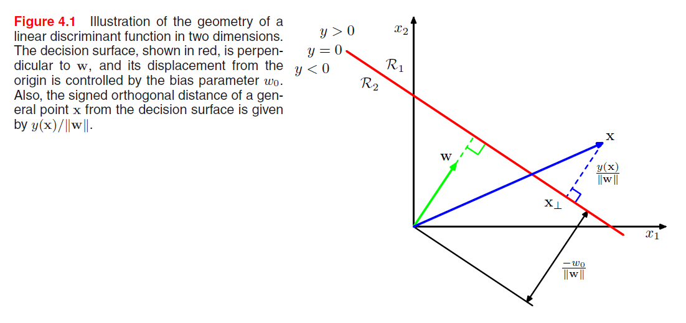
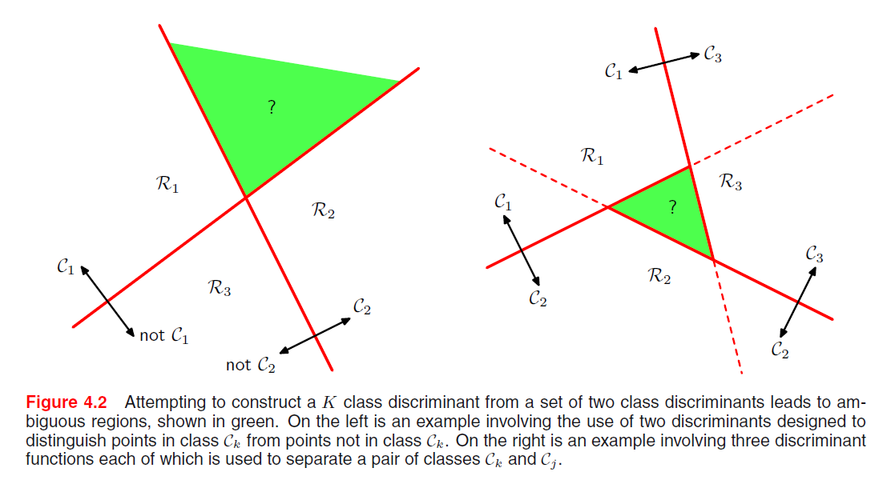
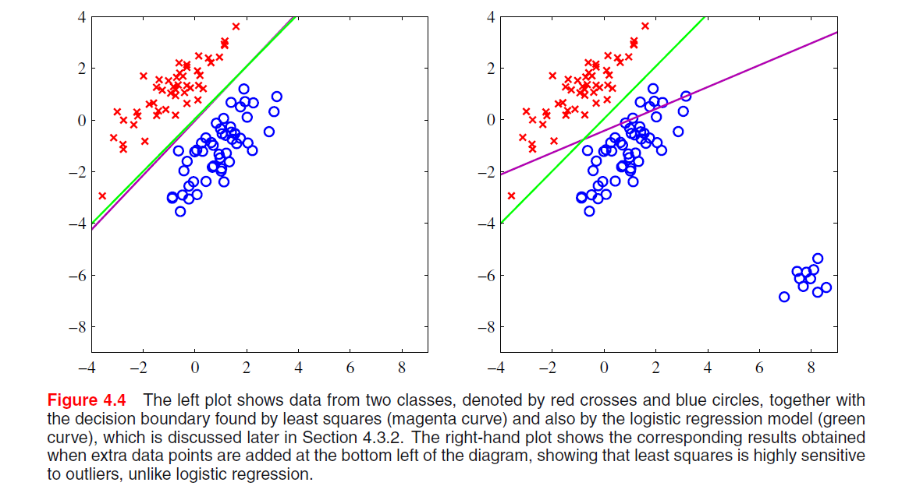
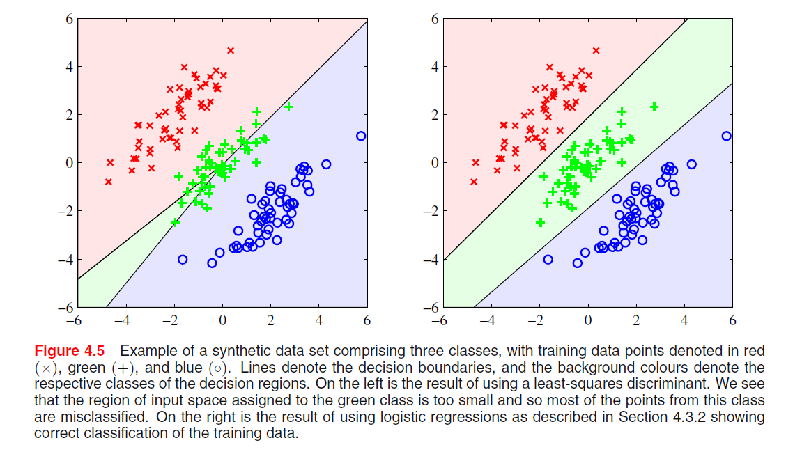
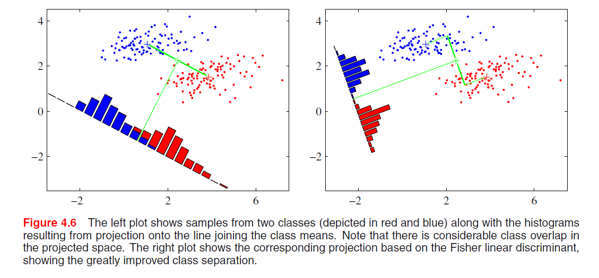

[TOC]

## 4 分类的线性模型

分类目标: 将输入变量$x$分到$K$个离散的类别 $\mathcal{C}_k$ 中的某一类.

输入空间被划分为不同的决策区域, 它的边界被称为决策边界/决策面. 输出用one-hot方式编码.

第一章中提出的三种方法:

+ 构造判别函数, 直接把向量$x$分到具体的类别中.
+ 推断阶段对条件概率分布 $p(\mathcal{C}_k \mid x)$ 直接建模, 然后使用该概率分布进行最优决策:
  + 直接对条件概率分布建模, 将条件概率分布表示为参数模型, 用训练集优化.
  + 生成式方法, 对类条件概率密度 $p(x \mid \mathcal{C}_k)$ 以及类先验概率分布 $p(\mathcal{C}_k)$ 建模, 然后使用贝叶斯定理计算后验.

### 4.1 判别函数

输入 $x$, 输出 $\mathcal{C}_k$.

#### 4.1.1 二分类

线性判别函数:
$$
y(\boldsymbol{x})=\boldsymbol{w}^{T} \boldsymbol{x}+w_{0}
$$
$\boldsymbol{x} \in \mathbb{R}^D$, 则 $y(\boldsymbol{x}) = 0$ 对应一个 $D - 1$ 维的超平面.

+ $\boldsymbol{w}$ 决定了决策面的方向:
  $$
  \boldsymbol{w}^{T}\left(\boldsymbol{x}_{A}-\boldsymbol{x}_{B}\right)=0
  $$

+ $w_0$ 决定了决策面的位置:
  $$
  \frac{\boldsymbol{w}^{T} \boldsymbol{x}}{\|\boldsymbol{w}\|}=-\frac{w_{0}}{\|\boldsymbol{x}\|}
  $$

+ 任意一点 $\boldsymbol{x}$ 到决策面的距离 $r$:
  $$
  \boldsymbol{x}=\boldsymbol{x}_{\perp}+r \frac{\boldsymbol{w}}{\|\boldsymbol{w}\|} \\
  r=\frac{y(\boldsymbol{x})}{\|\boldsymbol{w}\|}
  $$

#### 4.1.2 多分类

+ **第一种方法:** one-versus-one: $\frac{K(K - 1)}{2}$ 个二分类器, 但是仍然会造成无法分类的区域:

  

  

+ **第二种方法:** 引入 $K$ 类判别函数, $K$ 个, 判别属于 $\mathcal{C}_k$ 的概率.

  此时类别 $\mathcal{C}_{k}$ 和 $\mathcal{C}_{j}$ 之间的决策面为 $y_{k}(\boldsymbol{x})=y_{j}(\boldsymbol{x})$, 并且对应于一个 $(D-1)$ 维超平面, 形式为:
  $$
  \left(\boldsymbol{w}_{k}-\boldsymbol{w}_{j}\right)^{T} \boldsymbol{x}+\left(w_{k 0}-w_{j 0}\right)=0
  $$
  + 此时决策区域是单连通的, 并且是凸的.

    证明如下, $\boldsymbol{x}_A, \boldsymbol{x}_B$ 是位于决策区域 $\mathcal{R}_k$ 中任意两点, $0 \leq \lambda \leq 1$:
    $$
    \widehat{\boldsymbol{x}}=\lambda \boldsymbol{x}_{A}+(1-\lambda) \boldsymbol{x}_{B}
    $$
    其中$0 \leq \lambda \leq 1$, 根据判别函数的线性性质, 有:
    $$
    y_{k}(\widehat{\boldsymbol{x}})=\lambda y_{k}\left(\boldsymbol{x}_{A}\right)+(1-\lambda) y_{k}\left(\boldsymbol{x}_{B}\right)
    $$
    由于 $x_{A}$ 和 $x_{B}$ 位于 $\mathcal{R}_{k}$ 内部, 因此对于所有 $j \neq k$, 都有 $y_{k}\left(\boldsymbol{x}_{A}\right)>y_{j}\left(\boldsymbol{x}_{A}\right)$ 以及 $y_{k}\left(\boldsymbol{x}_{B}\right)>y_{j}\left(\boldsymbol{x}_{B}\right)$, 因此 $y_{k}(\widehat{\boldsymbol{x}})>y_{j}(\widehat{\boldsymbol{x}})$, 从而 $\hat{x}$ 也位于 $\mathcal{R}_{k}$ 内部, 即 $\mathcal{R}_{k}$ 是单连通的并且是凸的.

#### 4.1.3 用于分类的最小平方方法

沿用上述第二种方法, 每个类别 $\mathcal{C}_k$ 由自己的线性模型表述.
$$
y_{k}(\boldsymbol{x})=\boldsymbol{w}_{k}^{T} \boldsymbol{x}+w_{k 0} \\
\boldsymbol{y}(\boldsymbol{x})=\tilde{\boldsymbol{W}}^{T} \tilde{\boldsymbol{x}}
$$
如上整理成带有 $x$ 全一, 并且带有 $w_0$ 的全部矩阵表述, 同理目标输出 $t$ (注意这里目标输出就是**one-hot类型的, 属于某个类的向量**) 也整理成矩阵:
$$
E_{D}(\tilde{\boldsymbol{W}})=\frac{1}{2} \operatorname{Tr}\left\{(\tilde{\boldsymbol{X}} \tilde{\boldsymbol{W}}-\boldsymbol{T})^{T}(\tilde{\boldsymbol{X}} \tilde{\boldsymbol{W}}-\boldsymbol{T})\right\}
$$
$$
\tilde{\boldsymbol{W}}=\left(\tilde{\boldsymbol{X}}^{T} \tilde{\boldsymbol{X}}\right)^{-1} \tilde{\boldsymbol{X}}^{T} \boldsymbol{T}=\tilde{\boldsymbol{X}}^{\dagger} \boldsymbol{T}
$$
其中 $\tilde{X}^{\dagger}$ 是矩阵 $\tilde{X}$ 的伪逆矩阵, 这样得到了判别函数:
$$
y(\boldsymbol{x})=\tilde{\boldsymbol{W}}^{T} \tilde{\boldsymbol{x}}=\boldsymbol{T}^{T}\left(\tilde{\boldsymbol{X}}^{\dagger}\right)^{T} \tilde{\boldsymbol{x}}
$$

##### + 最小平方方法缺陷

对于离群点缺少鲁棒性, 与logistic回归模型比较: 

而且, 因为最小平方 对应于 高斯条件分布假设下的最大似然(在第1, 2章有证明), 但是目标向量的概率分布不是高斯分布: 

#### 4.1.4 Fisher 线性判别分析

+ 度量类别之间分开程度的方式(v1.0): 类别均值投影后的距离 $\boldsymbol{w}^T (\boldsymbol{m}_2 - \boldsymbol{m}_1)$ 尽量大, 限制 $\sum w_i^2 = 1$, 则可以用拉格朗日乘数法求解.

+ (v2.0) 仅如上分类会产生一个问题: 

  所以引入 同时让类内方差最小, 从而最小化类间的重叠.

$$
J(\boldsymbol{w})=\frac{\left(m_{2}-m_{1}\right)^{2}}{s_{1}^{2}+s_{2}^{2}}
$$
$$
J(\boldsymbol{w})=\frac{\boldsymbol{w}^{T} \boldsymbol{S}_{B} \boldsymbol{w}}{\boldsymbol{w}^{T} \boldsymbol{S}_{W} \boldsymbol{w}}
$$

$$
w \propto S_{W}^{-1}\left(m_{2}-m_{1}\right)
$$

到这里(式(4.30)), 求解和西瓜书几乎一样呀, 上式立即给出了 $w$ 最优的投影方向.