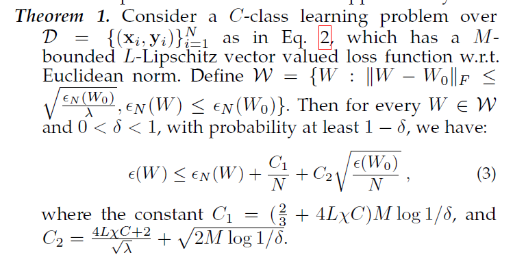
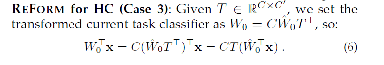
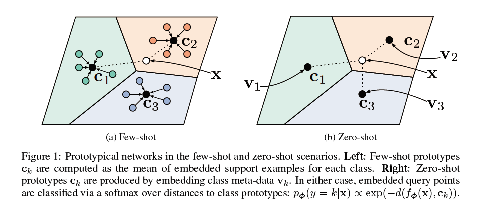
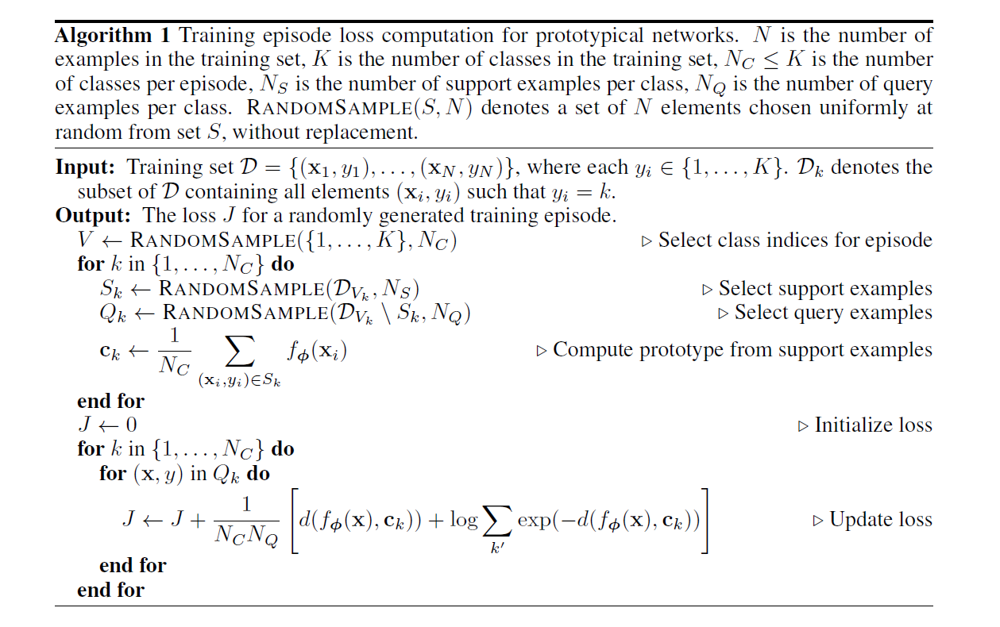
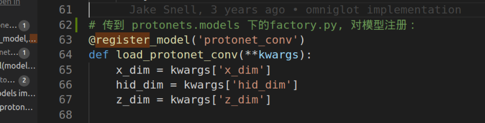

## 论文

### Heterogeneous Few-Shot Model Rectification with Semantic Mapping

---

+ 解决什么问题?

  当前FSL是通过 reuse well-trained models from related tasks, 但是不同任务之间具有 heterogeneity 异质性.

  + 以线性回归(正则化的)为例:

    > Learning in a new environment with few-shot training instances (small $N$) is difficult to generalize. Instead of optimizing $W$ directly, we consider the few-shot learning task with a given homogeneous model:

    直接训练泛化能力不行, 所以FSL用a given homogeneous model:

    也就是先用其他相关任务(相似分布)的一个a pre-trained model: 其预训练后参数$W_0 \in \mathbb{R}^{d \times C}$, 定义新的损失函数:
    $$
    \min _{W} \frac{1}{N} \sum_{i=1}^{N} \ell\left(f\left(\mathbf{x}_{i}\right)-\mathbf{y}_{i}\right)+\lambda\left\|W-W_{0}\right\|_{F}^{2}
    $$
    用一个biased regularization项, reuse $W_0$, 保证$W$不会差$W_0$太远.

    ? 有efficiency提高的定理的证明, 在附录. ? L-Lipschitz vector

    

    

  + 相关模型的异质性来自特征方面:

    Case 2: **Reuse a model with Heterogeneous Features (HF)**

    在reuse的过程中, 特征空间的不匹配, 比如维度不对, $W_0$ 需要用到新的$d'$维特征空间. 新任务的特征集合往往和原来的有交集.

    

  + 相关模型的异质性来自标签方面:

    Case 3: **Reuse a model with Heterogeneous Classes (HC)**

    新任务上同样是$d$维, 但映射/预测了不同数目的类别.

    例如新任务是对一些包含罕见动物的数据集分类.

    

  + $$
    \Delta_{d}=\left\{\mu: \mu \in \mathbb{R}_{+}^{d}, \mu^{\top} \boldsymbol{1}=1\right\}
    $$

+ 解决这个问题有什么意义?

+ 提出了什么方法?

  a general framework REctiFy via heterOgeneous pRedictor Mapping (REFORM).

  > REFORM constructs a semantic mapping between classifiers of the current and the related task without intervening in the training process of the pretrained model intensively.

  当前任务和相关任务的语义映射, 并且不深入干预预训练模型的训练过程.

  **提出了 $\mathcal{T}$, 一个语义映射解决上述$W_0$的问题(见下).**

+ 如何从 idea 形式化地对问题建模、简化并解决?

  + 为了一定程度上解决上述问题, 引出:

  $$
  \min _{W} \frac{1}{N} \sum_{i=1}^{N} \ell\left(f\left(\mathbf{x}_{i}\right)-\mathbf{y}_{i}\right)+\lambda\left\|W-\mathcal{T}\left(\hat{W}_{0}\right)\right\|_{F}^{2}
  $$

  $\mathcal{T}$ 将解决 $W_0$ 的上述问题.

  > **Theorem 1**(上面在附录里证明的那个) guarantees that with an effectively transformed homogeneous model $W_0 = T (\hat{W_0})$, Eq. 4 will adapt for the current task with only a small
  > amount of training examples.

  the transformation $\mathcal{T}$: an optimal transported semantic mapping.

+ > the semantic map $\mathcal{T}$ captures the correlation between feature/label sets of two tasks and transforms a heterogeneous model $\hat{W_0}$ to the current task.

  > **REctiFy via heterOgeneous pRedictor Mapping (REFORM)** framework, building **a semantic map** to reuse a model from **heterogeneous feature or label spaces**.

  通过异质分类器.

+ transformed current task classifier as $W_0 = dT \hat{W_0}$, **$d$ is a scale value**
  $$
  W_{0}^{\top} \mathbf{x}=d\left(T \hat{W}_{0}\right)^{\top} \mathbf{x}=d \hat{W}_{0}^{\top}\left(T^{\top} \mathbf{x}\right)
  $$

  > Since model coefficients **for similar features usually have similar values**, e.g., to classify political documents where features corresponding to words, then the classifier will weight “Trump” close to “Obama”.

+ 类似地对于Case 3有:

  

+ **Semantic Mapping via Optimal Transport**:

  ? Kantorovitch formulation

### Prototypical Networks for Few-shot Learning

+ 相关研究?

  + Vinyals et al. [29] proposed **matching networks**, which uses **an attention mechanism** over a learned embedding of the labeled set of examples (the support set) to predict classes for the unlabeled points (the query set).

    Matching networks can be interpreted as a weighted nearest-neighbor classifier applied within an embedding space.

  + episodic training.
  
  + Optimization-based meta-learning.

+ 解决什么问题?

  Few-Show／Zero-Shot 任务中overfitting.

+ 如何从 idea 形式化地对问题建模、简化并解决?

  there **exists an embedding** in which points cluster around a single prototype representation for each class.

  In order to do this, we learn

  + **a non-linear mapping of the input** into an embedding space using a neural network
  + and take **a class’s prototype** to be the **mean** of its support set in the embedding space.

  Classification is then performed for an embedded query point by simply **finding the nearest class prototype.**

  

  + **Model:**

    embedding function $f_{\phi}: \mathbb{R}^D \rightarrow \mathbb{R}^M$ with learnable parameters $\phi$. Each prototype is the mean vector of the embedded support points:
    $$
    \mathbf{c}_{k}=\frac{1}{\left|S_{k}\right|} \sum_{\left(\mathbf{x}_{i}, y_{i}\right) \in S_{k}} f_{\boldsymbol{\phi}}\left(\mathbf{x}_{i}\right)
    $$
    对于每个query point $x$, 基于"距离"原型网络建立了该点到 每个原型$\mathbf{c}_{k}$的概率分布:
    $$
    p_{\boldsymbol{\phi}}(y=k \mid \mathbf{x})=\frac{\exp \left(-d\left(f_{\boldsymbol{\phi}}(\mathbf{x}), \mathbf{c}_{k}\right)\right)}{\sum_{k^{\prime}} \exp \left(-d\left(f_{\boldsymbol{\phi}}(\mathbf{x}), \mathbf{c}_{k^{\prime}}\right)\right)}
    $$
    学习过程通过SGD最小化负对数概率: $J(\boldsymbol{\phi})=-\log p_{\boldsymbol{\phi}}(y=k \mid \mathbf{x})$

    **training episode**是training set的随机选取的子集, 在每个类中选择一些作为support set, 其余是query set.

    伪代码:

    

    

+ 对该方法的理论分析?
  
  + 等价于 Mixture Density Estimation:

+ 代码:

  `engine.py` 里是训练的大循环, `state['model']` 变量里存有模型.

  + 引用关系:

    train.py

    -> import protonets.utils.model as model_utils(model.py)

    -> from protonets.models import get_model(factory.py)

  + 不太懂 `Protonet` 在哪声明的? 似乎调用模型的都是接口类型的.

    似乎是这样: (还是VS的全局搜索好用呀)

  + 核心代码看不懂: /home/kai/paper-code/prototypical-networks/protonets/models/few_shot.py

  

### Siamese Neural Networks for One-shot Image Recognition

+ 如何从 idea 形式化地对问题建模、简化并解决?

  > 1) Train a model to discriminate **between a collection of same/different pairs.**
  >
  > 2) Generalize to evaluate new categories based on learned feature mappings for verification.

  > We build upon the deep **learning framework**, which uses many layers of non-linearities to **capture invariances to transformation in the input space**, usually by leveraging a model with many parameters and then using a large amount of data to prevent overfitting.

  

+ 该方法的优势是什么?

  a) are capable of **learning generic image features** useful for making predictions about unknown class distributions even when very few examples from these **new distributions are available**;

  b) are easily trained **using standard optimization techniques** on pairs sampled from the source data;

  c) provide a competitive approach that **does not rely** upon **domain-specific** knowledge by instead exploiting deep learning techniques.

### 基于模型分解的小样本学习

“元学习” (meta-learning) 提供了一种学习跨任务先验的方式(初始化、特征表示、优化策略都可看作一类模型先验). 为算法寻求一个“模型先验”, 当遇到少量的新类样本时, 该模型先验能够辅助模型快速适配一个新的任务.

+ 如何从 idea 形式化地对问题建模、简化并解决?

  通过模型的目标函数的性质, 对模型最优解的结构进行分解, 并将这种分解方式作为一种可行的先验.